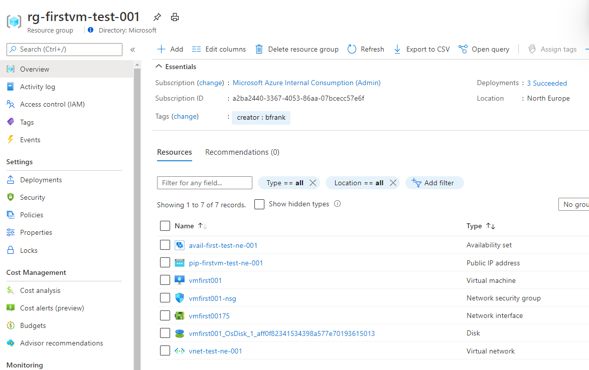

# Challenge 1: VM: Create a virtual machine using the Azure portal

## Here is what you will learn ##
- Create a vm using the portal
- See what belongs to a vm
- use naming convention for vm Azure artefacts

**Search for virtual machines in the portal and hit the '+' symbol to add a vm:**  

  
**Create the vm according to the table:**  

| Name | Values  |
|---|---|
| _Resource group_ | %use from previous lab% |
| _Virtual machine name_ | `vm<policy name or app name><###>`|
| _Region_ | **North Europe** | 
| _Availability options_ | **Availabilty set**  | 
| _Availabilty set_ | <ul><li>Name: `avail-<app or service name>-<subscription type>-<region>-<###>`</li><li>Fault domains: 2</li><li>Update domains: 5</li></ul> |
| _Image_ | **Windows Server 2019 Datacenter - Gen1** | 
| _Size_ | %Choose a size% | 
| _Username_ | **not** 'Admin' **nor** 'Administrator' **nor** 'root' |
| _Password_ | %complex enough% | 
| _Os disk type_ | **Standard SSD** | 
| _Virtual network_ | _e.g. the vnet from previous challenge-00_ | 
| _Public IP_ | _e.g. the public IP from previous challenge-00_ | 
| _Boot diagnostics_ | **Disable**  | 
| _Tag_ | e.g. **creator** : %yourName% |  
  
 
> **Helpful**(?) Reference: Azure naming convention Links  
> - [Define your naming convention](https://docs.microsoft.com/en-us/azure/cloud-adoption-framework/ready/azure-best-practices/resource-naming)  
> - [Recommended abbreviations for Azure resource types](https://docs.microsoft.com/en-us/azure/cloud-adoption-framework/ready/azure-best-practices/resource-abbreviations)  
  
**Result: Azure artefacts in resource group after challenge**  
