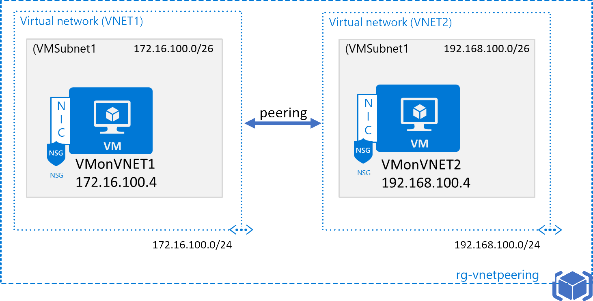
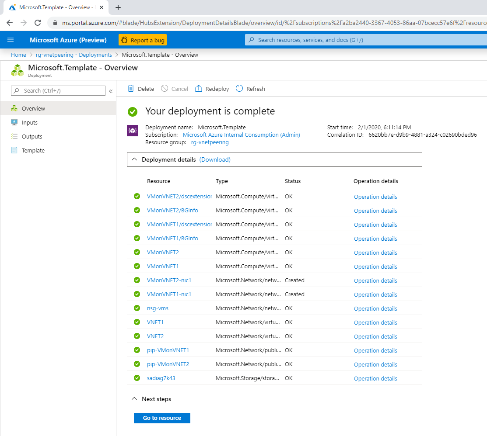
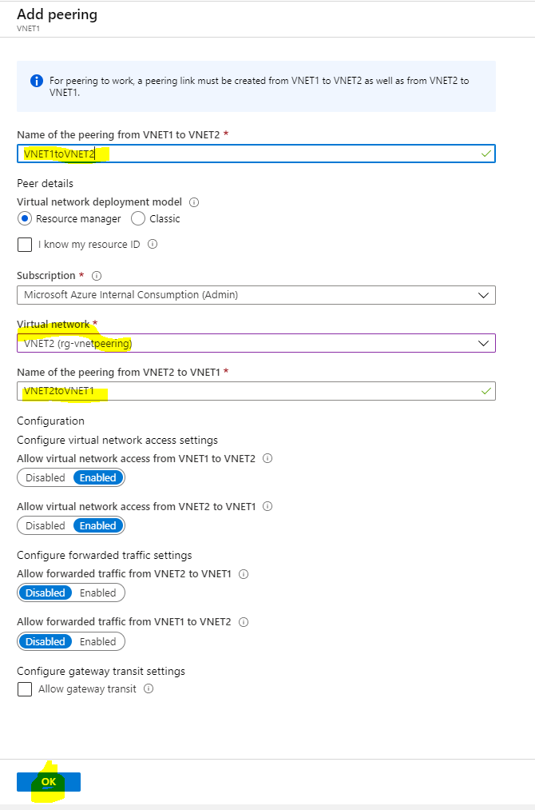

# Challenge 5: Networking - Connect Two Virtual Networks Using Azure VNET Peering

## Here is what you will learn 🎯

How to connect 2 virtual networks with Azure VNET Peering. Our final architecture should look like this:

  

At first you will deploy the _start environment_ and then you will implement the _peering_.

## Table of Contents

1. [Deploy the Starting Point](#deploy-the-starting-point)
2. [Implement the VNET peering](#implement-the-vnet-peering)
3. [Check if the peering works](#check-if-the-peering-works)
4. [Cleanup](#cleanup)

## Deploy the Starting Point

In this directory there is an ARM-template which 2 virtual networks and 2 VMs and its requirements (networking, disks,...):  

Deploy this scenario into your subscription by **clicking** on the  
<a href="https://portal.azure.com/#create/Microsoft.Template/uri/https%3A%2F%2Fraw.githubusercontent.com%2Fazuredevcollege%2Ftrainingdays%2Fmaster%2Fday1%2Fchallenge-09%2Fchallengestart%2Fchallengestart.json"></a> button.

| Name | Value |
|---|---|
| _Resource group_  |  **(new)** rg-VNETPeering |
| _Location_  |  West Europe |
| _Admin user_  |  demouser |
| _Admin password_  |  %some complex value% |
| _Vm Size_  |  Standard_B2s  or try e.g. Standard_F2s_v2|
| _Disk Sku_  |  StandardSSD_LRS |  
  
The result should look similar to this:

  

## Implement the VNET peering

You need to create the peerings on each virtual network:  

- VNET1 ---> VNET2
- VNET2 ---> VNET1  

The wizard in the portal is smart enough to let create 2 peerings in a single step. Select e.g. VNET1 as starting point:

```
[Azure Portal] 
-> Resource Groups 
-> "rg-VNETPeering" 
-> "VNET1" 
-> Peerings -> Add
```  

| Name | Value |
|---|---|
| _This virtual network_ (Peering link name)|  VNET1-to-VNET2 |
| _Virtual Network_ (to peer with) | VNET2 |
| _Remote virtual network_  (Peering link name)  | VNET2-to-VNET1 |


  
## Check if the peering works

1. Connect to one VM through RDP using its public ip address: e.g. VMonVNET1 through

  ```
  [Azure Portal] 
  -> Virtual Machines 
  -> "VMonVNET1" 
  -> Connect
  ```

  | User | Password |
  |---|---|
  | demouser | %your deployment password% |
  
2. Open a command prompt and ping the other VM using its internal IP: In our case VMonVNET2 - should be 192.168.100.4:
  
  

## Cleanup

Delete the resource group `rg-VNETPeering`

[◀ Previous challenge](../challenge-04/README.md) | [🔼 Day 1](../README.md) | [Next challenge ▶](../challenge-06/README.md)
