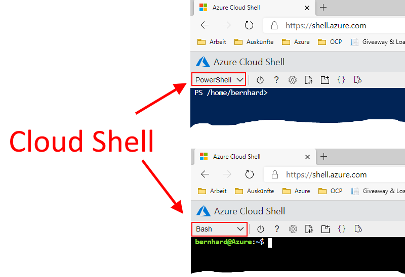
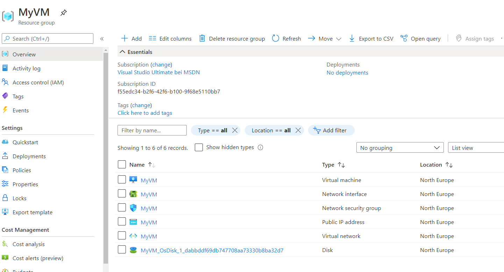

# Challenge 5: Cloud Shell: Coding Your Azure Resources

## Here is what you will learn ##

- Use the 'Cloud Shell' as _'launch point'_ for PowerShell | Bash scripts.
- Use it to automate Azure resource creation and configuration.  

## Benefits of the Azure Cloud Shell ##
Ok - quite impressive what the Azure portal as a single page application allows us to do, isn't it?  
However sometimes a shell is faster and better for repetitive tasks. But you may not want to install software nor tools for this in your machine.  
The Azure **Cloud Shell is a shell | console hosted in your browser window**. Ready to **execute commands to create, delete, modify Azure resources in your subscription**.  
While it is also possible to use PowerShell on your local PC to administer Azure. Using the Cloud Shell brings some advantages compared to using your PC as 'launch point'.  

Using the **Cloud Shell saves you time** as...:  
- **no need to explicitly code the azure logon within the script** - you are already authenticated to Azure via the browser ;-)
- **nothing needs to be installed on your PC** ([no "which version of PowerShell? What modules?](https://docs.microsoft.com/en-us/powershell/azure))"  


## Table Of Contents ##
1. [Create an Azure Cloud Shell (if you don't have one.)](#Create-an-Azure-Cloud-Shell)
2. [Playing with the Cloud Shell](#Playing-with-the-Cloud-Shell)
3. [PowerShell Az Modules for Azure](#PowerShell-Az-Modules-for-Azure)
4. [(optional) Create a VM with PowerShell](#Create-a-VM-with-PowerShell)
5. [Cleanup](#Cleanup)


# Create an Azure Cloud Shell #
```
[Azure Portal] -> Click the 'Cloud Shell' symbol close to your login details on the right upper corner.
```  
)  
The **'Cloud Shell' is an in-browser-accessible shell for managing Azure resources**. It already has the required SDKs and tools installed to interact with Azure. The **Azure Cloud Shell comes in 2 flavors: bash or PowerShell**  
  

When being asked **choose PowerShell this time**.  
**The first time you use the 'Cloud Shell' you will be asked to setup a storage account** e.g. to store files you have uploaded persistently. [See](https://docs.microsoft.com/en-us/azure/cloud-shell/persisting-shell-storage)  

```
[Azure Portal] -> Click 'Show advanced settings'
```  
  

| Name | Value |
|---|---|
| Subscription  |  _your subscription_ |
| Cloud Shell Region  |  e.g. **North Europe** |   
| Resource Group  |  e.g. **rg-cloudshell** |   
| Storage Account  |  **_some unique value_** |   
| File Share  |  **cloudshell**|   

```
[Azure Portal] -> Create storage
```  
Once successful your shell should appear at the bottom of the page:  


# Playing with the Cloud Shell #
**Execute your first commands**. Using 'PowerShell' as environment you can either call:  
**Azure CLI code** snippets, **go execute**:
```
az account show
```  
or **execute Azure PowerShell commands**, like:
```PowerShell
Get-AzSubscription
```
**Most Azure documentation offers script snippets shows both ways.**  
My 2cts:
- az commands tend to be shorter 
- PowerShell (as .net based scripting language) gives you more flexibility when scripts get longer.

**Note that Azure uses PowerShell Core on a Linux OS for PowerShell: Execute...**
```PowerShell
$psversiontable
```  
should return something like:  
  
>Keep this in mind - especially when you copy and pasted non PowerShell Core scripts - as they may need 'treatment' before they can run ;-)

Let's query e.g. the available VM sizes in a specific region:
```PowerShell
Get-AzVMSize -Location 'west europe'
```
Output should be something like:
```
Name                   NumberOfCores MemoryInMB MaxDataDiskCount OSDiskSizeInMB ResourceDiskSizeInMB
----                   ------------- ---------- ---------------- -------------- --------------------
Standard_A0                        1        768                1        1047552                20480
Standard_A1                        1       1792                2        1047552                71680
Standard_A2                        2       3584                4        1047552               138240
Standard_A3                        4       7168                8        1047552               291840
.
.
.

```

List your Azure resources by executing:  
```PowerShell
Get-AzResource
```
>Note:  
>Ok. So there are PowerShell cmds (so-called cmdlets "_action_-_target_") to administer azure. In Azure Cloud Shell they are 'pre'-installed for you. If you would want to run them from your PC you would need to install them (`install-module Az`) & update them (`update-module Az*`) on a regular basis. In PowerShell cmdlets are grouped into modules. If you want to find out which modules are installed - try `Get-Module az* -ListAvailable`. There is not a single Azure module. Instead the Azure services have their own modules - i.e. there is a module that hosts cmdlets for treating virtual machines, one for networking,...  

# PowerShell Az Modules for Azure #
To query the **specific modules for Azure administration - go execute:**  
```PowerShell
Get-Module az* -ListAvailable
```
**to list the pre-installed Az modules**:  
```
Directory: C:\Program Files\WindowsPowerShell\Modules

    Directory: /usr/local/share/powershell/Modules

ModuleType Version    PreRelease Name                                PSEdition ExportedCommands
---------- -------    ---------- ----                                --------- ----------------
Script     4.6.1                 Az                                  Core,Desk
Script     1.9.3                 Az.Accounts                         Core,Desk {Disable-AzDataCollection, Disable-AzContextAutosave, Enable-AzDataCollection, Enable-AzCon…
Script     1.1.1                 Az.Advisor                          Core,Desk {Get-AzAdvisorRecommendation, Enable-AzAdvisorRecommendation, Disable-AzAdvisorRecommendati…
Script     1.2.0                 Az.Aks                              Core,Desk {Get-AzAksCluster, New-AzAksCluster, Remove-AzAksCluster, Import-AzAksCredential…}
Script     1.1.4                 Az.AnalysisServices                 Core,Desk {Resume-AzAnalysisServicesServer, Suspend-AzAnalysisServicesServer, Get-AzAnalysisServicesS…
Script     2.1.0                 Az.ApiManagement                    Core,Desk {Add-AzApiManagementApiToGateway, Add-AzApiManagementApiToProduct, Add-AzApiManagementProdu…
Script     1.1.0                 Az.ApplicationInsights              Core,Desk {Get-AzApplicationInsights, New-AzApplicationInsights, Remove-AzApplicationInsights, Update…
Script     1.4.0                 Az.Automation                       Core,Desk {Get-AzAutomationHybridWorkerGroup, Remove-AzAutomationHybridWorkerGroup, Get-AzAutomationJ…
Script     3.1.0                 Az.Batch                            Core,Desk {Remove-AzBatchAccount, Get-AzBatchAccount, Get-AzBatchAccountKey, New-AzBatchAccount…}
Script     1.0.3                 Az.Billing                          Core,Desk {Get-AzBillingInvoice, Get-AzBillingPeriod, Get-AzEnrollmentAccount, Get-AzConsumptionBudge…
Script     1.4.3                 Az.Cdn                              Core,Desk {Get-AzCdnProfile, Get-AzCdnProfileSsoUrl, New-AzCdnProfile, Remove-AzCdnProfile…}
.
.
.
```
**To find out which module hosts which cmdlet** (e.g. Get-AzVMSize) **type** something like:
```PowerShell
get-command *vmsize*
```
Result similar to:  
```
CommandType     Name                                               Version    Source
-----------     ----                                               -------    ------
Alias           Get-AzureRmVMSize
Cmdlet          Get-AzDtlAllowedVMSizesPolicy                      1.0.2      Az.DevTestLabs
Cmdlet          Get-AzVMSize                                       4.3.1      Az.Compute
Cmdlet          Set-AzDtlAllowedVMSizesPolicy                      1.0.2      Az.DevTestLabs
```  

To find out all commands hosted in the Az.Compute module type:
```PowerShell
Get-Command -Module Az.Compute
```
delivers e.g.:
```
CommandType     Name                                               Version    Source
-----------     ----                                               -------    ------
.
.
.
Cmdlet          New-AzSnapshotUpdateConfig                         4.3.1      Az.Compute
Cmdlet          New-AzVM                                           4.3.1      Az.Compute
Cmdlet          New-AzVMConfig                                     4.3.1      Az.Compute
Cmdlet          New-AzVMDataDisk                                   4.3.1      Az.Compute
Cmdlet          New-AzVMSqlServerAutoBackupConfig                  4.3.1      Az.Compute
Cmdlet          New-AzVMSqlServerAutoPatchingConfig                4.3.1      Az.Compute
Cmdlet          New-AzVMSqlServerKeyVaultCredentialConfig          4.3.1      Az.Compute
.
.
.
```  
To learn more about a specific cmdlet. You can e.g. **execute**:  
```PowerShell
help New-AzVM -examples
```
# (optional)
# Create a VM with PowerShell
Now **let's create a VM using PowerShell**. **Execute**:  
```PowerShell
help New-AzVM -online
```
this **should open a new browser tab with online help for New-AzVM**. Examine the explanation and look at the code samples.

Try **creating a simple VM by executing**:  
```PowerShell
$VMName = 'MyVM'    # variable for easy reuse
New-AzVM -Name $VMName -Credential (Get-Credential) -Location 'North Europe' -Size 'Standard_A0'
```
**Enter a user name** (not 'admin' nor 'administrator') **and a complex password** when asked.
 
After a successful run you should have a VM in your subscription:  
   

# Cleanup
**Cleanup** e.g. **by deleting** the resource group with the vm **using the portal or via executing**:
```PowerShell
Remove-AzResourceGroup $VMName -Force -AsJob   # -AsJob will execute this operation in the background 
```
> **In case of an error** try restarting the cloud shell as it times out.  
  