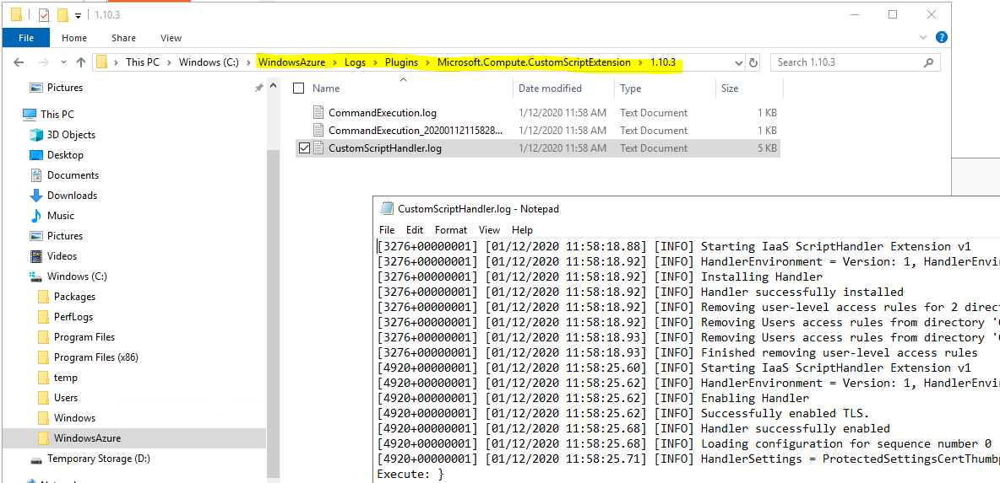
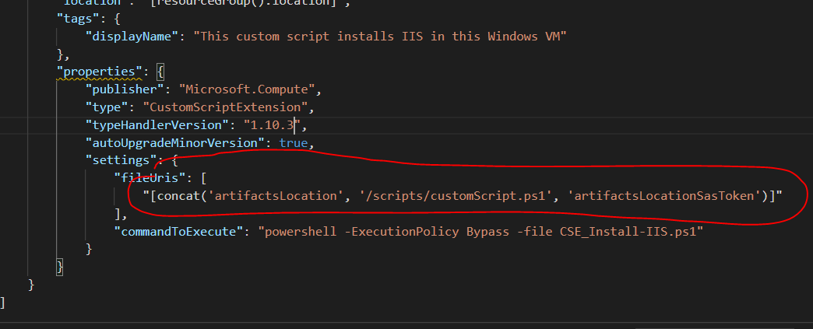
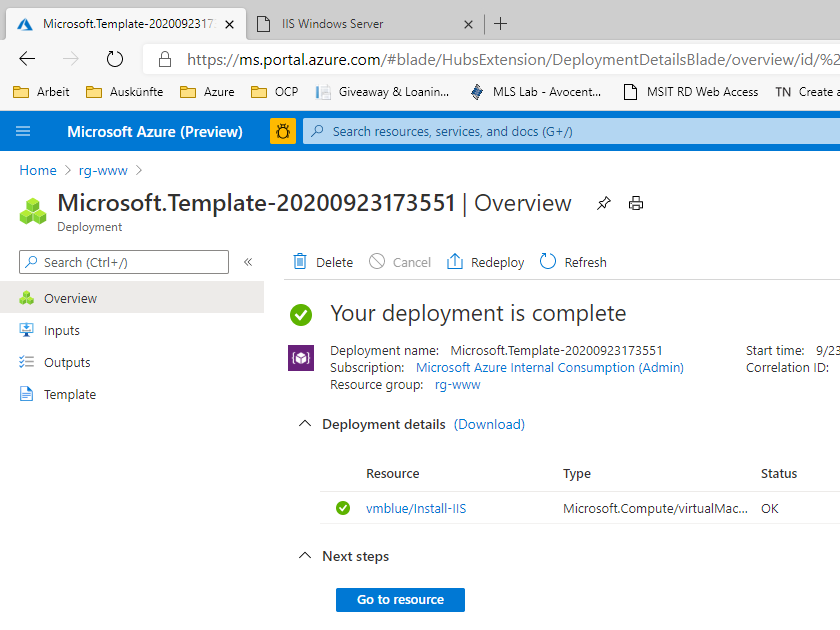
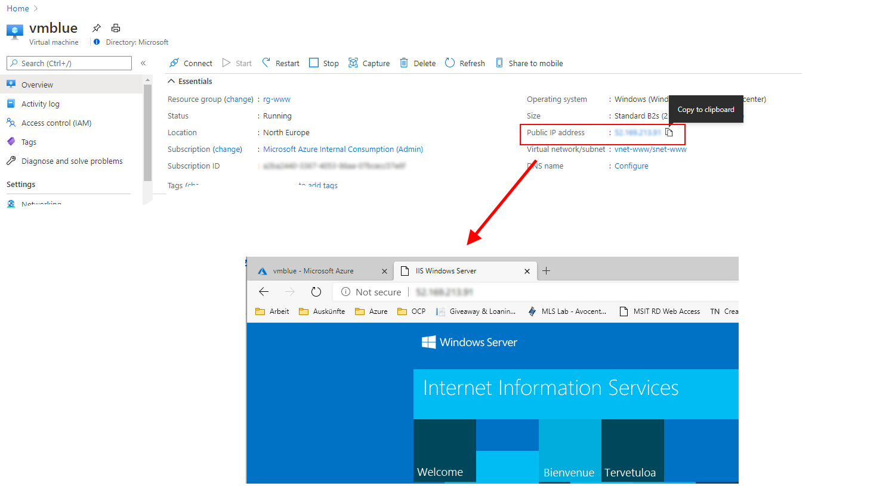

# Challenge 6: VM - Custom Script Extensions: Post deployment automation
## or - configure / setup / install something within an empty vm ##  

[back](../../README.md)  

## Here is what you will learn ##
- How to automate the further configuration / setup of an '_empty_' VM after it has been deployed.
- Use a Custom Script Extension for a Windows VM.
- Upload automation code into a storage account for anonymous download (so that the CSE agent can download)
- Modify an ARM Template to enable '_0 touch VM deployments_'

## Do you need a VM? ##
**For this lab you need an Azure virtual machine that runs Windows Server**. And some storage accessible to hold your automation code.  
Just **click**  <a href="https://portal.azure.com/#create/Microsoft.Template/uri/https%3A%2F%2Fraw.githubusercontent.com%2Fazuredevcollege%2Ftrainingdays%2Fmaster%2Fday1%2Fchallenges%2FChallenge6%2FChallenge6Start.json"></a> **to spin up a new VM** for this lab.


| Name | Value |
|---|---|
| Resource group  |  **(new)** rg-www |
| Location  |  **North Europe** |   
| Admin user  |  demouser |   
| Admin password  |  **_some complex value_** |   
| Vm Size  |  **Standard_B2s**  or try e.g. **Standard_F2s_v2**|   
| Disk Sku  |  StandardSSD_LRS |  

## Attach a simple HelloWorld Custom Script Extension (CSE) to a VM using the Portal ##
1. Take the following code and copy & paste it into a file named e.g. '_HelloWorld.ps1_':

```PowerShell
##############################################
#   HelloWorld Custom Script Extension (CSE)
##############################################

$filePath = "c:\temp\CSEwasRunAt.txt"

#create dir if it doesn't exist
if (!(Test-Path -Path (Split-Path $filePath -Parent))) {mkdir (Split-Path $filePath -Parent)}

#write current time to file.
Get-Date | Out-File $filePath -Append

#This is really simple but imagine what else you can do to customize a vm ...

```
2. Upload this file to a storage account
```
[Azure Portal] -> Resource Group -> rg-www -> sawww... (_your storage account_)  -> containers -> 'csescripts' -> Upload  
->File "HelloWorld.ps1" -> Upload
```


3. Make this file being executed by the Custom Script Extension within the the VM:
```
[Azure Portal] -> Home -> Search 'virtual machines' -> 'vmblue' 
-> Extensions -> Add -> 'Custom Script Extension' -> Create
```
  
| Script file (Required) |  Browse to your '_HelloWorld.ps1_' -> it is in your storage account 'sawww...' -> csescripts  |
|---|---|
| Arguments (Optional) |  _none_  |  
  
**Wait some seconds** then do a **refresh** of your browser - it'll show the progress:  

  
Final result should show a success:  


## See what has happened inside the VM
Now we **RDP into the VM** and see what has happened **and where to find logs** in case something breaks.
```
[Azure Portal] -> Resource Groups -> 'rg-www' -> 'vmblue'
  -> Connect -> Download RDP file -> Open -> Connect
```
**User**: demouser  
**Password**: _%Your Password%_  
  
Within the VM:
1. **Navigate to c:\temp**  
The **result** should look similar to this:  


2. **Navigate to C:\Packages\Plugins\Microsoft.Compute.CustomScriptExtension\ _%version%_\Downloads**
The CSE is software that runs within the VM. The script that will be executed is **download**ed first to this **location**. If you don't see your script file CSE might have trouble to download the resource.  
  

3. **Navigate to C:\WindowsAzure\Logs\Plugins\Microsoft.Compute.CustomScriptExtension\ _%version%_**
This is the place where the **CSE logs its actions locally** - a good place to start troubleshooting.  


4. **Remove the CSE from the VM**
```
[Azure Portal] -> Home -> Search 'virtual machines' -> 'vmblue' -> 'Custom Script Extension' -> 'Uninstall'
```
>**Note: You can only have one Custom Script Extension attached to a vm at a time**. If you want to process multiple CSE scripts you need to: Install CSE ('Script1') -> deinstall CSE -> Install CSE ('Script2') -> deinstall ->... 

## [optional] Attaching a CSE to a VM in an ARM Template ##
The goal of this action is to learn how to avoid the portal, i.e. so that the CSE can be attached to a VM during deployment time e.g. using an ARM template. With the whole setup Azure + VM Settings can be done in a '_0 touch way_'.

1. In the next CSE **we want to install Internet Information Services (IIS) in the VM**.  
Take a look at the code file first ("[CSE_Install-IIS.ps1](./CSE_Install-IIS.ps1)")  
The relevant parts starts at _#region install IIS features_

2. When automating CSE e.g. through **ARM deployment** - the CSE **needs a valid download location for the code file** (CSE_Install-IIS.ps1).  
This could be e.g. a public github repo or another https-reachable location.  
In this lab **we use a storage account for this**.  
**Upload ("[CSE_Install-IIS.ps1](./CSE_Install-IIS.ps1)") file to a storage account.**
```
[Azure Portal] -> Resource Group -> rg-www -> sawww... (%your storage account%)  -> containers -> 'csescripts' -> Upload  
->File "CSE_Install-IIS.ps1" -> Upload
```  
  
3. **Edit the CSE ARM template to use the correct scripts location**
Once uploaded you can copy the blobs URL from the azure portal  


**Can you download the file in your browser using the URL**? [Yes] If not have you set the correct access level at the container?

**Edit this** [CSE ARM template](./ARMCSE.json) **template** to use the scripts location: 
  

**with your value**
```
...
"fileUris": [
    "https://sawww....blob.core.windows.net/cse/CSE_Install-IIS.ps1"
],
...
```
**Copy the template into the clipboard.**

4. Deploy the ARM Template.
```
[Azure Portal] -> Resource Groups -> 'rg-www' -> '+' -> Template deployment -> "Build your own template in the editor" -> Paste the clipboard
```
**Select the right resource group and VM and deploy:**
| Name | Value |
|---|---|
| Resource group  |  **rg-www** |
| Region  |  **North Europe** |   
| VM name  |  vmblue |   

Deployment will take some minutes: A role is installed and an IIS feature is downloaded and installed.  
At the end **the result should look like this**  
  
Now you have a web server in your VM - you should test by browsing to the public IP address:  
  


## Cleanup the environment ##
Cleanup by deleting the resource group.
```
[Azure Portal] -> Resource Groups -> 'rg-www' -> 'Delete resource group'
```
[back](../../README.md) 
