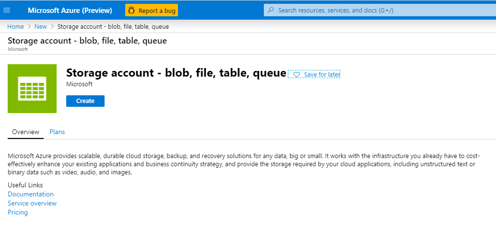
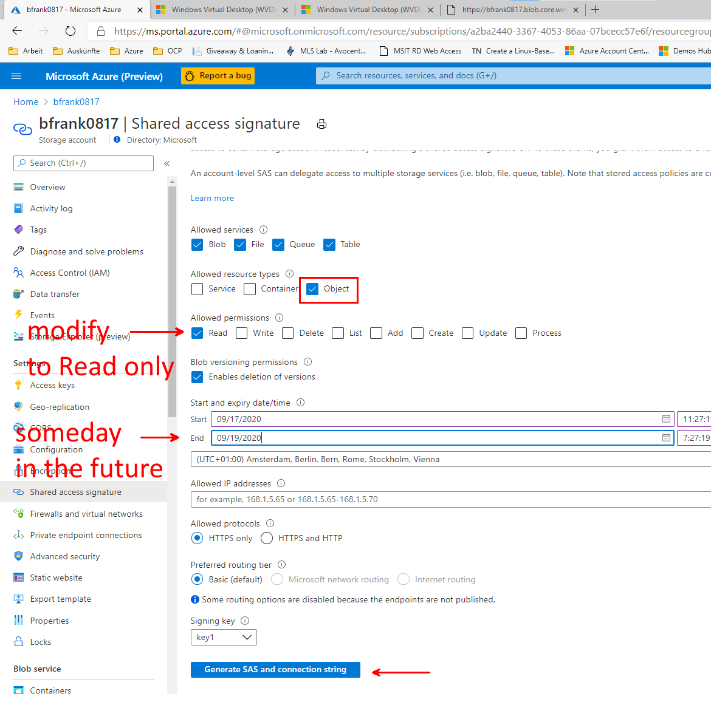
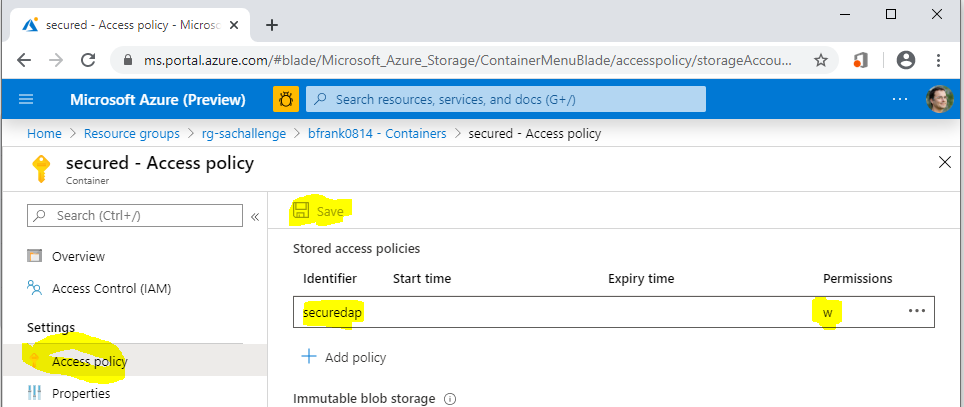
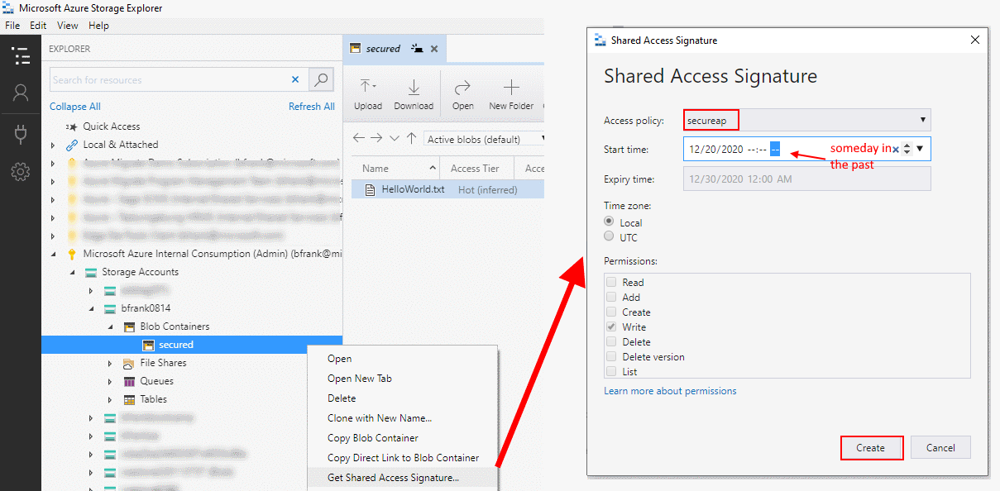
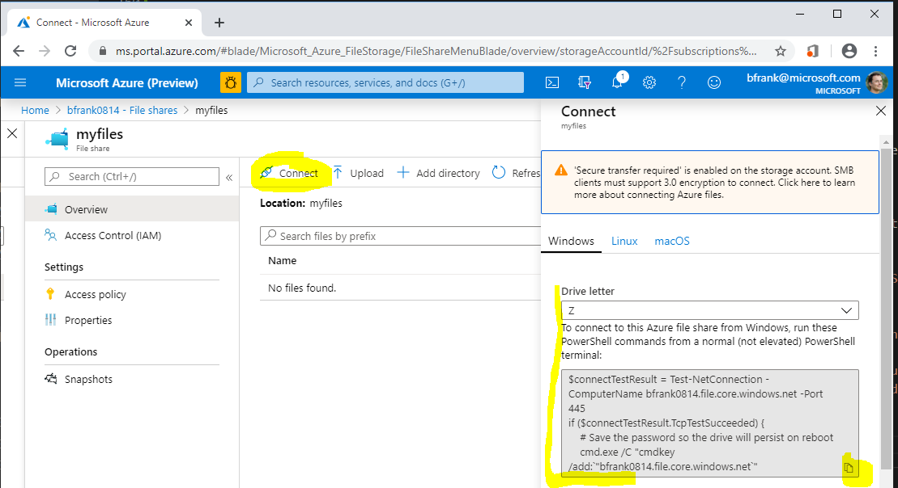
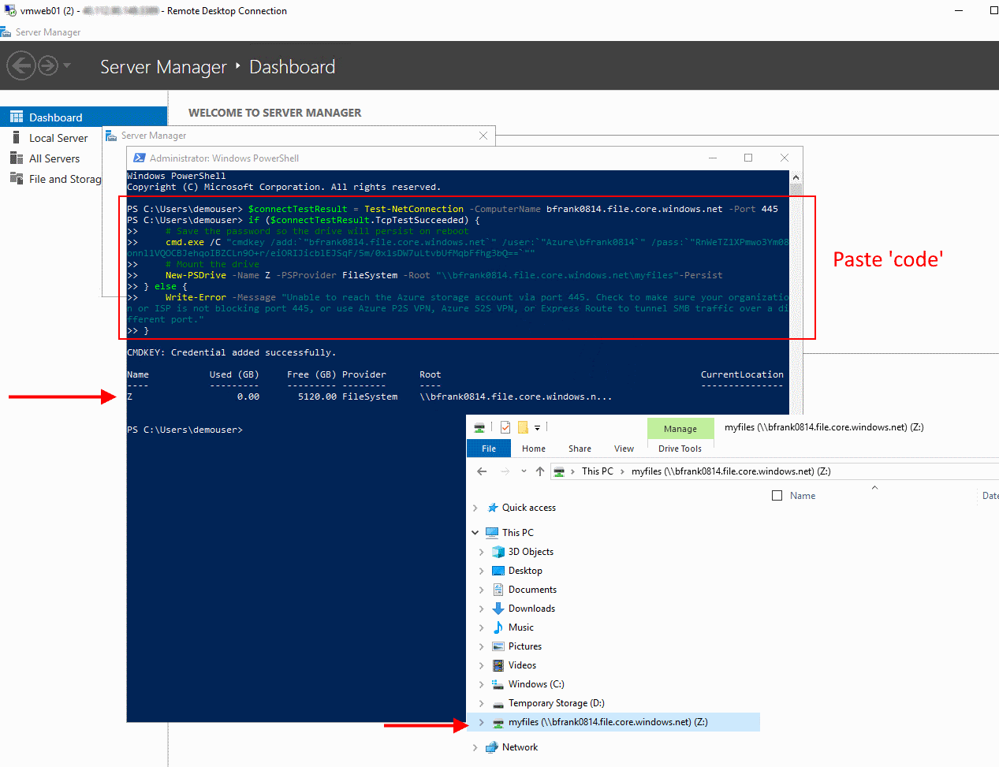

# Challenge 6: Storage Account - Creating Data Storage for VMs and Applications

## Here is what you will learn 🎯

- how to create an Azure storage account using the portal for the use as a 'cloud file share'
- enable 'secured' access to the storage account data (e.g. blobs) using Shared Access Signatures
- create a SAS policy to enable permission modification after SAS tokens have been issued.
- use AAD credentials as 'better' way for storage account authorization
- create a file share and attach it to your Azure virtual machine

## Table of Contents

1. [Create a storage account and a container using the Azure portal](#create-a-storage-account-and-a-container-using-the-azure-portal)
2. [Authorize access to blobs using AAD (optional)](#authorize-access-to-blobs-using-aad-optional)
3. [Add an Azure file share to a server](#add-an-azure-file-share-to-a-server)
4. [Cleanup](#cleanup)

## Create a storage account and a container using the Azure portal

1. Login to your Azure subscription and search the marketplace for 'Storage Account'

    

2. Create a storage account with the following values:

  | Name | Value |
  |---|---|
  | _Resource Group_  |  **(new)** rg-sachallenge |
  | _Storage account name_  |  %unique lowercase value% |
  | _Location_ | West Europe |
  | _Account kind_  |  StorageV2 |
  | _Performance_  |  Standard |
  | _Replication:  |  Locally-redundant storage (LRS) |
  | _Access tier_  |  Hot |

  :::tip
  📝 Find some use cases for [SAS](https://docs.microsoft.com/azure/storage/common/storage-sas-overview#when-to-use-a-shared-access-signature)
  :::

3. Once the storage account is created,  generate a new container within the storage account:  

  ```
  [Azure Portal] -> %Your Storage Account% -> Containers -> "+ Container"
  ```

  | Name | Value |
  |---|---|
  | _Name_  |  secured |
  | _Public access level_  |  Private (no anonymous access) |

4. Now upload a small file:

    

> ❔ **Question:** Can you download the file using its URI in another browser session?
>
>   
>
> **Answer:** No. Because anonymous access is not allowed and this URI does not contain any auth token
>
> 
  
5. Create a Shared Access Signature via the portal to enable blob access: 

  ```
  [Azure Portal] 
  -> %Your Storage Account% 
  -> Shared access signature 
  -> "Generate SAS and connection string"
  ```

6. Copy the Blob Service SAS URL to the clipboard

    
  
7. In the result copy the SAS token:

    
  
  and edit the SAS URL: You need to add the path to uploaded file - it should look similar to:
  
  ```http  
  https://**%Your Storage Account Name%**.blob.core.windows.net/**secured/HelloWorld.txt**?sv=2019-02-02&ss=bfqt&srt=sco&sp=rwdlacup&se=2020-01-26T00:03:42Z&st=2020-01-25T16:03:42Z&spr=https&sig=Pehc....  
  ```

> ❔ **Question:** Can you now download the file in the browser [Yes]  
> 

  :::tip
  📝 If a SAS:

- is leaked, it can be used by anyone who obtains it, which can potentially compromise your storage account.
- is provided to a client application expires and the application is unable to retrieve a new SAS from your service, then the application's functionality may be hindered.

  :::

8. Revoke the storage account's access key1 (optional)
  
  ```
  [Azure Portal] 
  -> %Your Storage Account% 
  -> Access keys 
  -> key1 
  -> 'regenerate' 
  ```

> ❔ **Questions:**
>
> - Can you still download the file in the browser using aboves URL [No]
> - Why? [Because the SAS key was generated using the previous key1 -> which is no longer valid.]

### Create a stored access policy to control permissions after SAS token is issued

1. Define a stored access policy ('mypolicy') on the container "secured" (write)  

  ```
  [Azure Portal] 
  -> %Your Storage Account% 
  -> Containers 
  -> 'secured' 
  -> Access policy 
  -> 'Stored access policy' 
  -> '+' Add policy
  ```

  | Name        | Value |
  |---          |---|
  | _Identifier_  |  securedap |
  | _Permissions_ |  Write |  

  :::tip
  📝Don't forget to use the **save** button!

  
  :::

2. Create a SAS URL that is using this access policy using Azure Storage Explorer
2.1 Open [Microsoft Azure Storage Explorer](https://azure.microsoft.com/features/storage-explorer/) [See Also Day 2: Challenge 0 - Setup your System](./day2/challenges/challenge-0.md)
2.2 Navigate to your storage account and container.  
2.3 Right click and do 'Get Shared Access Signature' based on our policy.

    
2.4 Copy the URI to the clipboard.  
2.5 Edit the SAS URI -> add the path to uploaded file

  >❔ **Question:** Can you now download the file in the browser? [No]  

2.5 Edit the stored access policy 'securedap' to allow READ access  

  ```
  [Azure Portal] 
  -> %Your Storage Account% 
  -> Containers 
  -> 'secured' 
  -> Access policy 
  -> Under 'Stored access policy' 
  -> 'securedap' 
  -> '...' 
  -> Edit 
  -> Permissions 
  -> Add READ 
  -> OK 
  -> Save
  ```

    

  >❔ **Question:** Can you now download the file in the browser? [Yes]

  :::tip
  📝 When you now distribute this SAS URI to users or Apps you can later modify it's behavior by modifying the access policy. So stored access policies can help to modify permissions to a container after the SAS has been issued to users / apps.
  :::  
  
## Authorize access to blobs using AAD (optional)  

You can also authorize access to storage accounts using Azure Active Directory (AAD) credentials ([documentation](https://docs.microsoft.com/azure/storage/common/storage-auth-aad?toc=%2fazure%2fstorage%2fblobs%2ftoc.json)) which means you assign users RBAC permissions to e.g. a  container. This is in fact the _recommended way_.

However, apps might want to use 'service accounts' as users (aka Service Principals) in Azure. The following PowerShell code creates a Service Principal in AAD. Run this in your cloud shell (How? See [challenge 5](../challenge-05/README.md)):  

```PowerShell
$servicePrincipalName = "myADCServicePrincipal$(get-random -min 100 -max 999)"   #must be unique within AAD tenant

#using Azure CLI is more comfortable to use for creating a Service Principal
$jsonResult = &az ad sp create-for-rbac --name $servicePrincipalName 

$SPPassword = ($jsonResult | convertfrom-json).password
$SPName = ($jsonResult | convertfrom-json).name

#Get your AAD ID
$tenantID = $((Get-AzContext).Tenant.Id)  #e.g. '72f988bf-8.....'

Write-Host "You created SP: $servicePrincipalName with password: $SPPassword in tenant: $tenantID" -ForegroundColor Cyan  

```

Below is some PowerShell Code that simulates your app. It will login to Azure as Service Principal and access the storage account.  
Run this in the Cloud Shell:  

```PowerShell
#Now sign in as this service principal
$passwd = ConvertTo-SecureString $SPPassword -AsPlainText -Force
$pscredential = New-Object System.Management.Automation.PSCredential($SPName, $passwd)
Connect-AzAccount -ServicePrincipal -Credential $pscredential -Tenant $tenantID
```

Check if the login worked via:  

```PowerShell
Account                         SubscriptionName                             TenantId                             Environment
-------                         ----------------                             --------                             -----------
http://myADCServicePrincipal925 Microsoft Azure ...                       72f988bf-........                        AzureCloud
```

If yes - proceed.

You need to give this 'user' or better 'service principal' permissions to your storage account -> container  

```
[Azure Portal] 
-> %Your Storage Account% 
-> Containers 
-> 'secured' 
->  Access Control (IAM) 
-> Add a role assignment...
    Role: e.g. "Storage Blob Data Contributor"
    Select: "myADCServicePrincipal..."
```

```PowerShell
Write-Host "Select the proper storage account" -ForegroundColor Blue

#select your storage account
do {
    $saccts = @("")
    Get-AzResource -ResourceType 'Microsoft.Storage/storageAccounts' | foreach -Begin { $i = 0 } -Process {
        $i++
        $saccts += "{0}. {1}" -f $i, $_.Name
    } -outvariable menu
    $saccts | Format-Wide { $_ } -Column 4 -Force
    $r = Read-Host "Select the storage account"
    $SA = $saccts[$r].Split()[1]
    if ($SA -eq $null) { Write-Host "You must make a valid selection" -ForegroundColor Red }
    else {
        Write-Host "Selecting storage account: $($saccts[$r])" -ForegroundColor Green
    }
}
until ($SA -ne $null)

$ctx = $null
$ctx = New-AzStorageContext -StorageAccountName $SA -UseConnectedAccount
$container = Get-AzStorageContainer -Context $ctx -Name 'secured'
Get-AzStorageBlob -Container $($container.Name) -Context $ctx

#in case of error - do you have the correct role permissions? (e.g. Storage Blob Data Contributor)
#Get-AzRoleAssignment -ServicePrincipalName $SPName

#Display the content of the first file
$myfiles = Get-AzStorageBlob -Container $($container.Name) -Context $ctx 
$myfile = ($myfiles | Select-Object -First 1).Name
Get-AzStorageBlobContent $myfile -Force -Context $ctx -container $($container.Name)
Write-Host "the content...."  -ForegroundColor Cyan
$content = get-content -path $myfile
Write-Host -ForegroundColor DarkYellow $content
":-)"  

```

You now want to delete your service principal? Do this:

```PowerShell
#cleanup
Logout-AzAccount -Username $SPName 
Read-Host -Prompt "Ready to cleanup? (key)"
$SPDisplayName = ($jsonResult | convertfrom-json).displayName
Remove-AzADApplication -DisplayName $SPDisplayName -Force
```  
  
## Add an Azure file share to a server

### Prerequisites  

1. Create a VM to attach the file share to if you don't have one. **Click** on the
<a href="https://portal.azure.com/#create/Microsoft.Template/uri/https%3A%2F%2Fraw.githubusercontent.com%2Fazuredevcollege%2Ftrainingdays%2Fmaster%2Fday1%2Fchallenge-06%2Fchallengestart%2Fchallengestart.json"></a>
button.

2. Create a file share via the portal:  

  ```
  [Azure Portal] 
  -> Storage Account 
  -> File Shares 
  -> "+" File Share
  ```

  | Name | Value |
  |---|---|
  | _Name_  |  myfiles |
  | _Quota_  |  %empty% |
  
3. In your Azure VM mount the share as drive by executing the command taken from:

  ```
  [Azure Portal] 
  -> Storage Account 
  -> File Shares 
  -> 'myfiles' 
  -> Connect 
  -> copy the code into the clipboard
  ```  
  
  )  
  
4. In your VM paste the code into a PowerShell window and execute it. Once successful your 'drive' has been mounted:
  
  

>❔ **Question:**
>
> - What is the default quota of an Azure file share?
> - Which user account is used for establishing the connection?
> - Is the 'drive' available to other users that logon to the VM? [No]
> - Is the 'drive' mounted 'automatically' after a reboot? [Yes]
> - Can I mount a file share located in e.g. North Europe from a machine located in e.g. West Europe [Yes]  
  
## Cleanup

Delete Resource Group `rg-sachallenge`

[◀ Previous challenge](../challenge-05/README.md) | [🔼 Day 1](../README.md) | [Next challenge ▶](../challenge-07/README.md)
