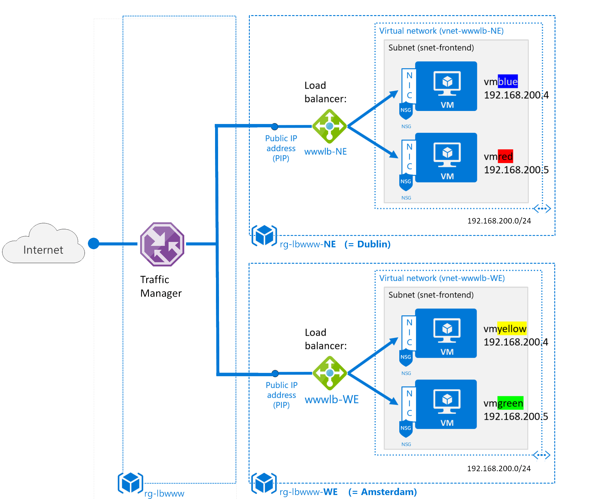
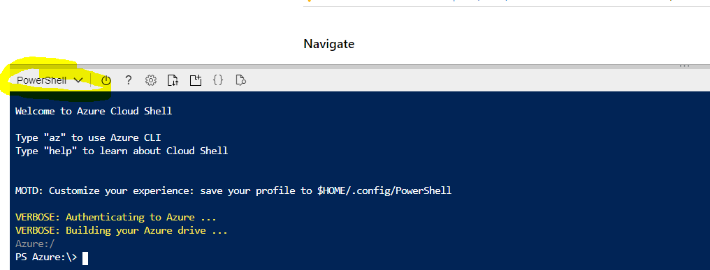
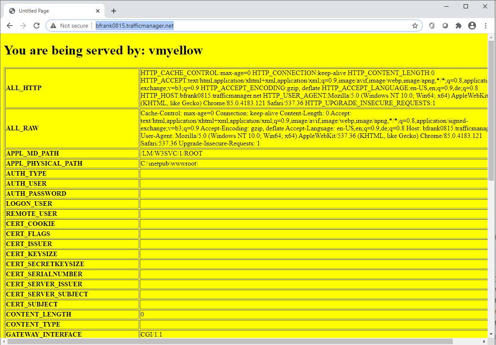
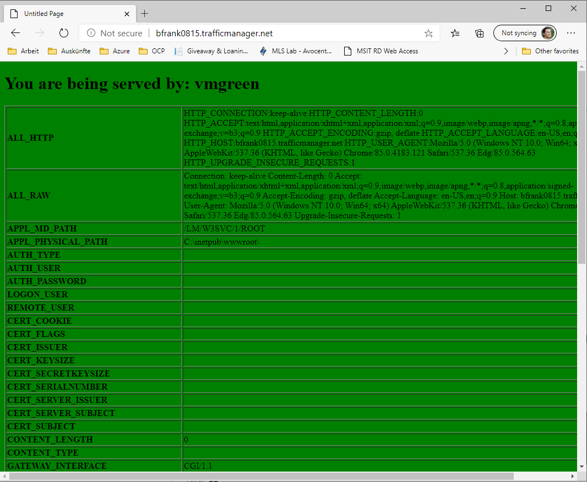
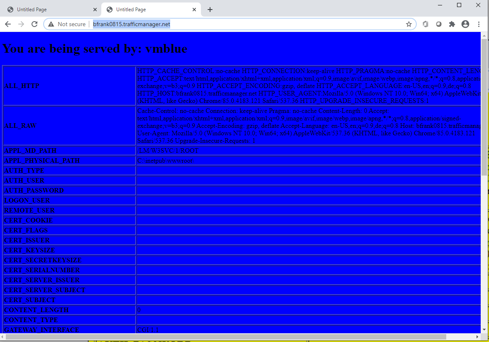
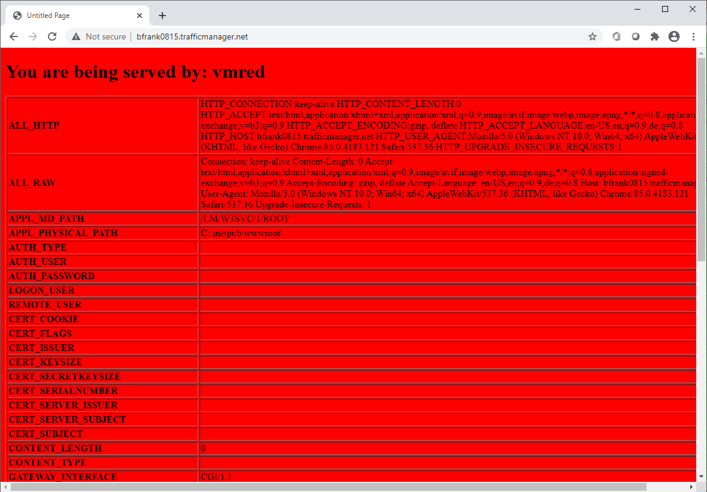

# Challenge 8: Networking - Distribute traffic across global Azure regions for optimal latency and availability using Traffic Manager

## Here is what you will learn 🎯

- How to setup Traffic Manager using the Azure portal.
- Setup 2 endpoints located in 2 Azure regions ('North Europe', 'West Europe')
- Configure load balancing based on clients origin geography.

Our **final architecture** will look like this:
  
  
To speed things up  you will first deploy the _start point_ and then you will add the external _Traffic Manager_.  

## Table of Contents

1. [Introduction Traffic Manager](#introduction-traffic-manager)
2. [Deploy the Starting Point](#deploy-the-starting-point)
3. [Deploy a Traffic Manager Instance](#deploy-a-traffic-manager-instance)
4. [Cleanup](#cleanup)

## Introduction Traffic Manager

The [Traffic Manager](https://docs.microsoft.com/azure/traffic-manager/traffic-manager-overview) uses DNS to load balance traffic to endpoints across Azure regions. It can help you to:

- **provide optimal latency** by serving clients from the nearest location.
- **increase availability** as it monitors its endpoints and provides failover.
- **redirect traffic** to online endpoints while others are in maintenance.

## Deploy the Starting Point

Now let's create some VMs using the 'Cloud Shell' in the Azure Portal. When being asked choose _PowerShell_ this time.

```
[Azure Portal] 
-> Click the 'Cloud Shell' symbol close to your login details on the right upper corner
```  

)  

:::tip
📝 The 'Cloud Shell' is an in-browser-accessible shell for managing Azure resources. It already has the required SDKs and tools installed to interact with Azure. You can use either Bash or PowerShell.  
:::  

The first time you use the 'Cloud Shell' you will be asked to setup a storage account e.g. to store files you have uploaded persistently. See the [documentation](https://docs.microsoft.com/azure/cloud-shell/persisting-shell-storage) formore details. 

```
[Azure Portal] -> Click 'Show advanced settings'
```

  

| Name | Value |
|---|---|
| _Subscription_  |  %Your subscription% |
| _Cloud Shell Region_  |  West Europe |
| _Resource Group_  |  rg-cloudshell |
| _Storage Account_  | %some unique value% |
| _File Share_  | cloudshell |

```
[Azure Portal] 
-> Create storage
```

Once successful your shell should appear at the bottom of the page:


  
To setup the starting point, copy & paste the following code into the Cloud Shell:

```PowerShell
#Creates some resource groups in different Azure regions
New-AzResourceGroup -Name 'rg-wwwlb-NE' -Location 'North Europe'
New-AzResourceGroup -Name 'rg-wwwlb-WE' -Location 'West Europe'
New-AzResourceGroup -Name 'rg-wwwlb' -Location 'North Europe'

$TemplateParameters = @{
    "adminUser" = [string]'demouser';
    "adminPassword" = [System.Security.SecureString](Read-Host -Prompt "adminUser password please" -AsSecureString);
    "vmNames" = [array]@('vmblue','vmred');
    "vmSize" = [string]'Standard_F2s_v2' # or 'Standard_B2s'
    "DiskSku" = [string]'StandardSSD_LRS'
}

```

Enter the password as asked. Then execute the deployment by adding 2 lines

```PowerShell
#will create some vms in different Azure regions in parallel
New-AzResourceGroupDeployment -Name 'NE' -TemplateUri "https://raw.githubusercontent.com/azuredevcollege/trainingdays/master/day1/challenge-11/challengestart/challengestart.json" -ResourceGroupName 'rg-wwwlb-NE' -TemplateParameterObject $TemplateParameters -AsJob

$TemplateParameters.vmNames = @('vmyellow','vmgreen')
New-AzResourceGroupDeployment -Name 'WE' -TemplateUri "https://raw.githubusercontent.com/azuredevcollege/trainingdays/master/day1/challenge-11/challengestart/challengestart.json" -ResourceGroupName 'rg-wwwlb-WE' -TemplateParameterObject $TemplateParameters -AsJob  

#wait until both deployments are done
get-job -State Running | wait-job  

```

## Deploy a Traffic Manager Instance

Add the [Traffic Manager Profile](https://docs.microsoft.com/azure/traffic-manager/quickstart-create-traffic-manager-profile#add-traffic-manager-endpoints) in resource group `rg-wwwlb` with a routing method based on e.g. performance. 
  
Add 2 endpoints to the traffic manager.

- Endpoint 1
  | Name | Value |
  |---|---|
  | _Type_  |  Azure endpoint |
  | _Name_  |  Dublin |
  | _Target resource type_  |  Public IP address |
  | _Public IP address_  |  pip-wwwlb-NE |

- Endpoint 2
  | Name | Value |
  |---|---|
  | _Type_  |  Azure endpoint |
  | _Name_  |  Amsterdam |
  | _Target resource type_  |  Public IP address |
  | _Public IP address_  |  pip-wwwlb-WE |

Now test by opening the traffic managers DNS name in your browser (you might need to open multiple different browsers to see some change):  

|    |    |   |   |
|---|---|---|---|
| vmyellow (Amsterdam)   | vmgreen (Amsterdam) |  vmblue (Dublin) | vmred (Dublin) |
  
## Cleanup

Delete the resource groups `rg-wwwlb....` or execute the following commands in the Cloud Shell:  

```PowerShell
Remove-AzResourceGroup -Name 'rg-wwwlb-NE' -Force -AsJob
Remove-AzResourceGroup -Name 'rg-wwwlb-WE' -Force -AsJob
Remove-AzResourceGroup -Name 'rg-wwwlb'    -Force -AsJob

Get-Job -State Running | Wait-Job
```

[◀ Previous challenge](../challenge-07/README.md) | [🔼 Day 1](../README.md) | [Next challenge ▶](../challenge-09/README.md)
