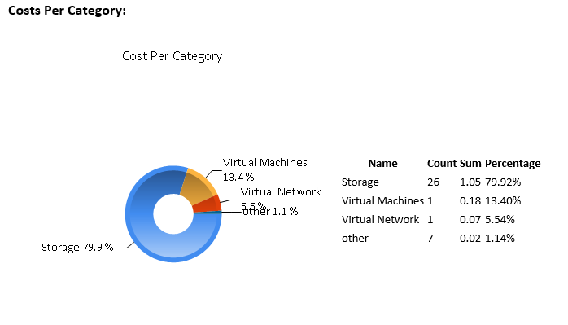
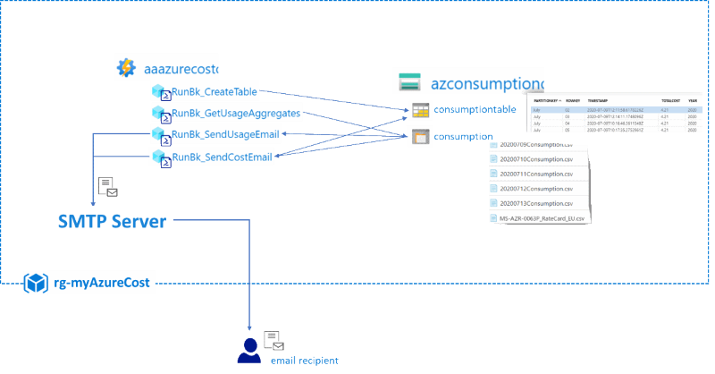
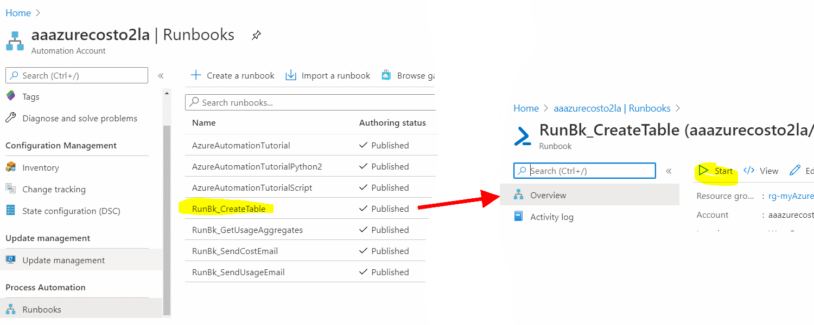
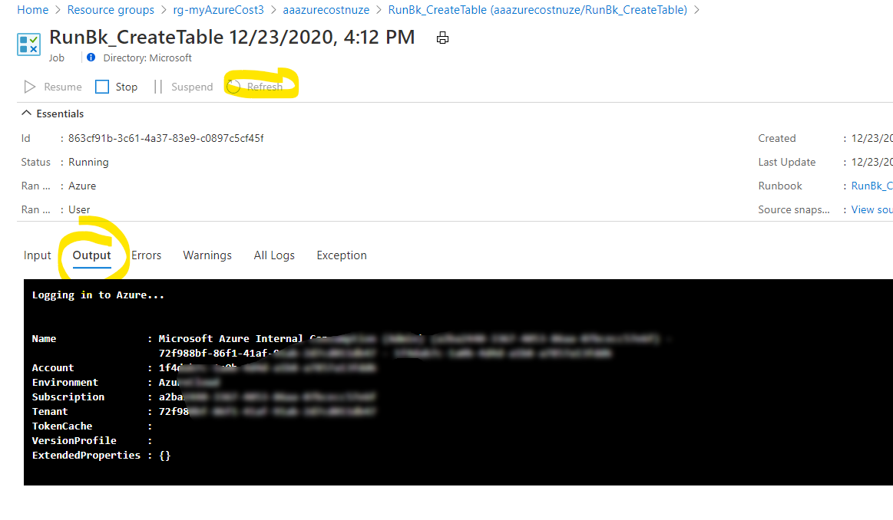
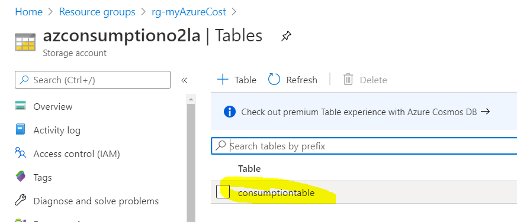
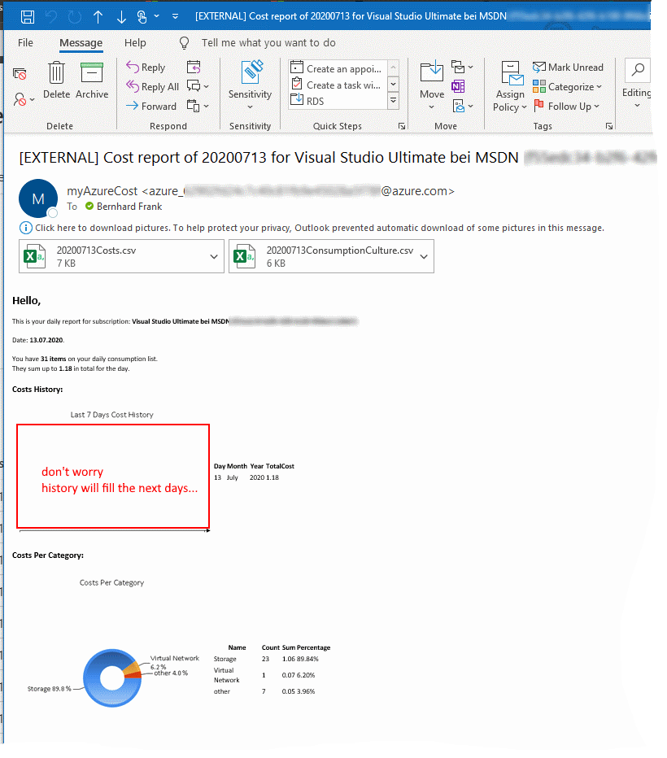

# Challenge 12: Azure Automation: Send me yesterday's Azure cost.
adapted from [MyAzure Cost](https://github.com/bfrankMS/myAzureCost) this will send you an email with your daily Azure cost report. 

## Here is what you will learn ##
- How to use an Azure Automation account with PowerShell runbooks.
- Get insights in your azure consumption for the day.  
  
## In your inbox you'll get a report each day of the usage and the costs:  
|  |  |
|--|--|
| your **daily cost email** looks similar to this | sample **cost report** (as .csv) |  
  
It'll also contain e.g.
|   |  |
|--|--|
| **historic data** (using an Azure table) | Cost Per Category |

## A look behind the curtain:
| Architecture |  |
|--|--|
| | <ul><li>ARM template for setup</li><li>azure automation for daily tasks</li><li>.net code to send email and analysis</li><li>a storage account to hold data</li></ul> |  

## Table Of Contents ##
1. [Deploy the ARM Template](#Deploy-the-ARM-Template)  
2. [Create an Azure Run As Account](#Create-an-Azure-Run-As-Account)  
3. [Create a Table and see AA Variables Section](#Create-a-Table-and-see-AA-Variables-Section)  
4. [Upload a price sheet](#Upload-a-price-sheet)  
5. [Run a report](#Run-a-report) 

# Deploy the ARM Template 
**Click** on the 
<a href="https://portal.azure.com/#create/Microsoft.Template/uri/https%3A%2F%2Fraw.githubusercontent.com%2Fazuredevcollege%2Ftrainingdays%2Fmaster%2Fday1%2Fchallenge-12%2Fchallengestart%2Fchallengestart.json"></a>
button.  
| Name | Values  |
|---|---|
| _Region_ | **West Europe** | 
| _Resource group_ | rg-myAzureCost |
| _O_my Azure Cost Smtp Recipient_ | _%the destination email address%_ |
| _O_my Azure Cost Smtp Sender_ | _%the source email / sender address%_ |
| _O_my Azure Cost Smtp Sender Password_ | _%the email sender's smtp pwd%_ |
| _O_my Azure Cost Smtp Server_ | %the senders smtp server% e.g. _smtp.office365.com_ |
| _O_my Azure Cost Smtp Server SSL Port_ | e.g. 587 for smtp.office365.com |
| _O_base Time_ | **_don't touch_** |  

**Deployment should take < 10mins.**  
  
# Create an Azure Run As Account
For Azure Automation (AA) to perform tasks in the current subscription (e.g. gather usage information) needs an account a so called Run As Account. This account is a so called service principal (SP) which has permissions in the current subscription. To create this SP and connect it to AA please do the following:  
```
[Azure Portal] -> Resource Groups -> "rg-AzureCost" -> 'aaazurecost...' (Your Automation Account) -> Account Settings -> Run as accounts
```  
Hit **Create**, **wait** and **watch** the account being created:  
  
Note that **this account has an _'expiration date'_**.  
  
## [Optional] - See how the AA Run As account manifests itself throughout AAD and your subscription
|  |  |
|--|--|
| `[Azure Portal] -> Azure Active Directory -> App registrations` |  `[Azure Portal] -> Subscriptions -> Access Control (IAM) -> View role assignments -> 'View'` |
  
# Create a Table and see AA Variables Section
Storing settings for Azure Automation (AA) e.g. account information, locale settings,... AA credentials and AA variables can be used.
In our myAzureCost sample we use:  
- **AA Credentials** to store the **sender's account** details:  
- **AA Variables** to hold **settings** **needed** for the AA **Runbooks** that do the usage & cost calculation
- **one Azure table** to **store** processed data e.g. **daily cost history**.

## 1. Inspect the variables
```
[Azure Portal] -> Resource Groups -> "rg-AzureCost" -> 'aaazurecost...' (Your Automation Account) -> Variables
```

| Variable **Name** | **Description** |
|---|---|
| myAzureCostAzureSubscriptionId | _**GUID of your subscription** to calculate the usage for_ |
| myAzureCostCultureInfo | _e.g. **de-DE** for reports (CSVs) to come with numbers, date formatted for Germans_  |
| myAzureCostPriceSheetURI | _a URI pointing to a CSV with pricing information about azure resources - we'll take care of this soon_ |
| myAzureCostSAContainer | _where your daily reports are stored - pls don't change_|
| myAzureCostSATable | _table name to hold your daily usage costs for 'history view'_ |
| myAzureCostSmtpRecipient | _email recipient of the report_  |
| myAzureCostStorageAccountName | _where your daily reports are stored_ |


## 2. Create the azure table to hold your daily usage costs for 'history view'
There is a **AA Runbook that will create an azure table for us - we only need to start it**:  
```
[Azure Portal] -> Resource Groups -> "rg-AzureCost" -> 'aaazurecost...' (Your Automation Account) -> "Process Automation" Runbooks -> RunBk_CreateTable -> Start
```  
  

This runbook will execute PowerShell code that creates an Azure table using the AA Runas Account.  
A runbook is a piece of code (here PowerShell) that is being executed in an Azure runtime environment. It'll login to your subscription as the Run as Account and perform tasks against your subscription. You can follow the execution by:  
   
Once completed you should have a new table in:  
```
[Azure Portal] -> Resource Groups -> "rg-AzureCost" -> 'azconsumption...' (Your Storage Account) -> Tables
```  
  

# Upload a price sheet
**myAzureCost** can gather your daily consumption data. Additionally it **can** also **estimate** the **costs** that **your consumption will pose**. To do this **you need to upload a price sheet** with your specific azure rates. The price sheet needs to be **formatted as CSV** (en-us) and contain at least 2 columns: **MeterID** and **MeterRates**.

> **Annotation**: **Every azure resource in each region has a MeterID** (GUID) that uniquely identifies it. When you query the usage of an azure resource the MeterID is delivered with it. **The MeterID translates to a price** -> MeterRates - e.g.:  

| MeterId	| MeterName	| MeterRates |	MeterRegion |
|--|--|--|--|
| 793843d0-d081-4934-9782-ee92505c56cb |D2 v3|0.1011..|	EU West |  

>**Note**: **Price information for Azure resources** is accessible through the [**RateCard API**](https://docs.microsoft.com/en-us/azure/cost-management-billing/manage/usage-rate-card-overview#azure-resource-ratecard-api-preview).  
[optional] If you want to dig into some details go [here for a sample](https://github.com/bfrankMS/myAzureCost/tree/master/SetupChallenges/GenerateAPriceSheet)

**I'll provide a sample price list for you**.  [day1\challenge-12\challengestart\Sample_PriceSheet_EN.csv](./day1/challenge-12/challengestart/Sample_PriceSheet_EN.csv)

Upload this to your storage account:
```
[Azure Portal] -> Resource Groups -> "rg-AzureCost" -> 'azconsumption...' (Your Storage Account) -> Containers -> 'consumption'
```

  

Generate a URI with a Read only SAS token for this file (when you have done challenge6 you should know how to do this.)

Copy & paste the URI into the AA variable 
And your **AA variable 'myAzureCostPriceSheetURI' contains a URI to the pricesheet**:  
```
[Azure Portal] -> Resource Groups -> "rg-AzureCost" -> 'aaazurecost...' (Your Automation Account) -> Variables
```  
  

# Run a report
Here you'll **kick off the runbooks to test your myAzureCost implementation**. You'll also might **want** to **link** the **runbook** to a **schedule** to receive a **daily report**.  

## Gather your daily usage Runbook
Start the **AA Runbook** that will **gather** the azure **usage for the previous day** it'll **save** it as **CSV** (en-us) in the **storage account** - **Leave the MYDATE parameter empty.**:
```
[Azure Portal] -> Resource Groups -> "rg-AzureCost" -> 'aaazurecost...' (Your Automation Account) -> "Process Automation" Runbooks -> RunBk_GetUsageAggregates -> Start
```  
>**Note**: The **optional** MYDATE parameter takes a short en-us formatted time string MM/dd/yyyy -> e.g. '07/13/2020'

Once the **runbooks is completed** you should find a **result report in your storage account**:  
```
[Azure Portal] -> Resource Groups -> "rg-AzureCost" -> 'azconsumption...' (Your Storage Account) -> Containers -> 'consumption'
```  
  

## Send cost report email
As the previous runbook has calculated the azure consumpution for a day and stored it on our storage account. We can now start the **AA Runbook** that will do a **cost estimation** and **send** it as email the recipient - **Leave the MYDATE parameter empty.**: 
```
[Azure Portal] -> Resource Groups -> "rg-AzureCost" -> 'aaazurecost...' (Your Automation Account) -> "Process Automation" Runbooks -> RunBk_SendCostEmail -> Start
```  
>**Note**: The **optional** MYDATE parameter takes a short en-us formatted time string MM/dd/yyyy -> e.g. '07/13/2020'  

Once the **runbooks is completed** you should receive an **email** with the **costs & graphs** calculated and some reports attached as CSV:  
  

**Congratulations!**
**and wait for tomorrows email :-)**

