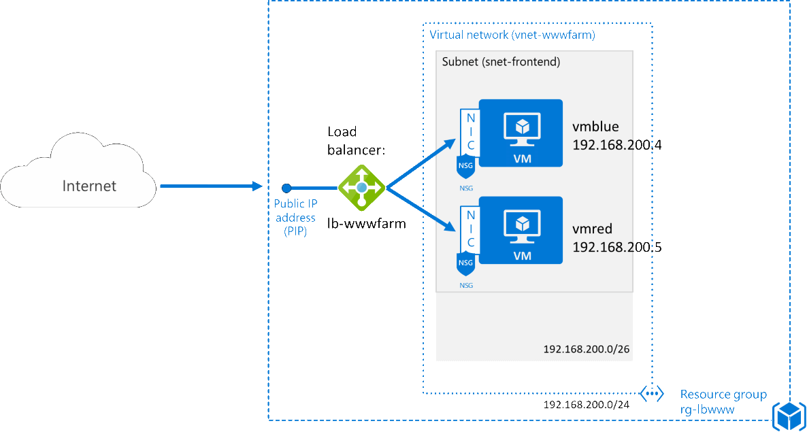
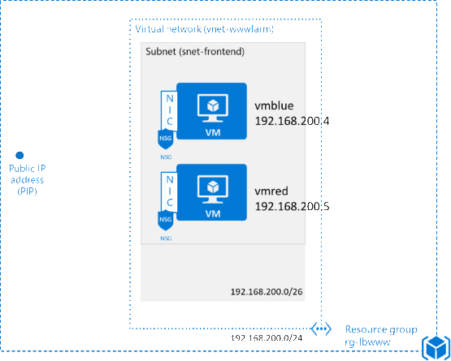
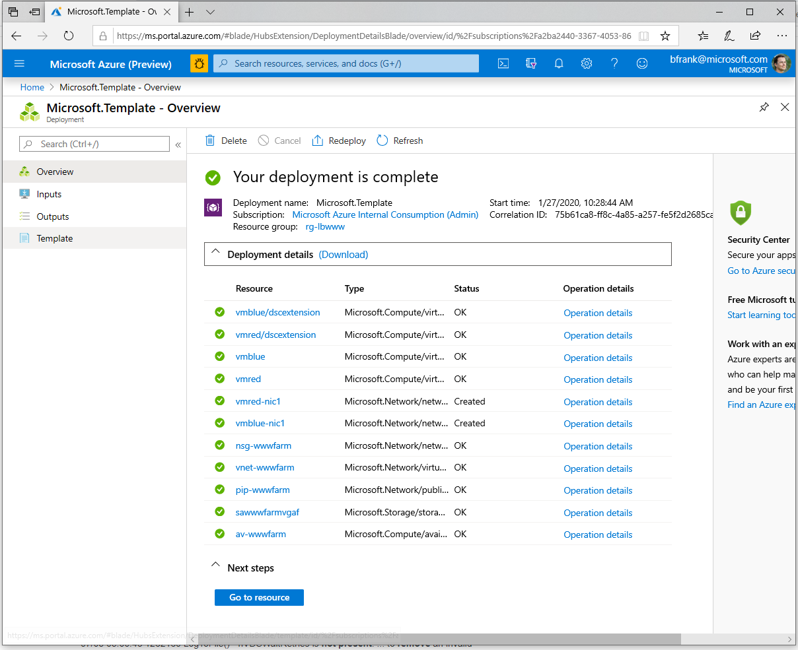

# Challenge 7: Networking: Loadbalancing your WWW Server Farm

[back](../../README.md)

## Here is what you will learn ##

- How to load balance http traffic to 2 webserver vms 
- Create an external load balancer using the azure portal
- Learn to know the requirements for an azure external loadbalancer and how to configure it.

Our **final architecture** should look like this: 
  
At **first** you will deploy the _start environment_ and in the **second** step you will add the external loadbalancer.

## 1. Deploy the 'starting point' ##
In this directory there is an ARM-template which includes 2 web server vms and its requirements (networking, disks,...).:  

  

**Deploy this scenario** into your subscription by clicking on the 
<a href="https://portal.azure.com/#create/Microsoft.Template/uri/https%3A%2F%2Fraw.githubusercontent.com%2FCSA-OCP-GER%2Fazure-developer-college%2Fmaster%2Fday1%2Fchallenges%2FChallenge7%2FChallenge7Start.json"></a>
button.  

| Name | Value |
|---|---|
| Resource group  |  **(new)** rg-lbwww |
| Location  |  **North Europe** |   
| Admin user  |  demouser |   
| Admin password  |  **_some complex value_** |   
| Vm Size  |  **Standard_B2s**  or try e.g. **Standard_F2s_v2**|   
| Disk Sku  |  StandardSSD_LRS |  
  
The result should look similar to this:  
  

## 2. Deploy the load balancer ##
Now let's **add an external azure loadbalancer** in front of the 2 parallel web server machines.  
```
[Azure Portal] -> '+' Add -> Search the marketplace for 'Load balancer'
```  

| Name | Value |
|---|---|
| Resource group  |  rg-lbwww |
| Name  | **lb-wwwfarm** |
| Region  |  **North Europe** |   
| Type  |  Public |   
| SKU  |  Basic |   
| Public IP address  |  **Use existing**|   
| Choose public IP address  |  pip-wwwfarm |  
  
> **Note**: To **get your loadbalancer working** you need to **configure** the following:
> - ... [**a backend pool**](./lbconfig01.PNG) that contains the 'endpoints' i.e. the vms to which the traffic will be routed.
> - ... [**a health probe**](./lbconfig02.PNG) for TCP port 80 (http) to check if the endpoints are 'responsive' to web requests
> - ... [**a lb rule**](./lbconfig03.PNG) to forward incoming traffic (TCP port 80) on lb's frontend IP address to backend pool (TCP port 80)  

**Finally**  
To **check** if your **lb is working** do a **http://_%PIP of your lb%_**  
Depending which endpoint serves your request the **result should something like**:  
<a href="lbresult1.png"></a>
<a href="lbresult2.png"></a>

## [optional] Test server outage ##
Stop one vm and verifiy if the webpage is still served.  
Restart the vm and check if the lb notices it and rebalances load.

## Cleanup ##
**Delete the resource group** _rg-lbwww_

[back](../../README.md)