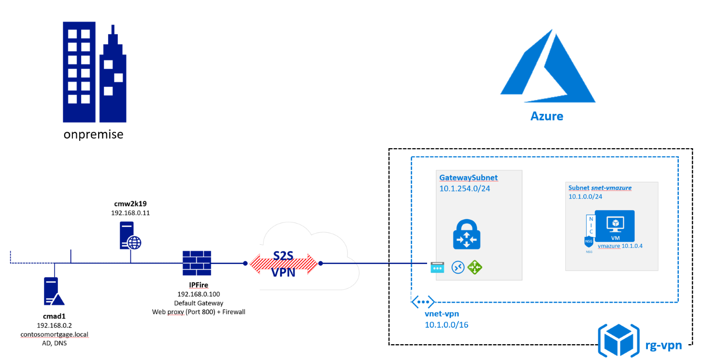
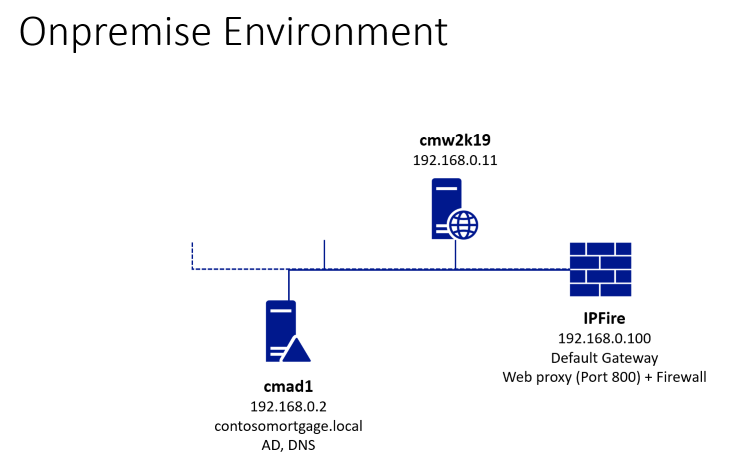
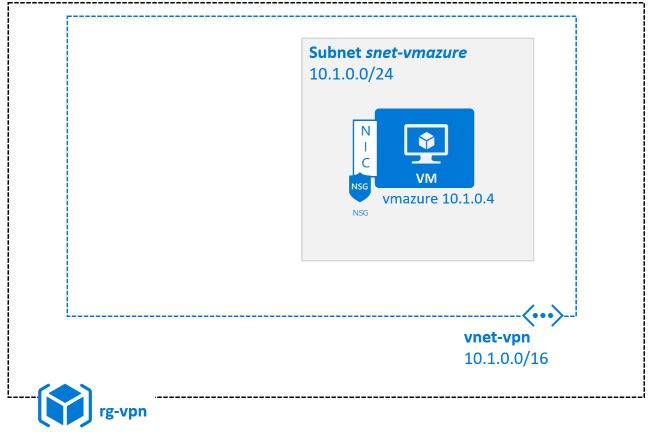
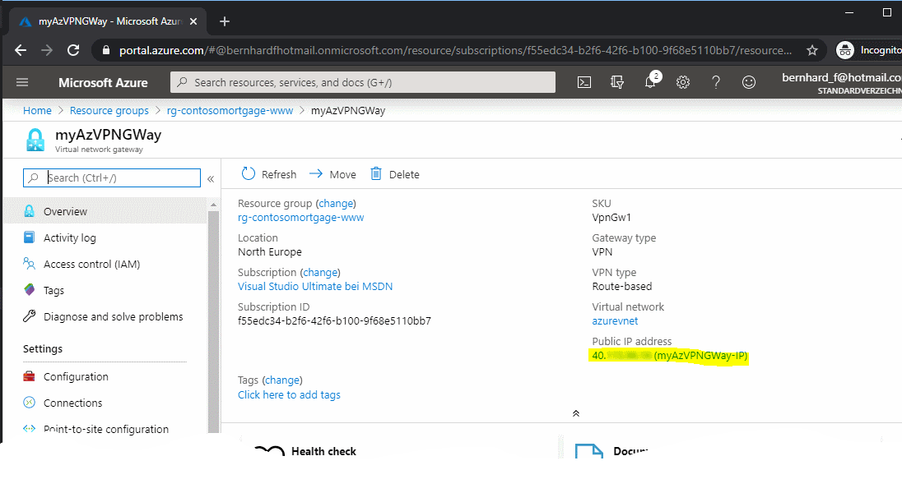
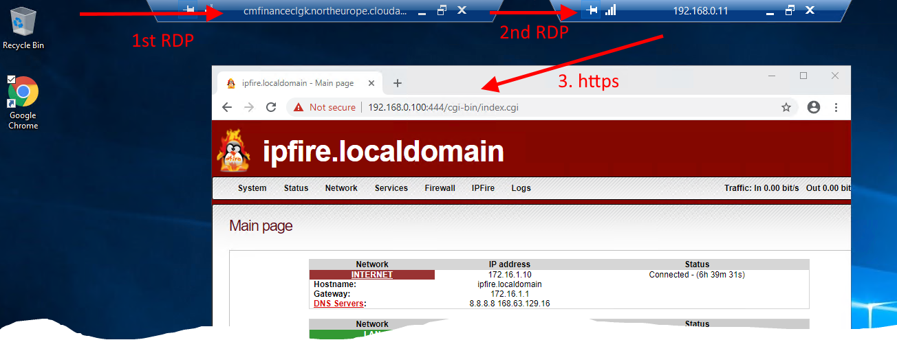
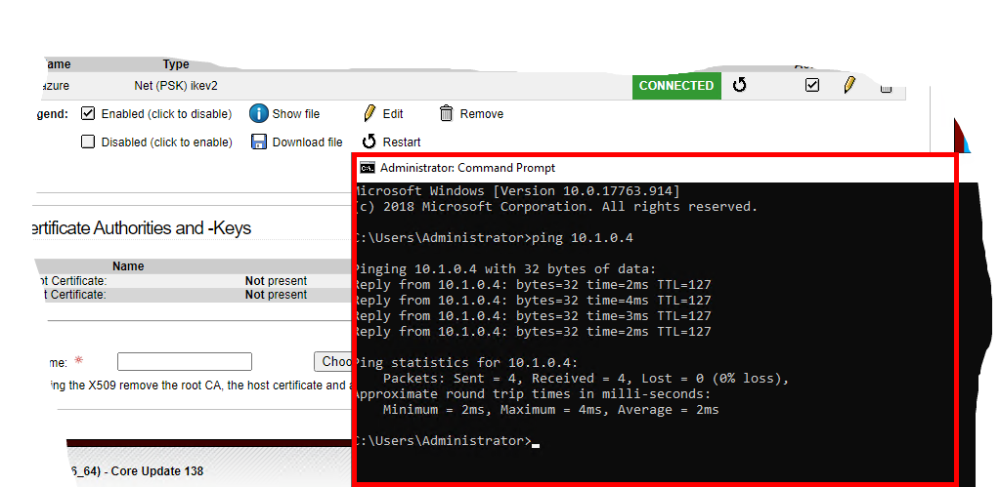

# Challenge 8: Networking - VPN: Enabling Hybrid Networking with a Site-2-Site (Onprem to Azure) VPN Connection
[back](../../README.md)  

## Here is what you will learn ##
What it takes to implement a VPN tunnel between your onprem firewall <---VPN S2S---> Azure  
**Our final architecture will look like this**:  



## An Azure S2S VPN requires: ##
**Azure**
- VPN Gateway in its own subnet.
- VPN GWay requires a dynamic Public IP
- Settings how the onprem VPN / FWall is to be contacted (aka LocalNetworkGateway)
- Connection Objekt with e.g. shared key

**onprem**
- A supported device Azure can talk to.

## 1. Starting Point ##
Your **instructor** (_ask him for the details_) **has setup for you the onprem** part:  


**Click** on the 
<a href="https://portal.azure.com/#create/Microsoft.Template/uri/https%3A%2F%2Fraw.githubusercontent.com%2FCSA-OCP-GER%2Fazure-developer-college%2Fmaster%2Fday1%2Fchallenges%2FChallenge8%2FChallenge8Start.json"></a>
button **you will get some Azure resources to start** with:  


| Name | Value |
|---|---|
| Resource group  |  **(new)** rg-vpn |
| Location  |  **North Europe** |   
| Admin user  |  demouser |   
| Admin password  |  **_some complex value_** |   
| Vm Size  |  **Standard_B2s**  or try e.g. **Standard_F2s_v2**|   
| Disk Sku  |  StandardSSD_LRS |  


## 2. Create a VPN Gateway and a Public IP using the portal ##
```
[Azure Portal] -> '+ Create a resource' -> type "Virtual network gateway"
  -> Create
```
**Use the following parameter values**:  

| Parameter Name | Values  |
|---|---|
| Name  |  **myAzVPNGWay** |  
| Region| **North Europe** |
| Gateway type| VPN |
| VPN Type| Route based |
| Gateway type| VPN |
| SKU| VpnGw1 |
| Virtual Network | **vnet-vpn** |
| Gateway subnet address range | e.g. **10.1.254.192/26** |
| Public IP address | **Create new** | 
| Public IP address name | **myAzVPNGWay-IP** |
| Enable active-active mode | Disabled |
| Configure BGP | Disabled |

**The GW setup will take approx 30 mins. to create** -> come back later (e.g. in the meantime you can do the next lab :-))...  
When your **GW has** been assigned a **public IP** address then you know **it is online**.  


## 3. [Azure] Create a Local Network Gateway ##
The purpose of this task is to tell azure how to contact the onpremise firewall:  
```
[Azure Portal] -> '+ Add' -> type 'Local network gateway' -> Create
```
| Parameter Name | Values  |
|---|---|
| Name  |  **l-gw-ipfire** |  
| IP address| **_%external IP of your Firewall - ask instructor%_**|
| Address Space | **192.168.0.0/24** |
| Resource Group | **rg-vpn** |
| Location | **North Europe** |

## 4. [Azure] Create a connection object with shared key ##
```
[Azure Portal] -> Resource Groups -> rg-vpn -> myAzVPNGWay
 -> Connections -> 
``` 
| Parameter Name | Values  |
|---|---|
| Name  |  **azure-to-onprem** |  
| Connection Type | **Site-to-Site (IPSec)** |
| Virtual Network Gateway| **myAzVPNGWay** |
| Local Network Gateway| **l-gw-ipfire** |
| Shared Key| *********** (your choice here) |
| IKE Protocol | IKEv2 |
| Resource Group | rg-vpn |
| Location | North Europe |

## 5. [Onpremise] Configure your onpremise VPN counterpart e.g. ipfire ##
**We now need to configure the other end of the vpn tunnel**: **_the onpremise firewall_** in our case IPFire.  
1. For this **use the remote desktop client to RDP into your onpremise environment**:  
  

**Internet -- 1st RDP--> onprem Lab (HyperV Host) -- 2nd RDP--> cmW2k19** (192.168.0.11) **--https-->IPFire** (192.168.0.100)  


| Parameter Name | Values  |
|---|---|
| connect to</br>1st RDP  |  <ul><li><b>IP</b>: %ask instructor%</li><li><b>username</b>: demouser</li><li><b>password</b>: %ask instructor%</li></ul> |  
| within this session connect to</br>2nd RDP  |  <ul><li><b>IP</b>: 192.168.0.11</li><li><b>username</b>: administrator</li><li><b>password</b>: %ask instructor%</li></ul>|
| open browser an do https</br>( ignore certificate warning -> proceed)  |  <ul><li><b>URI</b>: https://192.168.0.100:444</li><li><b>username</b>: admin</li><li><b>password</b>: %ask instructor%</li></ul>   |  
  
>Note: **_ask your instructor for connection details_**  

2. Add the VPN details
```
   IPFire -> Services -> IPSec -> 'Connection Status and -Control' -> Add
```


```
   "Net-to-Net Virtual Private Network" -> Add
```


| Parameter Name | Values  |
|---|---|
| Name | **azure** |
| Local subnet | 192.168.0.0/255.255.255.0 |
| Remote Host/IP  |  _**%myAzVPNGWay IP Address%**_  (Azure Portal -> VPN Gateway -> Public IP address) | 
| Remote subnet | **_%Address Range of the virtual network in azure%_** (in our case 10.1.0.0/255.255.0.0) |
| Use a pre-shared key | **_%Shared Key you used above%_** (Azure Portal -> VPN Gateway -> Connections -> Shared Key)|

 
**Save**

**Click on the pencil symbol and choose 'Advanced'**:
 

Select the **following algorithms / suites for the connection**:
  
**select Always on** then **Save**

**Tick checkbox to enable connection** - connection status should go to green:
 

**Now let's ping your azure vm** (e.g. vmazure) under its private ip (probably: 10.1.0.4) from onpremise:  
 
Do you receive a response?  

## [Optional] Apply a more secure cipher for the VPN tunnel.
**The following ARM Template ([VPNMoreSecureConnPolicy.json](./VPNMoreSecureConnPolicy.json)) defines a more secure cipher / algorithm to use for the VPN tunnel.**  
| Parameter Name | Values  |
|---|---|
| ipsecEncryption | AES256 |
| ipsecIntegrity | SHA256 |
| ikeEncryption | AES256 |
| ikeIntegrity | SHA384 |
| dhGroup | DHGroup14 |
| pfsGroup | PFS2048 |  

To deploy click the
<a href="https://portal.azure.com/#create/Microsoft.Template/uri/https%3A%2F%2Fraw.githubusercontent.com%2FCSA-OCP-GER%2Fazure-developer-college%2Fmaster%2Fday1%2Fchallenges%2FChallenge8%2FVPNMoreSecureConnPolicy.json"></a>
button and select correct parameters to apply new ciphers to your current connection.  
However you also need to apply this to the onprem firewall:  
 

## Cleanup ##
**Delete the resource group** _rg-vpn_

[back](../../README.md) 
