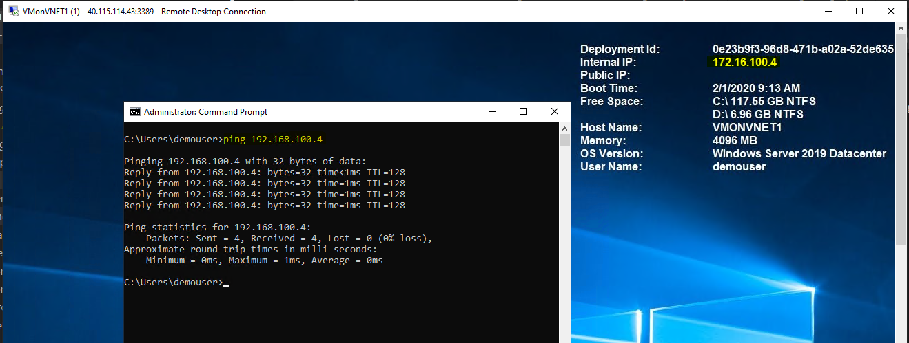

# Challenge 9: Networking: Connect Two Virtual Networks Using Azure VNET Peering

[back](../../README.md)

## Here is what you will learn ##
- How to connect 2 virtual networks with Azure VNET Peering

Our **final architecture** should look like this: 
  
At **first** you will deploy the _start environment_ and in the **second** step you will implement the **peering**.

## 1. Deploy the 'starting point' ##
In this directory there is an ARM-template which 2 virtual networks and 2 vms and its requirements (networking, disks,...).:  

**Deploy this scenario** into your subscription by clicking on the 
<a href="https://portal.azure.com/#create/Microsoft.Template/uri/https%3A%2F%2Fraw.githubusercontent.com%2FCSA-OCP-GER%2Fazure-developer-college%2Fmaster%2Fday1%2Fchallenges%2FChallenge9%2FChallenge9Start.json"></a>
button.  

| Name | Value |
|---|---|
| Resource group  |  **(new)** rg-VNETPeering |
| Location  |  **North Europe** |   
| Admin user  |  demouser |   
| Admin password  |  **_some complex value_** |   
| Vm Size  |  **Standard_B2s**  or try e.g. **Standard_F2s_v2**|   
| Disk Sku  |  StandardSSD_LRS |  
  
The result should look similar to this:  
  

## 2. Implement the VNET peering ##
You need to create the peerings on each virtual network:  
- VNET1 ---> VNET2
- VNET2 ---> VNET1  

The wizard in the portal is _smart enough_ to let create 2 peerings in a single step. Select e.g. VNET1 as starting point:
```
[Azure Portal] -> Resource Groups -> "rg-VNETPeering" -> "VNET1" -> Peerings -> Add
```  

| Name | Value |
|---|---|
| **This** virtual network - Peering link name|  **VNET1-to-VNET2** |
| Virtual Network (_to peer with_) | **VNET2** |
| **Remote** virtual network - Peering link name  |  **VNET2-to-VNET1** |   


  
## 3. Check if the peering works ##
Connect to one vm through RDP using its public ip address: e.g. VMonVNET1 through 
```
[Azure Portal] -> Virtual Machines -> "VMonVNET1" -> Connect
```
**User**: demouser  
**PWD**: %your deployment password%  
  

**Open a command prompt and ping the other vm** using its internal IP: In our case VMonVNET2 - should be 192.168.100.4:  


## Cleanup ##
**Delete the resource group** _rg-VNETPeering_

[back](../../README.md)