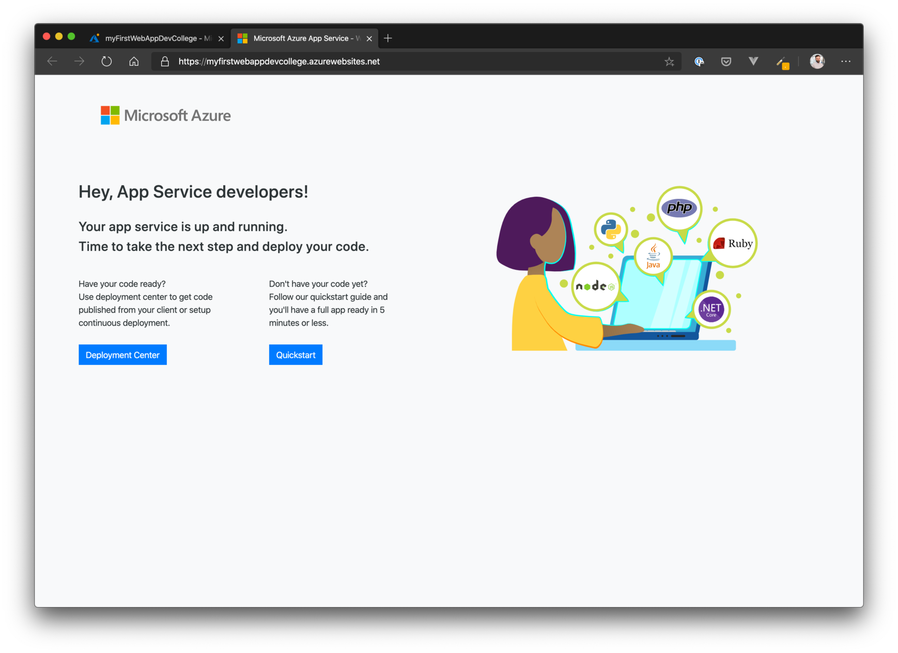
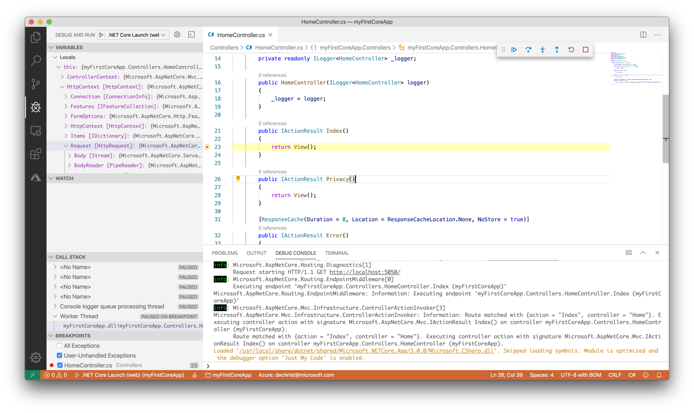
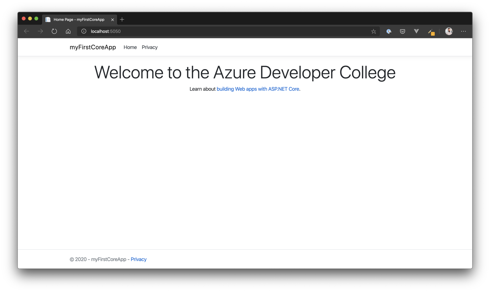
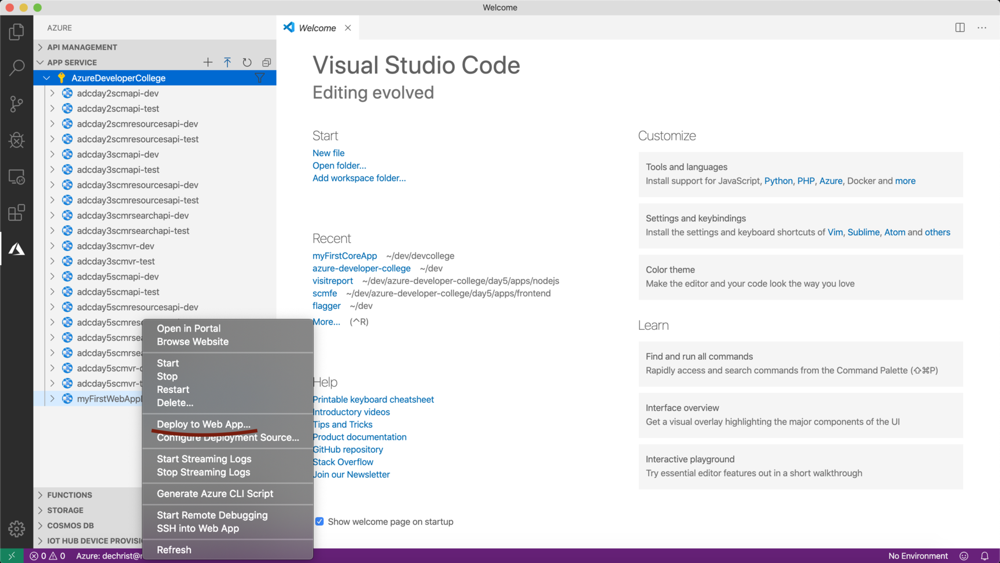
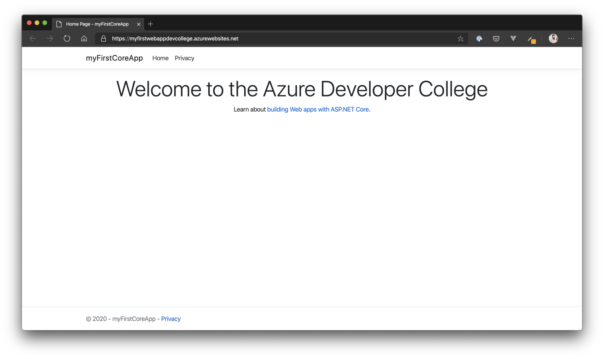
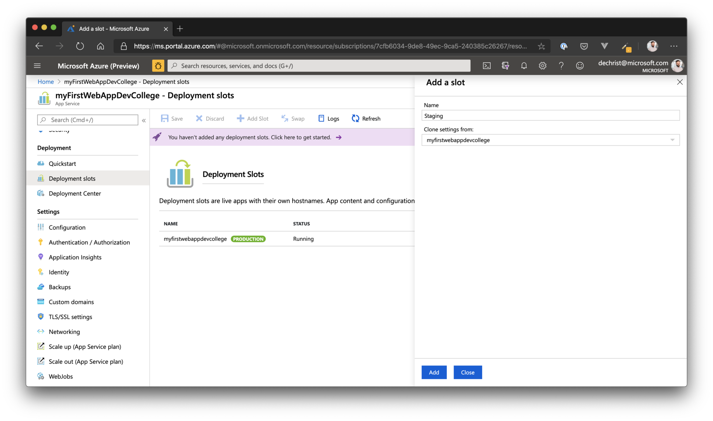
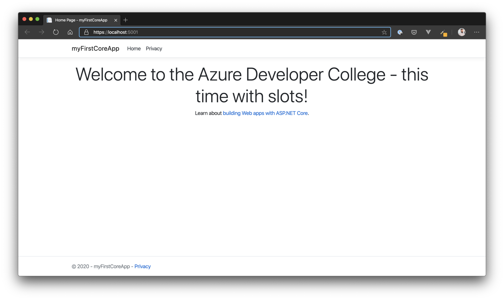
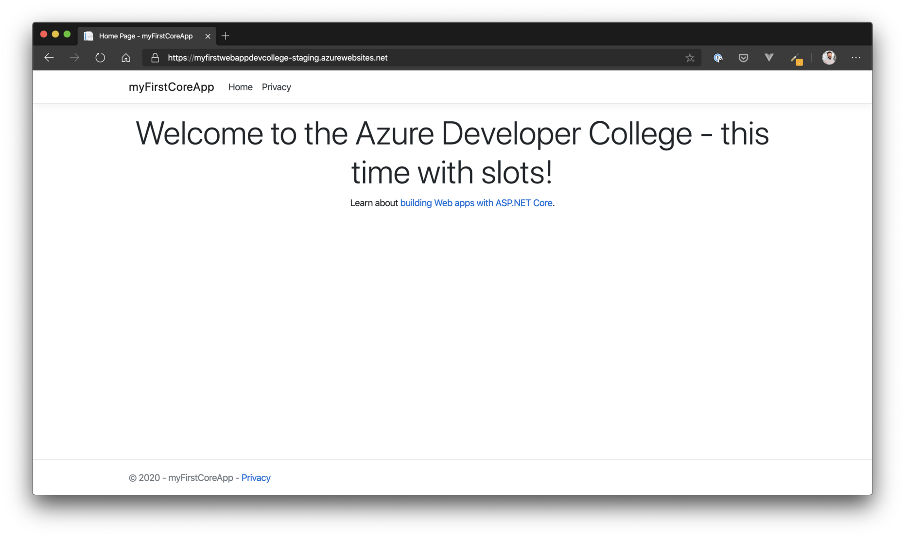
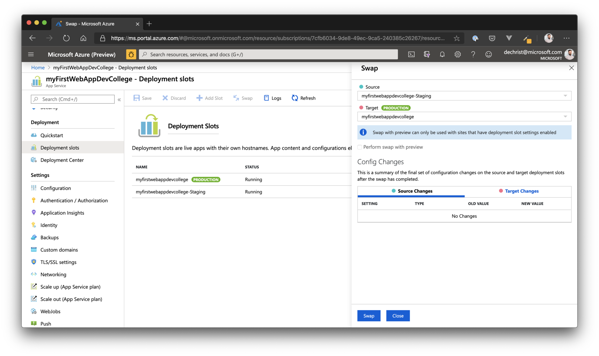

# Challenge 1: Azure Web Apps

⏲️ *Est. time to complete: 45 min.* ⏲️

## Here is what you will learn 🎯

In this challenge you will learn how to:

- create an AppService Plan / Azure Web App
- create and deploy an ASP.NET Core Web App to Azure
- create and configure WebApp slots
- use slots to deploy new versions of your web application with near-zero downtime

## Table Of Contents

1. [Create an Azure Web App](#create-an-azure-web-app)
2. [Create a Sample Application](#create-a-sample-application)
3. [Deploy the Sample App to Azure](#deploy-the-sample-app-to-azure)
4. [Working with Deployment Slots (optional - but recommended)](#working-with-deployment-slots-optional-but-recommended)
5. [Azure Samples](#azure-samples)
6. [Cleanup](#cleanup)

## Create an Azure Web App

You have two options to create an Azure Web App: use either the *Azure Portal* or the *Azure Command Line Interface*. We will walk you through both options in the following sections.

:::tip
📝 You can also work with both, just make sure to use different names when creating the web app the second time!
:::

### Option 1: Azure Portal

Go to the Azure Portal and click on **"Create a resource"**, in the next view choose **"Web App"**.


When you reached the **"Create Web App"** wizard, follow the steps below:

| Name               | Value                                                                  |
| ------------------ | ---------------------------------------------------------------------- |
| *Subscription*     | Choose the correct subscription                                        |
| *Resource Group*   | create a new one and name it "myFirstWebApps-rg"                       |
| *Instance Details* | Enter a name for your Web App (this must be a _globally unique_ name!) |
| *Publish*          | Code                                                                   |
| *Runtime*          | .NET Core 3.1 (LTS)                                                    |
| *Operation System* | Windows                                                                |
| *Region*           | West Europe                                                            |
| *App Service Plan* | Create a new plan and choose S! for `SKU and Size`                     |

:::tip
📝 To get familiar with other sizes, click **"Change size"** in the App Service Plan section.
:::

Click **"Next: Monitoring"**.

| Name          | Value                                               |
| ------------- | --------------------------------------------------- |
| *AppInsights* | Enable AppInsights and create a new instance for it |

When done, proceed to the **"Review + create"** screen.


Check that all the properties are filled with the expected values and click **"Create"**.

When the deployment has finished, got to the resource and get familiar with all the configuration options discussed in the introduction talk.


Open the web app in your browser.



### Option 2: Azure CLI

If you have created the web application already with option 1, go to the portal and delete the resource group including all the newly created resources (you have to wait until it has finished, before proceeding). We will be creating the exact same resources now with the Azure CLI.

:::tip
📝 You can check the results of each command in the Portal.
:::

First, let's create the resource group:

```shell
$ az group create --name myFirstWebApps-rg --location westeurope

{
  "id": "/subscriptions/xxxxxxxx-xxxx-xxxx-xxxx-xxxxxxxxxxxx/resourceGroups/myFirstWebApps-rg",
  "location": "westeurope",
  "managedBy": null,
  "name": "myFirstWebApps-rg",
  "properties": {
    "provisioningState": "Succeeded"
  },
  "tags": null,
  "type": "Microsoft.Resources/resourceGroups"
}
```

Next, add an App Service Plan:

```shell
$ az appservice plan create -g myFirstWebApps-rg -n myFirstWebAppsPlan --sku S1

{
  "freeOfferExpirationTime": null,
  "geoRegion": "West Europe",
  "hostingEnvironmentProfile": null,
  "hyperV": false,
  "id": "/subscriptions/xxxxxxxx-xxxx-xxxx-xxxx-xxxxxxxxxxxx/resourceGroups/myFirstWebApps-rg/providers/Microsoft.Web/serverfarms/myFirstWebAppsPlan",
  "isSpot": false,
  "isXenon": false,
  "kind": "app",
  "location": "West Europe",
  "maximumElasticWorkerCount": 1,
  "maximumNumberOfWorkers": 10,
  "name": "myFirstWebAppsPlan",
  "numberOfSites": 0,
  "perSiteScaling": false,
  "provisioningState": "Succeeded",
  "reserved": false,
  "resourceGroup": "myFirstWebApps-rg",
  "sku": {
    "capabilities": null,
    "capacity": 1,
    "family": "S",
    "locations": null,
    "name": "S1",
    "size": "S1",
    "skuCapacity": null,
    "tier": "Standard"
  },
  "spotExpirationTime": null,
  "status": "Ready",
  "subscription": "xxxxxxxx-xxxx-xxxx-xxxx-xxxxxxxxxxxx",
  "tags": null,
  "targetWorkerCount": 0,
  "targetWorkerSizeId": 0,
  "type": "Microsoft.Web/serverfarms",
  "workerTierName": null
}
```

When the App Service Plan has been created, we can add the Web App:

```shell
$ az webapp create -g myFirstWebApps-rg -p myFirstWebAppsPlan -n myFirstWebAppDevCollege

{
  "availabilityState": "Normal",
  "clientAffinityEnabled": true,
  "clientCertEnabled": false,
  "clientCertExclusionPaths": null,
  "cloningInfo": null,
  "containerSize": 0,
  "dailyMemoryTimeQuota": 0,
  "defaultHostName": "myfirstwebappdevcollege.azurewebsites.net",
  "enabled": true,
  "enabledHostNames": [
    "myfirstwebappdevcollege.azurewebsites.net",
    "myfirstwebappdevcollege.scm.azurewebsites.net"
  ],
  "ftpPublishingUrl": "ftp://waws-prod-am2-217.ftp.azurewebsites.windows.net/site/wwwroot",
  "geoDistributions": null,
  "hostNameSslStates": [
    {
      "hostType": "Standard",
      "ipBasedSslResult": null,
      "ipBasedSslState": "NotConfigured",
      "name": "myfirstwebappdevcollege.azurewebsites.net",
      "sslState": "Disabled",
      "thumbprint": null,
      "toUpdate": null,
      "toUpdateIpBasedSsl": null,
      "virtualIp": null
    },
    {
      "hostType": "Repository",
      "ipBasedSslResult": null,
      "ipBasedSslState": "NotConfigured",
      "name": "myfirstwebappdevcollege.scm.azurewebsites.net",
      "sslState": "Disabled",
      "thumbprint": null,
      "toUpdate": null,
      "toUpdateIpBasedSsl": null,
      "virtualIp": null
    }
  ],
  "hostNames": [
    "myfirstwebappdevcollege.azurewebsites.net"
  ],
  "hostNamesDisabled": false,
  "hostingEnvironmentProfile": null,
  "httpsOnly": false,
  "hyperV": false,
  "id": "/subscriptions/xxxxxxxx-xxxx-xxxx-xxxx-xxxxxxxxxxxx/resourceGroups/myFirstWebApps-rg/providers/Microsoft.Web/sites/myFirstWebAppDevCollege",
  "identity": null,
  "inProgressOperationId": null,
  "isDefaultContainer": null,
  "isXenon": false,
  "kind": "app",
  "lastModifiedTimeUtc": "2020-01-13T13:17:15.623333",
  "location": "West Europe",
  "maxNumberOfWorkers": null,
  "name": "myFirstWebAppDevCollege",
  "outboundIpAddresses": "137.117.218.101,137.117.210.101,137.117.214.210,137.117.214.88,137.117.212.13",
  "possibleOutboundIpAddresses": "137.117.218.101,137.117.210.101,137.117.214.210,137.117.214.88,137.117.212.13,137.117.208.108,137.117.208.41,137.117.211.152",
  "redundancyMode": "None",
  "repositorySiteName": "myFirstWebAppDevCollege",
  "reserved": false,
  "resourceGroup": "myFirstWebApps-rg",
  "scmSiteAlsoStopped": false,
  "serverFarmId": "/subscriptions/xxxxxxxx-xxxx-xxxx-xxxx-xxxxxxxxxxxx/resourceGroups/myFirstWebApps-rg/providers/Microsoft.Web/serverfarms/myFirstWebAppsPlan",
  "siteConfig": null,
  "slotSwapStatus": null,
  "state": "Running",
  "suspendedTill": null,
  "tags": null,
  "targetSwapSlot": null,
  "trafficManagerHostNames": null,
  "type": "Microsoft.Web/sites",
  "usageState": "Normal"
}
```

The last step we need to have the same environment like when we created everything via the portal, is to add Application Insights. The Azure CLI Application Insights component is still in preview. To access it, you first need to run:

```shell
$ az extension add -n application-insights

The installed extension 'application-insights' is in preview.
```

Now, let's create the AppInsights component for our application:

```shell{13}
$ az monitor app-insights component create --app myFirstWebAppsAppIn --location westeurope --kind web -g myFirstWebApps-rg  --application-type web

{
  "appId": "14f1a266-629c-44aa-ad0f-9e09bed00f71",
  "applicationId": "myFirstWebAppsAppIn",
  "applicationType": "web",
  "creationDate": "2020-01-13T06:23:58.761173+00:00",
  "etag": "\"0500a71d-0000-0200-0000-5e1c0cfe0000\"",
  "flowType": "Bluefield",
  "hockeyAppId": null,
  "hockeyAppToken": null,
  "id": "/subscriptions/xxxxxxxx-xxxx-xxxx-xxxx-xxxxxxxxxxxx/resourceGroups/myFirstWebApps-rg/providers/microsoft.insights/components/myFirstWebAppsAppIn",
  "instrumentationKey": "8bfd7511-d6ad-4ea8-9a10-d0db786ec415",
  "kind": "web",
  "location": "westeurope",
  "name": "myFirstWebAppsAppIn",
  "provisioningState": "Succeeded",
  "requestSource": "rest",
  "resourceGroup": "myFirstWebApps-rg",
  "samplingPercentage": null,
  "tags": {},
  "tenantId": "xxxxxxxx-xxxx-xxxx-xxxx-xxxxxxxxxxxx",
  "type": "microsoft.insights/components"
}
```

Add the Application Insights instrumentation key to your WebApp. Use the `instrumentation key` from the above output in the next command.

```shell
az webapp config appsettings set --settings APPINSIGHTS_INSTRUMENTATIONKEY=<YOUR_INSTRUMENTATION_KEY> -n myFirstWebAppDevCollege -g myFirstWebApps-rg
```

Now, we are all set to add a sample application.

## Create a Sample Application

We will use a .NET Core MVC application to demonstrate the deployment process to an Azure Web App. So first, let's create a demo application. Create a local folder called _devcollege_ and open it in the command-line.

 `cd` into that folder and execute:

```shell
$ dotnet new mvc -o myFirstCoreApp -f netcoreapp3.1

The template "ASP.NET Core Web App (Model-View-Controller)" was created successfully.
This template contains technologies from parties other than Microsoft, see https://aka.ms/aspnetcore/3.0-third-party-notices for details.

Processing post-creation actions...
Running 'dotnet restore' on myFirstCoreApp/myFirstCoreApp.csproj...
  Restore completed in 60.34 ms for /Users/christiandennig/dev/myFirstCoreApp/myFirstCoreApp.csproj.

Restore succeeded.
```

### Visual Studio Code

After the wizard has finished, `cd` into the new folder `myFirstCoreApp` and open it in VS Code:

```shell
cd myFirstCoreApp
code .
```


:::tip
📝 Get familiar with the environment and have a look at the controller `HomeController`.
:::

Set a breakpoint (**F9**) on method `public IActionResult Index()` in `Controllers/HomeController.cs` and press **F5**. If VS Code asks you about the environment, choose _.NET Core_.

The project will now be built and after that, your browser will point to [https:/localhost:5001](https:/localhost:5001).

:::tip
Here is a workaround, if port _5001_ is blocked on your machine.

Open file `launch.json` in the folder `.vscode` and add the env variable `ASPNETCORE_URLS` with a value that works for you.

Example:


:::

### Debug Tools

When the breakpoint gets hit, get familiar with the tools of the debugger.



Open `Views/Home/Index.cshtml` and change the welcome text to "Welcome to the Azure Developer College".

Run it again locally and check, if the changes appear.



## Deploy the Sample App to Azure

Now let's deploy the webapp to Azure. Therefore, open the "Azure Extension" on the left side of Visual Studio Code.

If you haven't done so far, add the Azure App Service Extension (see: [Challenge 0: Setup your System](./challenge-0.md))

Find your webapp in the extension and right-click --> Deploy to Web App...

:::tip
📝 If you can't find your subscription, press **F1** and choose the Task _Azure: Sign In_.
:::




After a few seconds the browser will show you your first web app running in Azure.



## Working with Deployment Slots (optional - but recommended)

Open your web app in the portal and go to **"Deployment Slots"**.

Create a new slot called **"Staging"** (choose **"clone settings"** from your production slot).



When finished, go back to VS Code.

## Deploy Sample Application to Staging Slot

Open `Views/Home/Index.cshtml` again and change the welcome text to _"Welcome to the Azure Developer College - this time with slots!"_.

Check that your local development environment works as expected.



To deploy the application to the _"Staging"__ slot, find your webapp in the **Azure AppService extension**, drill down to **Deployment Slots** and right-click --> **Deploy to Slot...**

Your current application will now be deployed to your _"Staging"_ slot.

### Show Staging Application

To see your staging slot in action, go to the deployment slot in the portal and copy the URL in the overview blade.


Open your browser, navigate to the URL and check, if the headline contains the new text.



:::tip
📝 Also check the production slot (URL without "-staging").
:::

### Swapping Slots

Now as everything works as expected, go back to **"Deployment Slots"** and click on **"Swap"** selecting the staging slot as source.

With this command, we are swapping the current _"production"_ slot with our _"Staging"_ slot, which basically means that the load balancer in front of our Web App points to _"Staging"_ and promotes it as the new _"production"_ slot.



Now check, that the production slot serves the new version of the website.

:::tip
📝 Split traffic 50:50 to staging and production a see what happens when you reload your page in the browser pointing to the _production_ slot. What do you think, why does this happen?
:::

## Azure Samples

Azure AppService code samples:

- <https://docs.microsoft.com/en-us/samples/browse/?expanded=azure&products=azure-app-service%2Cazure-app-service-web>

## Cleanup

Remove the sample resource group via:

```shell
az group delete -n myFirstWebApps-rg
```

[◀ Previous challenge](./00-challenge-setup.md) | [🔼 Day 2](../README.md) | [Next challenge ▶](./02-challenge-bo-1.md)
