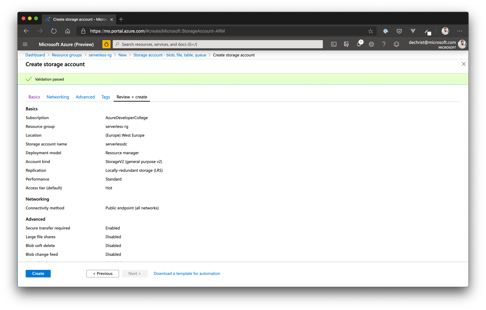
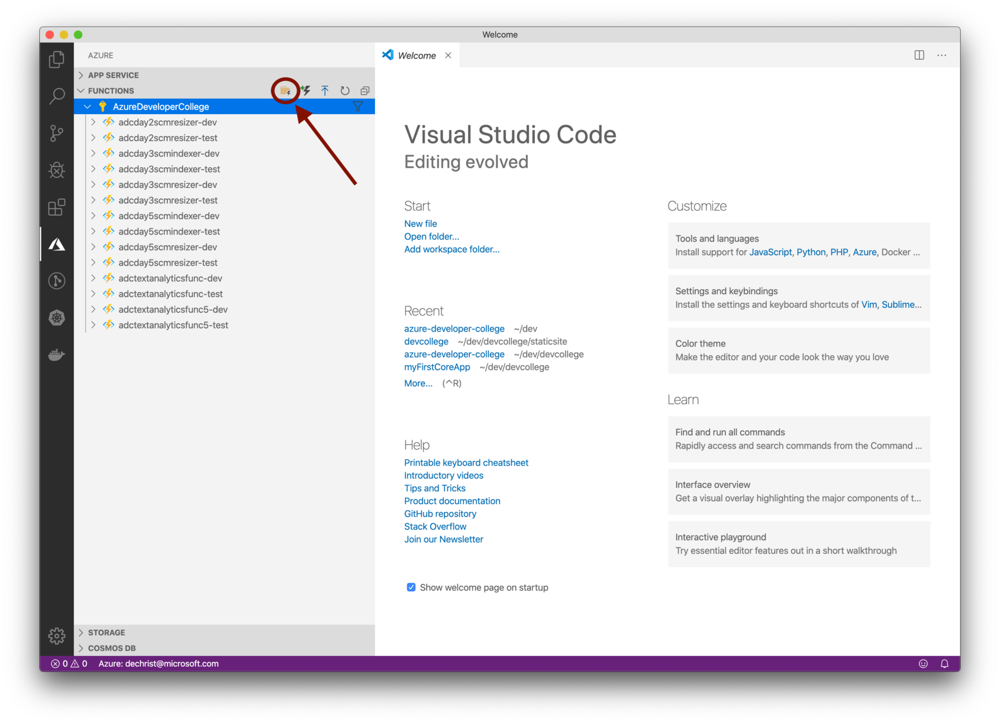
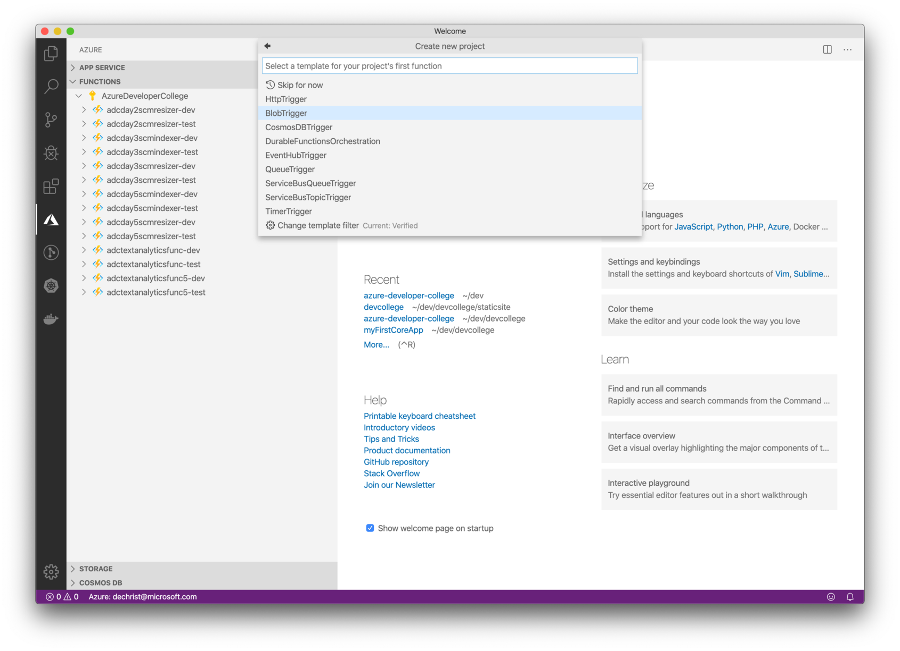
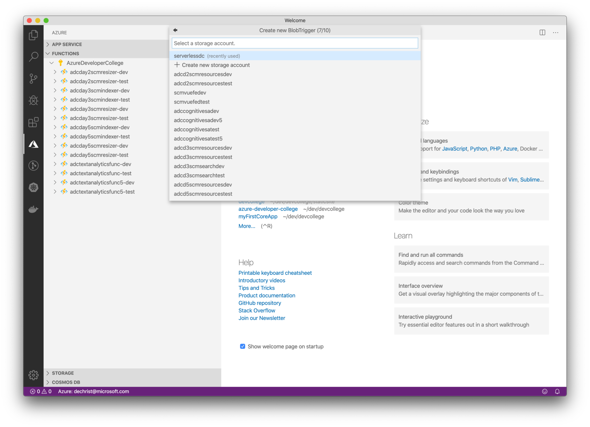
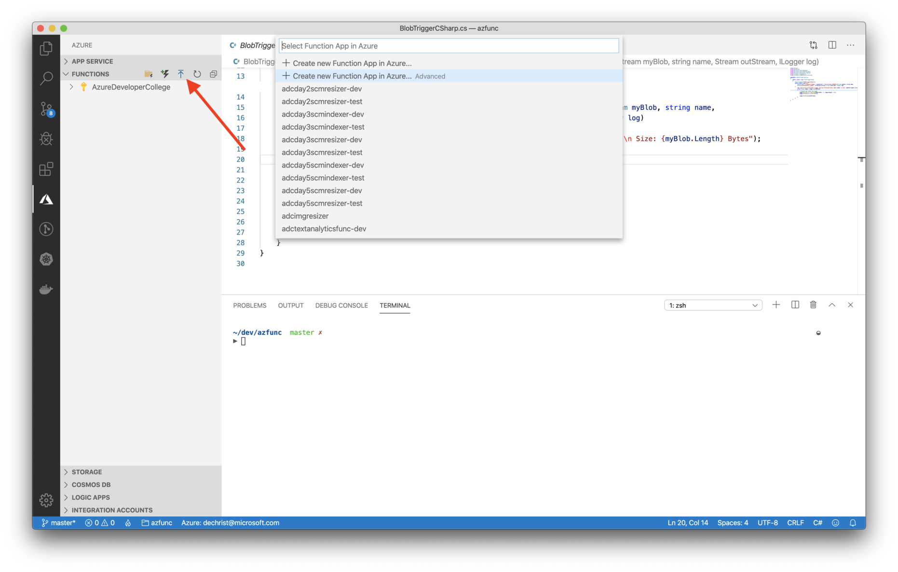
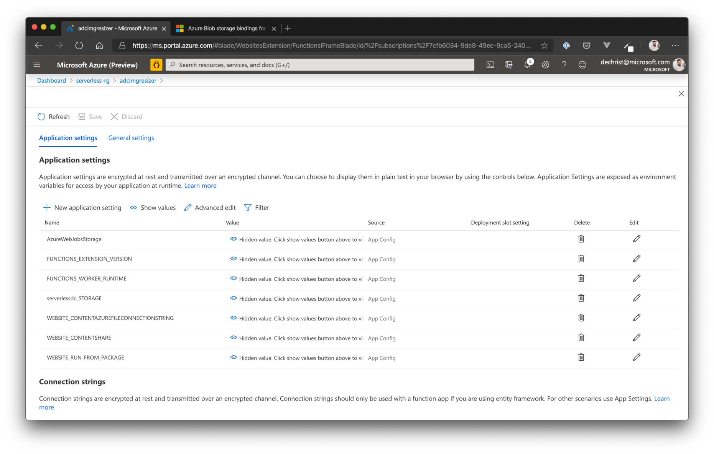

# Challenge 2: Serverless

⏲️ *Est. time to complete: 45 min.* ⏲️

## Here is what you will learn 🎯

- Create an Azure Function on your local machine
- Learn how to debug Azure Functions
- Learn how to use Function Triggers to react to events in Azure
- Deploy Azure Functions

## Table Of Contents

1. [Create an Azure Function locally](#create-an-azure-function-locally)
2. [Deploy the Azure Function App to Azure](#deploy-the-azure-function-app-to-azure)
3. [Azure Samples](#azure-samples)
4. [Cleanup](#cleanup)

## Create an Azure Function locally

To get familiar with _Azure Functions_ on your local machine, we will create a sample that listens for files on an Azure Storage Account (Blob). Each time a new file is added to a predefined container, our function will be called by Azure, giving us the opportunity to manipulate the file and save it to another location (just a small sample).

So, first of all, we need to create a Storage Account to being able to upload/process files.

### Add a Storage Account

Go to the Azure Portal and click on **"Create a resource"**, in the next view choose/search for **"Storage Account"** and afterwards click **create**.

Follow the wizard to create the storage account:

| Parameter          | Value                                      |
| ------------------ | ------------------------------------------ |
| _Resource group_   | new, serverless-rg                         |
| Name               | Give your account a _globally unique_ name |
| _Location_         | West Europe                                |
| _Performance Tier_ | Standard                                   |
| _Account Kind_     | Storage V2 (General Purpose)               |
| _Replication_      | Locally-redundant storage (LRS)            |
| _Access Tier_      | Hot                                        |

Leave all other options to their defaults. In the summary view, it should look like that:



Proceed and create the Storage Account.

When the deployment has finished

- Go to the storage account and open **"Containers"** (under "Blob service")
- Create a container called **originals** and another one called **processed**
- Leave the proposed settings for **Public Access Level** - _Private_.

The infrastructure to store files is now ready. Let's create the local Azure Function.

### Create the local Function App

Open a new Visual Studio Code window and switch to the Azure Tools Extension. In the section for **"Functions"**, click on **"Create New Project"** and select a new, empty folder on your local machine:



The Wizard will guide you through the local setup process.

Choose the following options:

- _Language_: C#
  
- _Template_: BlobTrigger
  
- _Function Name_: BlobTriggerCSharp
  
- _Namespace_: AzDevCollege.Function
  
- _Settings_: Create new local app setting
  
- _Storage Account_: select the storage account you created previously
  
- _Trigger Path_ (the container name we want to listen to for new files): originals
  
- _Debug_: select the same storage account as above

When everything is setup, we test the function.

- Open `BlobTriggerCSharp.cs` file and set a breakpoint in the `Run` method.
- Start the Azure Function by hitting **F5**.

:::tip
📝 If you get a message that the core function tools are required, install them by executing `npm i -g azure-functions-core-tools@3 --unsafe-perm true`. If you still see an error, it's likely that remote-signed Powershell scripts aren't allowed on your machine. To fix that, run `Set-ExecutionPolicy -ExecutionPolicy RemoteSigned` in a Powershell environment (as _admin_).
:::

The debug console should print logs like that:

```shell
> func start

Azure Functions Core Tools
Core Tools Version:       3.0.3284 Commit hash: 98bc25e668274edd175a1647fe5a9bc4ffb6887d
Function Runtime Version: 3.0.15371.0
```

Open the _Azure Storage Explorer_, find your storage account and select the `originals` container (alternatively: go to the Portal and open the "Storage Explorer" in the Storage Account).


Drag and drop a file to the container or upload one via the menu. After a few seconds, the breakpoint in VS Code will be hit. Examine the properties of the variable `myBlob`.

### Adjusting the Sample

We can now receive events when a file is added to blob storage. Let's add a more meaningful sample.

We want to receive images that we will resize/manipulate in our function and write the result to the **processed** container. Therefore, we need to add a dependency to our project that enables us to do image manipulation in dotnet core. We will use [SixLabors.ImageSharp](https://github.com/SixLabors/ImageSharp).

Open a terminal and go to your projects folder. Add the library via:

```shell
dotnet add <NAME_OF_FUNCTION_PROJECT>.csproj package SixLabors.ImageSharp
```

Now, back in Visual Studio Code, replace the contents of the file `BlobTriggerCSharp.cs` with:

```csharp
using System;
using System.IO;
using Microsoft.Azure.WebJobs;
using Microsoft.Azure.WebJobs.Host;
using Microsoft.Extensions.Logging;
using SixLabors.ImageSharp;
using SixLabors.ImageSharp.Processing;

namespace AzDevCollege.Function
{
    public static class BlobTriggerCSharp
    {
        [FunctionName("BlobTriggerCSharp")]
        public static void Run(
            [BlobTrigger("originals/{name}", Connection = "<REPLACE_WITH_NAME_OF_STORAGE_ACCOUNT>_STORAGE")]Stream myBlob, string name,
            [Blob("processed/proc_{name}", FileAccess.Write, Connection = "<REPLACE_WITH_NAME_OF_STORAGE_ACCOUNT>_STORAGE")] Stream outStream, ILogger log)
        {
            using (Image image = Image.Load(myBlob))
            {
                // Resize and rotate the image!
                image.Mutate(x => x.Resize(image.Width / 2, image.Height / 2));
                image.Mutate(x => x.Rotate(90));

                image.SaveAsJpeg(outStream);
            }
            log.LogInformation($"C# Blob trigger function Processed blob\n Name:{name} \n Size: {myBlob.Length} Bytes");
        }
    }
}
```

What has been added to the **Run** method:

- The parameter `[Blob("processed/proc_{name}", FileAccess.Write)] Stream outStream` to automatically write the results of the image manipulation to a blob in the container **processed** having the same file name, prefixed with "proc". This is called an _Output Binding_. You simply write data to these kind of annotated variables and Azure takes care of storing to the configured data store. For more information on that, see <https://docs.microsoft.com/en-us/azure/azure-functions/functions-bindings-storage-blob?tabs=csharp#output>
- The code needed to manipulate the input image in the `using` statement

Now restart the local Azure Function and when the function is ready to accept calls, go to the Storage Explorer and drag an image (**!use an image!**) to the folder **originals**. A few seconds later, you will see that the Azure Function has been triggered.

Now check the **processed** container. You will find a new `proc\_`-image with the results of our manipulation.

If everything works as expected on your local machine, we deploy the Azure Function to Azure.

## Deploy the Azure Function App to Azure

Go to the Azure Tools Extension and click on the **"Deploy to Azure..."** button in the **"Functions"** section. A wizard will guide you through the creation process.

:::tip
📝 Choose _Advanced_ mode.
:::



Choose the following options, when asked:

| Parameter              | Value                                    |
| ---------------------- | ---------------------------------------- |
| _Runtime_              | NET Core 3.1                             |
| _OS_                   | Windows                                  |
| _Hosting Plan_         | Consumption                              |
| _Resource Group_       | serverless-rg                            |
| _Storage Account_      | The same as you used in the local sample |
| _Application Insights_ | Skip for now                             |

We still have to configure our Functions App, to be able to listen to blob changes in the Storage Account (_BlobTrigger information_). Therefore

- Go to the Portal and open the Functions App you previously created.
- Open the Application settings under **Configuration**
- Add a new application setting (you can check your `local.settings.json` file for the correct values):
  | Parameter                      | Value                                                                                                       |
  | ------------------------------ | ----------------------------------------------------------------------------------------------------------- |
  | \<storageaccountname>\_STORAGE | enter the connection string to the storage account (you can copy that from your _local.settings.json_ file) |

:::tip
📝 Make sure to click on _Save_ afterwards.
:::

Finally, your application settings should look like that:



Test again (upload images) and check, if the Function App is running correctly in Azure

:::tip
📝 It might be necessary to restart your function app.
:::

## Azure Samples

Azure Functions code samples:

- <https://docs.microsoft.com/en-us/samples/browse/?expanded=azure&products=azure-functions>

## Cleanup

Remove the sample resource group via

```shell
az group delete -n serverless-rg
```

[◀ Previous challenge](./02-challenge-bo-1.md) | [🔼 Day 2](../README.md) | [Next challenge ▶](./04-challenge-messaging.md)
