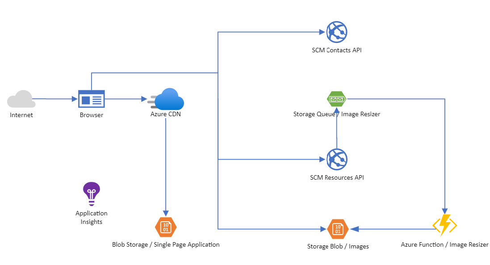
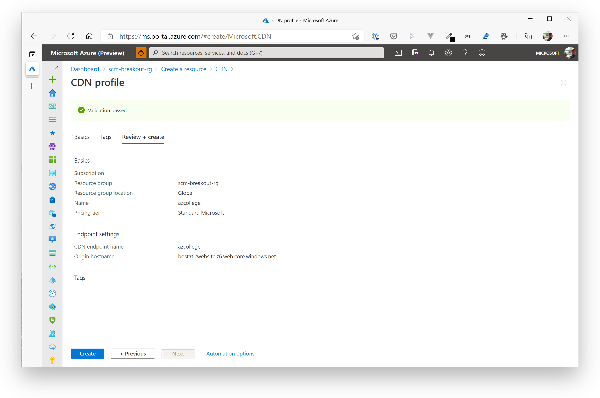
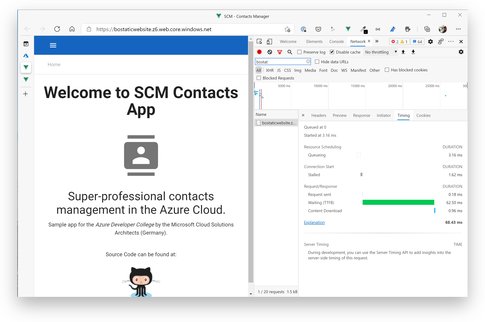
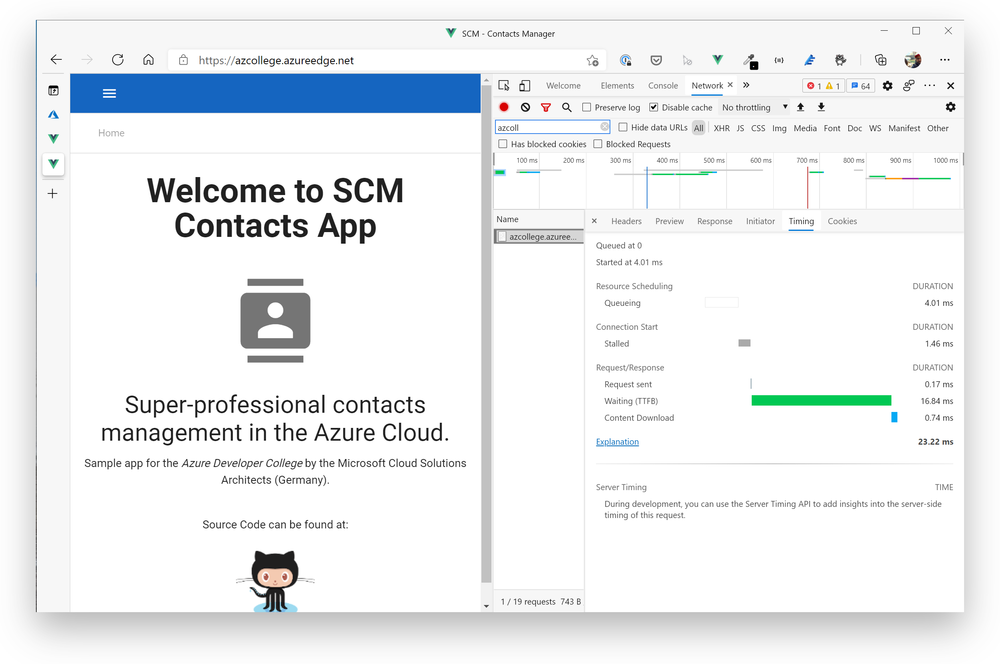

# 💎 Breakout 3 (optional): User a Content Delivery Network for the SPA 💎

⏲️ *Est. time to complete: 30 min.* ⏲️

## Here is what you will learn 🎯

Now that we have set up our application in Azure and the Single Page Application is running on an Azure Storage account, it is time show you how you _should_ host the static web app in **a production environment**.

In this challenge you will:

- Create an Azure Content Delivery Network endpoint to serve the frontent for your users

:::tip
📝 This is an **optional** challenge and is not neccessary to complete the workshop.
:::

## Table Of Contents

1. [Introduction](#introduction)
2. [Create a Content Deliver Network / CDN Endpoint](#create-a-content-deliver-network--cdn-endpoint)
3. [Wrap-Up](#wrap-up)

## Introduction

As you know by now, an Azure Storage Account is the cheapest option to host static content in Azure. You can even consider it to deliver your Single Page Application written in React, Angular, VueJS etc. to your endusers. Nevertheless, an Azure Storage Account lacks a few features like compression, geo-replication etc. that you can only achieve with a content delivery network. Fortunately, Azure has a service where you can operate your own CDN.

So for the application, you will provision a CDN and put it in front of the VueJS frontend to let the CDN serve the app. In the end, the architecture will look like that:

## Create a Content Deliver Network / CDN Endpoint

To create a Content Delivery Network, go to the Azure markeplace, search for "CDN" and hit the "Create" button. You will be guided by a wizard to setup the CDN. Please use the following parameters:

| Name           | Value                                                                                                              |
| -------------- | ------------------------------------------------------------------------------------------------------------------ |
| Resource Group | Use the existing resource group, e.g. **scm-breakout-rg**                                                          |
| Name           | Give the CDN a global unique name. In the example here, we chose "azcollege"                                       |
| Pricing Tier   | Select _Standard Microsoft_ (there are others like Akamai or Verizon, you can of course choose whichever you like) |

In the "**Endpoint settings**" section, select "Create a new CDN endpoint" and use the following parameters:

| Name              | Value                                      |
| ----------------- | ------------------------------------------ |
| CDN endpoint name | Give the endpoint a global unique name     |
| Origin type       | Select _Storage static website_            |
| Origin hostname   | Select the endpoint of your static website |

When the CDN and the corresponding endpoint for your application have been created, you need to wait a few minutes until it is ready. You can check by opening a browser and load the website at the newly created location. Here in this example, it is <https://azcollege.azureedge.net/>.

You now get the following benefits:

- Global distribution of the web app by using the correspondig [point-of-presence (POP) / edge datacenters](https://docs.microsoft.com/de-de/azure/cdn/cdn-pop-locations). E.g. Microsoft CDN has over 130 locations worldwide.
- Compression for html, text, js, json etc. files (with gzip / [Brotli](https://en.wikipedia.org/wiki/Brotli))
- HTTP/2 support
- Caching at the CDN level. You can also customize [how Azure CDN will cache your content](https://docs.microsoft.com/en-us/azure/cdn/cdn-how-caching-works)
- Geo-filtering (if you want to)
- A [rules engine](https://docs.microsoft.com/en-us/azure/cdn/cdn-standard-rules-engine-reference) for URL redirecting, rewriting, caching etc.

If you open the developer tools in your browser (F12), you can see the difference in performance, e.g. regarding the TTFB (time-to-first-byte) numbers:

Azure Storage Account **Static Website** (62ms TTFB):

Azure **Content Delivery Network** (16ms TTFB):

## Wrap-Up

Congrats 🎉! You just created a global Content Delivery Network for your single page application and enhanced the performance for your users without rewriting anything in the application itself. Users from all over the globe will now benefit from it as they get the content streamed from the nearest possible location!

You could also leverage another CDN endpoint e.g. for the contact images. But in that case, you would also need to adjust the way the URLs for the pictures are persisted. However, it is definetly possible and worth a try when running a production version of the app.

In this Breakout Challenge, you made use of:

- [Azure CDN](https://docs.microsoft.com/de-de/azure/cdn/)

[◀ Previous challenge](./05-challenge-bo-2.md) | [🔼 Day 2](../README.md) | [Next challenge ▶](./07-challenge-bo-4.md)
