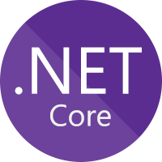
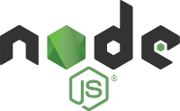
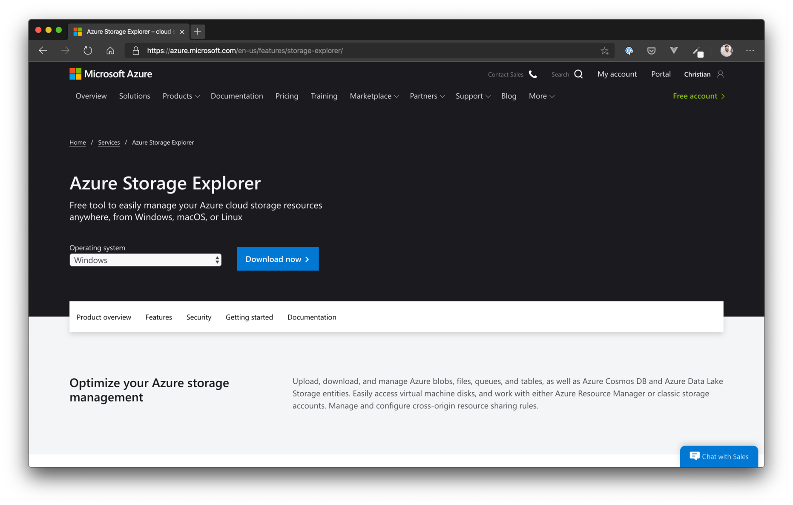
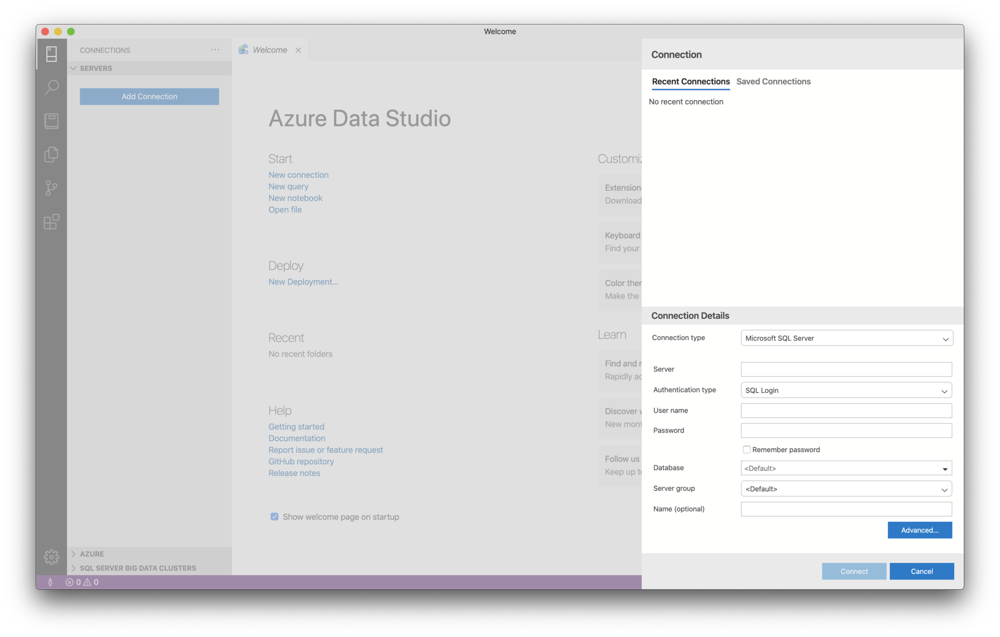

# Challenge 0: Setup your System

## Here is what you will learn 🎯

To be able to follow all the challenges provided in this workshop, you need a few prerequisites on your machine. This challenge is for setting up your system.

## Table Of Contents

1. [.NET SDK](#net-sdk)
2. [Node.js](#node-js)
3. [Vue.js CLI](#vue-js-cli)
4. [Azure CLI](#azure-cli)
5. [Visual Studio Code](#visual-studio-code)
6. [Azure Storage Explorer](#azure-storage-explorer)
7. [Azure Data Studio](#azure-data-studio)
8. [jq](#jq)
9. [git Version Control](#git-version-control)

## .NET SDK

Download and install .NET Core SDK from <https://dotnet.microsoft.com/download>.

:::tip
📝 Choose the LTS version (currently .NET Core 3.1).
:::



After the installation is complete, check if everything works as expected. Open a command prompt and execute the .NET CLI.

```shell
$ dotnet

Usage: dotnet [options]
Usage: dotnet [path-to-application]

Options:
  -h|--help         Display help.
  --info            Display .NET Core information.
  --list-sdks       Display the installed SDKs.
  --list-runtimes   Display the installed runtimes.

path-to-application:
  The path to an application .dll file to execute.

$ dotnet --list-sdks
3.1.405 [C:\Program Files\dotnet\sdk]
```

## Node.js

Download and install Node.js from <https://nodejs.org/en/download/>

:::tip
📝 Choose the LTS version (currently Node.js 14).
:::



After the installation is complete, check if everything works as expected. Open a command prompt and execute the following commands.

```shell
$ node --version

v14.15.4

$ npm

Usage: npm <command>

where <command> is one of:
    access, adduser, audit, bin, bugs, c, cache, ci, cit,
    clean-install, clean-install-test, completion, config,
    create, ddp, dedupe, deprecate, dist-tag, docs, doctor,
    edit, explore, fund, get, help, help-search, hook, i, init,
    install, install-ci-test, install-test, it, link, list, ln,
    login, logout, ls, org, outdated, owner, pack, ping, prefix,
    profile, prune, publish, rb, rebuild, repo, restart, root,
    run, run-script, s, se, search, set, shrinkwrap, star,
    stars, start, stop, t, team, test, token, tst, un,
    uninstall, unpublish, unstar, up, update, v, version, view,
    whoami

npm <command> -h  quick help on <command>
npm -l            display full usage info
npm help <term>   search for help on <term>
npm help npm      involved overview
```

## Vue CLI


We will be using VueJS as our frontend framework. Install it from the command-line via npm:

```shell
$ npm install -g @vue/cli

[...]
[...]
[...]

$ vue --version

@vue/cli 4.5.10
```

## Azure CLI

We will also be using the Azure command-line interface to create and interact with resources running in Azure. To install it, go to <https://docs.microsoft.com/en-us/cli/azure/install-azure-cli?view=azure-cli-latest> and choose your platform.

When finished, login to your Azure account from the command-line:

```shell
$ az login
You have logged in. Now let us find all the subscriptions to which you have access...
```

A browser window will open, login to Azure and go back to the command prompt. Your active subscription will be shown as JSON, e.g.:

```json
{
  "cloudName": "AzureCloud",
  "id": "xxxxxxxx-xxxx-xxxx-xxxx-xxxxxxxxxxxx",
  "isDefault": false,
  "name": "Your Subscription Name",
  "state": "Enabled",
  "tenantId": "xxxxxxxx-xxxx-xxxx-xxxx-xxxxxxxxxxxx",
  "user": {
    "name": "xxx@example.com",
    "type": "user"
  }
}
```

:::tip
📝If you have multiple subscriptions, make sure you are working with the correct one!
:::

```shell
$ az account show
{
  "cloudName": "AzureCloud",
  "id": "xxxxxxxx-xxxx-xxxx-xxxx-xxxxxxxxxxxx",
  "isDefault": false,
  "name": "Your Subscription Name",
  "state": "Enabled",
  "tenantId": "xxxxxxxx-xxxx-xxxx-xxxx-xxxxxxxxxxxx",
  "user": {
    "name": "xxx@example.com",
    "type": "user"
  }
}
```

If the displayed subscription is not the correct one, follow the steps below:

```shell
$ az account list -o table
[the list of available subscriptions is printed]

$ az account set -s <SUBSCRIPTIONID_YOU_WANT_TO_USE>
```

## Visual Studio Code

To work with all the samples provided in this workshop, you will need an IDE. To target a wide range of developers/architects, we will be using Visual Studio Code (VS Code) as it works cross-platform. Therefore, go to <https://code.visualstudio.com/docs/setup/setup-overview> and install it on your machine.

:::warning
Please do not use VSCodium. You will run into problems building/debugging some of the samples provided in this workshop.
:::

### Useful Extensions

After the setup is complete, open Visual Studio Code and select the "Extensions" sidebar:


Search and install the following extensions:

- Azure Tools <https://marketplace.visualstudio.com/items?itemName=ms-vscode.vscode-node-azure-pack>
- C# <https://marketplace.visualstudio.com/items?itemName=ms-vscode.csharp>
- Azure Functions <https://marketplace.visualstudio.com/items?itemName=ms-azuretools.vscode-azurefunctions>

:::tip
📝 The _Azure Functions_ extension should have already been installed as part of the _Azure Tools_ extension, but you additionally need to make sure to follow the OS-specific instructions.
:::

## Azure Storage Explorer

In order to work with Azure Storage Accounts, we will use the Azure Storage Explorer. Go to <https://azure.microsoft.com/en-us/features/storage-explorer/>, download and install the tool.




## Azure Data Studio

We will also work with Azure SQL Databases. You can, of course, use SQL Server Management Studio if you are on a Windows machine. If you want to work cross-platform, use Azure Data Studio.

Go to <https://docs.microsoft.com/en-us/sql/azure-data-studio/download-azure-data-studio>, download and install the tool.



## jq

jq is a lightweight and flexible command-line JSON processor. In some challenges we use jq to process the JSON documents that we get back from Azure CLI. To install jq go to <https://stedolan.github.io/jq/download/> and follow the instructions.


## git Version Control

The repository is located at [GitHub](https://github.com/), so - obviously - we will need a local git client to interact with the repository. Download and install the appropriate version of git here: <https://git-scm.com/download>


[🔼 Day 2](../README.md) | [Next challenge ▶](./challenge-1.md)
