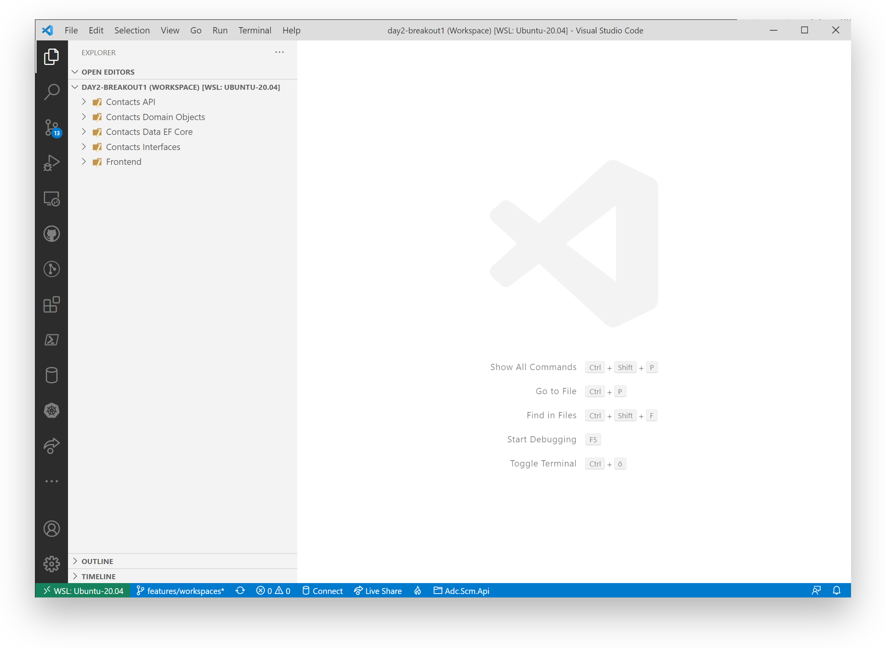
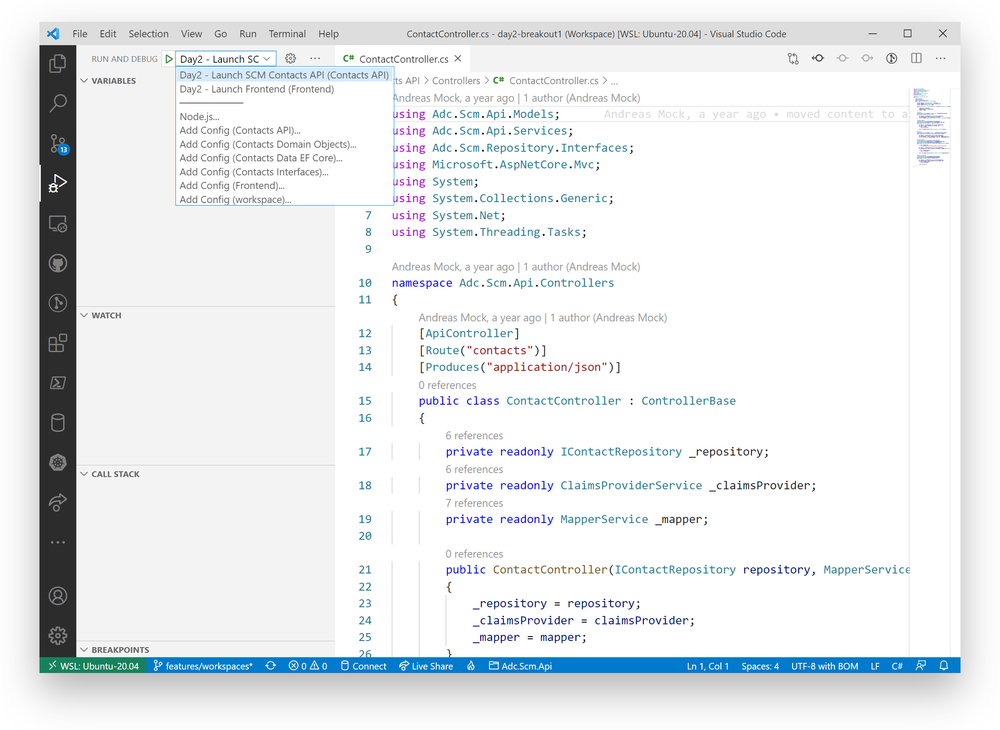
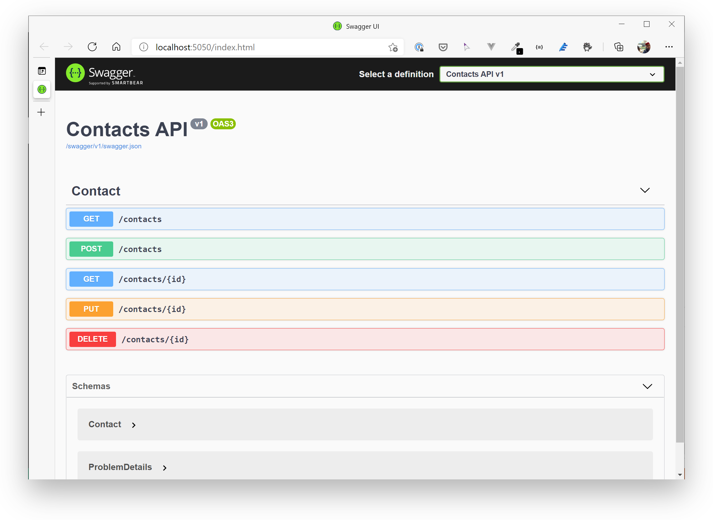
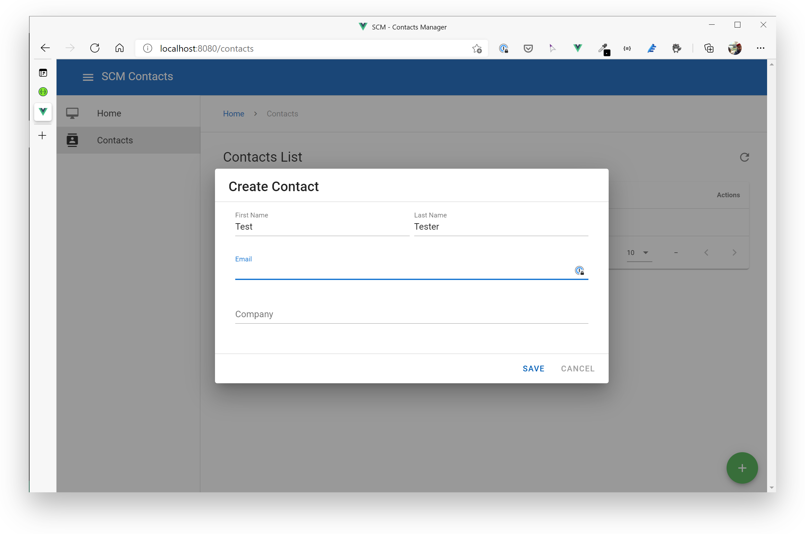
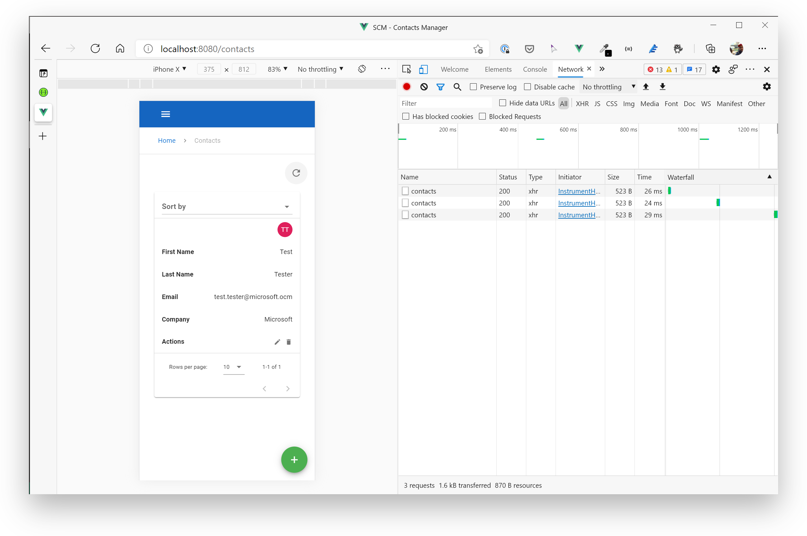

# :small_orange_diamond: Breakout 1: Deploy the Azure Dev College sample application to Azure :small_orange_diamond:

## Here is what you will learn 🎯

Now it's time to get familiar with our sample application. In this challenge you will:

- clone the repository to your local machine
- setup your "local loop"
- deploy a first version to Azure


:::tip
📝 Please check, that all the [prerequisites](challenge-0.md) are set up in your machine.
:::

## Table Of Contents

1. [Setup Local Loop](#setup-local-loop)
2. [Run the Contacts Service locally](#run-the-contacts-service-locally)
3. [Deploy to Azure](#deploy-to-azure)
4. [Finished before Time?](#finished-before-time)
5. [Wrap-Up](#wrap-up)

## Setup Local Loop

Clone the repository to your local machine. Run this command from a blank folder.

```shell
$ git clone https://github.com/azuredevcollege/trainingdays.git

Cloning into 'azure-developer-college'...
remote: Enumerating objects: 236, done.
remote: Counting objects: 100% (236/236), done.
remote: Compressing objects: 100% (178/178), done.
remote: Total 2473 (delta 89), reused 177 (delta 51), pack-reused 2237
Receiving objects: 100% (2473/2473), 22.78 MiB | 16.39 MiB/s, done.
Resolving deltas: 100% (1392/1392), done.
```

Switch to the `azure-developer-college` folder and open VS Code from there:

```shell
code .
```

Open folder `Day2/apps`. In that folder, we will be concentrating on `dotnetcore/Scm` and `frontend/scmfe`.



The first folder contains the backend logic for working with _contacts_ objects, the latter one contains the _Single Page Application_ (SPA) which is written in Vue.js.

Open each folder and get familiar with the code in there.

:::tip
📝 If you have any questions, reach out to one of the proctors.
:::

## Run the Contacts Service locally

Now it's time to run the contacts API on your local machine. Therefore, a debug configuration has already been prepared for you. So, switch to the "Debug" view in Visual Studio Code and in the drop-down, choose **Day2 - Launch SCM Contacts API**. Click the **"Run"** button.



If you set up your machine correctly, a browser window will open and show the Swagger UI for the _contacts_ API after a few seconds. Get familiar with all the available operations and also test a few of them via the UI.



### Preparing the SPA for the first run

To run the Single Page Application on your local machine, we first need to install all the necessary Node.js packages via the _Node Package Manager_ (NPM).

On the command-line, switch to the folder `apps/frontend/scmfe` and run the following command:

```shell
$ npm install

[...]
[...]
[...]
added 1281 packages from 895 contributors and audited 26623 packages in 24.125s
[...]
[...]
```

Back in Visual Studio Code, we need to tell the SPA where to call the contacts service. 

:::tip
📝 The contacts API endpoint, as well as all other upcoming endpoint, can be dynamically configured per environment).
:::

Open the file `apps/frontend/scmfe/public/settings/settings.js` and make sure the property `endpoint` has the value `http://localhost:5050`.

```json{2}
var uisettings = {
    "endpoint": "http://localhost:5050/",
    "resourcesEndpoint": "",
    "aiKey": ""
}
```

This file will be loaded during the startup of our application and will configure the contacts module to use our local service for contacts management.

So, everything is in place now...let's start the application. Go back to the _Debug_ view, choose **Day2 - Launch Frontend**.

:::tip
📝 There **may** be a problem when running that debug configuration. In case `npm` cannot be started, please go to the command-line and run `npm run serve`!
:::

⚠ **IMPORTANT**: Make sure the contacts API still runs! ⚠

When you run the config, a local build will be kicked-off and after finishing, the Chrome Debugger will be launched. Get familiar with the application, open the contacts list, create a few contacts, edit a contact and delete one.

If you want to, you can also test the mobile experience of the app by opening the Chrome/Edge Developer Tool (**F12**) and switching to a mobile user-agent.





## Deploy to Azure

We have now been able to run the application locally. Of course, we want to have it in Azure. In this first Break Out, we only deploy the _Contacts_ API to Azure and run the SPA on our local machine.

So, first of all, let's deploy the backend to Azure. You already know how to do it ([Challenge 1 - Azure Web Applications](./challenge-1.md) is your "cheat sheet"), so here is just an overview:

1. Basic Setup via Portal or Azure CLI

  | Parameter | Value |
  |---|---|
  | _Resource group_ | new, name it e.g. `scm-breakout-rg`|
  | _Location_ | West Europe |

2. Create an Azure Web App 
  
  | Parameter | Value |
  | ---|---|
  | _OS_ | Windows |
  | _RuntimeStack_ | NET Core 3.1 (LTS) |
  | _Size_ | S1 |
  | _AppInsights_ | Not needed at the moment |

3. Deploy the _Contacts API_ to Azure
4. After deployment, check whether the API is running by open the Swagger UI

:::tip
Hint for Step 3: now that we have a lot of projects in our folder, VS Code is not able to determine which project to pick when deploying via the Azure Tools App Services extension. We first need to publish the project to a local folder and take that as our deployment source. There is already a predefined task for you, called **day2publishScmContacts** (btw, all tasks are defined in the `.vscode` folder). To run it, simply press **F1** and choose **"Tasks: Run Task"**. In the dropdown, select **day2publishScmContacts**. A release build will be started and the outputs placed in the folder  `apps/dotnetcore/Scm/Adc.Scm.Api/publish` folder. Choose that folder when "right-click-deploying" from the Azure AppService extension (via **"Browse..."**).
:::

:::warning
Don't confirm the message that asks to always deploy that service to the Azure AppService! If you accidentally did, delete the file `.vscode/settings.json`. Then you will be able to select the folder to publish again.
:::

When everything works as expected in Azure, go back to the `settings.js` file of your SPA and adjust the **endpoint** property. Enter the value of your newly deployed API for it, e.g. `https://mynewcontactsapi.azurewebsites.net/`.

Open the browser and check, if your application still works as expected.

## Finished before Time?

Try adding slots to your app and deploy the service to the slot. Afterwards swap it.

## Wrap-Up

We have now set up our local development environment. We cloned the repo, installed dependencies of the SPA, ran both services locally and deployed the contacts API to Azure.

[◀ Previous challenge](./challenge-1.md) | [🔼 Day 2](../README.md) | [Next challenge ▶](./challenge-2.md)