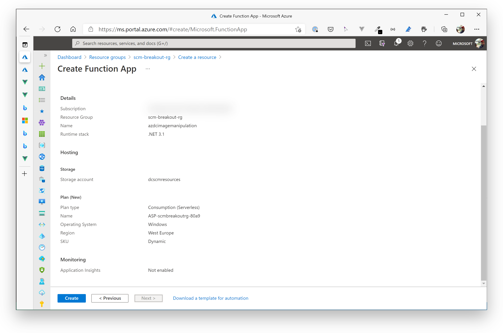
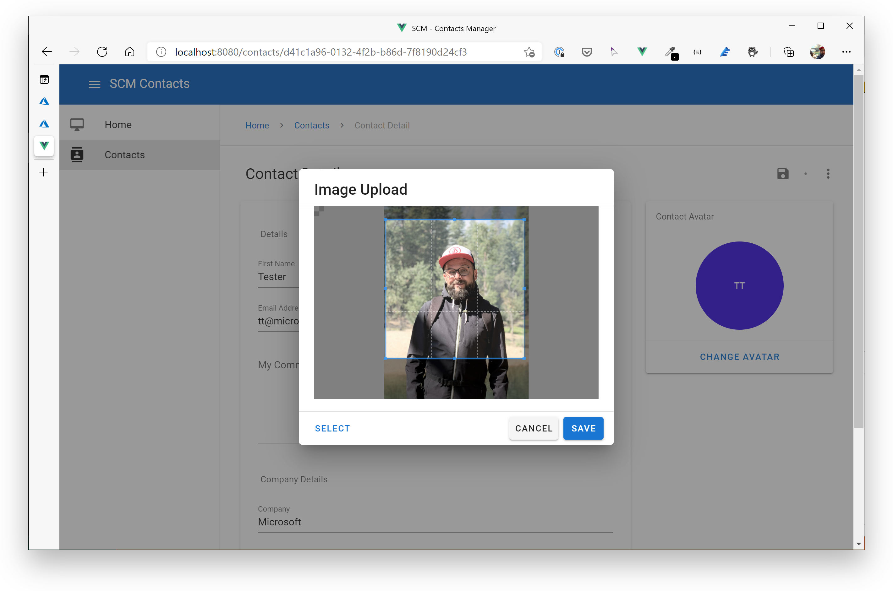
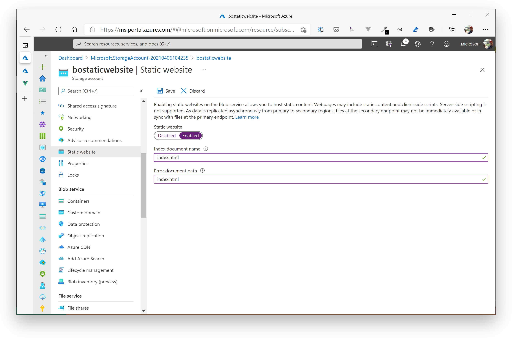

# :small_orange_diamond: Breakout 2: Add a serverless microservice to our sample app and include messaging :small_orange_diamond:

## Here is what you will learn 🎯

Time for our second "Break-Out" session!

We now will deploy _all required services_ of our SCM Contacts Management app to Azure, including the _Vue.js Single Page Application_. To host the SPA, which is basically a static website, we make use of the "Static Website Hosting" option of Azure Storage Accounts. This is the cheapest option to host applications built e.g. with Angular, React or like in our case Vue.js.

We also add a second service, that allows us to save images for our contacts. The service will be implemented in .NET Core and will use _Azure Storage Queues_ (to make you familiar with another messaging service) to notify an Azure Function that in turn creates thumbnails of the images. The results will then be saved in an Azure Storage Account.

At the end of the day, this will be the architecture of our SCM Contacts Management application:


## Table Of Contents

1. [Services to handle Contact Images](#services-to-handle-contact-images)
2. [Host the Single Page Application in Azure](#host-the-single-page-application-in-azure)
3. [Wrap-Up](#wrap-up)

## Services to handle Contact Images

We will start implementing our target architecture by adding a Storage Account to save contact images.

### Storage Account (Container/Queue)

Therefore, create a Storage Account in the resource group you took for the first breakout session (should be `scm-breakout-rg`). Create the account having these parameters:

|Parameter|Value|
|---|---|
| _Name the storage account_ | <YOUR_PREFIX>scmresources
| _Location_ | West Europe
| _Performance_ | Standard
| _Account Kind_ | Storage V2
| _Replication_ | LRS
| _Access Tier_ | Hot

When the Storage Account has been created, add two containers where we will be storing the images:

| Container Name | Public Access Level |
| --- | --- |
| _rawimages_ | Blob |
| _thumbnails_ | Blob |

Also, add a new _Queue_ in your Storage Account. Name the queue `thumbnails`.

The infrastructure for handling images regarding storage and messaging is now set up.

### Azure Function for Image Manipulation

In the _Serverless_ challenge, we created the Azure Function via the Visual Studio Code wizard. Now, let's see how the the Portal experience is like.

Go to your resource group (`scm-breakout-rg`) and add an Azure Function. To do so search for **"Function App"** in the wizard.

Follow the wizard and when asked, enter the following information (only important information will be mentioned):

- Basic Tab
  | Parameter | Value |
  |---|---|
   | _Function App name_ | choose a globally unique name
  | _Publish_ | Code
  | _Runtime Stack_ |.NET Core
  | _Version_ | 3.1
  | _Region:_ | West Europe
- Hosting Tab
  | Parameter | Value |
  |---|---|
  | _Storage Account_ | choose the one you created before in this challenge
  | _Operating System_ | Windows
  | _Plan Type_ | Consumption
- Monitoring
  | Parameter | Value |
  |---|---|
  | _Enable AppInsights_ | No



When the Function has been created, we need to add a few _Configuration settings_ that our image manipulation function needs to be working correctly:

- Open the Azure Function and switch to the **Configuration** view.

- Add the following Configuration settings
  | Parameter                                             | Value / Hints                                                                      |
  | ------------------------------------------------------- | ---------------------------------------------------------------------------------- |
  | _QueueName_                                               | thumbnails                                                                       |
  | _StorageAccountConnectionString_                          | take the _Connection String_ from your Storage Account (under **_Access Keys_**) |
  | _ImageProcessorOptions\_\_StorageAccountConnectionString_ | take the _Connection String_ from your Storage Account (under **_Access Keys_**) |
  | _ImageProcessorOptions\_\_ImageWidth_                     | 100                                                                              |

  :::tip
  📝 You should open the portal in a second tab in your browser, because you need to switch back and forth copying values from different locations.
  :::

- Save your settings. The Functions app will now restart to apply your changes.

Now it is time to deploy the Image Resizer Function App to Azure.

:::tip
📝 You need to open a new Visual Studio Code window and open folder `day2/apps/dotnetcore/Scm.Resources/Adc.Scm.Resources.ImageResizer`. The deployment steps have to be done in that new window!
:::

To deploy the function follow these steps:

- Go to the **Azure Tools** extension
- In the Functions section: choose your Azure Function you created previously
- Right-click on it, choose **"Deploy to Function App..."**

The deployment of you function starts and after a few seconds, it is running in Azure. You can close the window now.

### Deploy the Azure Web App providing the API to store images

We need to add another Azure Web App to host the "Resources API" of our SCM Contacts application:

- Go to your resource group **scm-breakout-rg**
- Create an Azure Web App (you can choose to use the Portal or the Azure CLI: OS - **Windows**, RuntimeStack - **.NET Core 3.1 (LTS)**, Size - **S1**, AppInsights is not needed at the moment). You can choose the same settings as for the Contacts API.

When the deployment has finished, we also need to add a few settings. Open the Web App in the Portal and go to the "Configuration" view (under **Settings**): 

- add the following parameters:
  | Parameter                                               | Value / Hints                                                                                                      |
  | -----------------------------------------------------   | ------------------------------------------------------------------------------------------------------------------ |
  | _ImageStoreOptions\_\_StorageAccountConnectionString_   | take the _Connection String_ from your Storage Account created in this Break Out session (under **_Access Keys_**) |
  | _StorageQueueOptions\_\_StorageAccountConnectionString_ | take the _Connection String_ from your Storage Account created in this Break Out session (under **_Access Keys_**) |
  | _ImageStoreOptions\_\_ImageContainer_                   | rawimages                                                                                                          |
  | _StorageQueueOptions\_\_ImageContainer_                 | rawimages                                                                                                          |
  | _ImageStoreOptions\_\_ThumbnailContainer_               | thumbnails                                                                                                         |
  | _StorageQueueOptions\_\_Queue_                          | thumbnails                                                                                                         |
  | _StorageQueueOptions\_\_ThumbnailContainer_             | thumbnails                                                                                                         |

- go back to Visual Studio Code and deploy the Resources API from folder `day2/apps/dotnetcore/Scm.Resources/Adc.Scm.Resources.Api` to the Azure Web App.

You have done this several times now and should be familiar with the process. For your convenience, we added (as in [Break Out 1](./challenge-bo-1.md)) a task that publishes the .NET Core API to a local folder that you can use as deployment source for the Azure Web App:

- Press **F1** and choose **"Tasks: Run Task"**
- Select **day2publishScmResources**
- Outputs of the build will be placed in `day2/apps/dotnetcore/Scm.Resources/Adc.Scm.Resources.Api/publish`
- Choose that folder when "right-click-deploying" from the **Azure Tools** extension (via **"Browse..."**)

Time for testing!

### Test with you local Single Page Application

When everything has been deployed to Azure:

- Open the `settings.js` file of your SPA (folder `day2/apps/frontend/scmfe/public/settings`) 
- Adjust the `resourcesEndpoint` property. 
- Make sure, that `endpoint` points to the Contacts API in Azure. 
- Enter the value of your newly deployed Resources API for it, e.g. [https://scmimageresource.azurewebsites.net/](https://scmimageresource.azurewebsites.net/).
- Switch to the "Debug" view and start the Single Page Application (dropdown: **Day2 - Launch Frontend**).

:::tip
📝 There _may_ be a problem when running that debug configuration. In case "npm" cannot be started, please go to the command-line and run `npm run serve`
:::

To test everything we just set up, create a new _Contact_ and open the details of it afterwards. On the right side box, you should now see a button called "**CHANGE AVATAR**".



Upload a picture and save the Contact.

## Host the Single Page Application in Azure

We still run the Single Page Application on our local machine. Time to switch to hosting in Azure. As mentioned before, we make use of the _"Static Website"_ feature of Azure Storage Accounts.

It's very simple to use:

- Create a new Azure Storage Account (or you can reuse the Storage Account for the images/queue)
- Go to **"Static website"** under **Settings** of your Azure Storage Account and enable it
- Choose `index.html` as _Index document name_ and _Error document path_



:::tip
📝 When you save the settings, Azure will create a new container called **\$web** where you can copy static (web) file to. Azure will serve the contents of this containers as "Static Website".
:::

Now open a command-line, go to folder `day2/apps/frontend/scmfe` and execute:

```shell
$ npm run build

> scmfe@0.1.0 build /Users/yourname/dev/azure-developer-college/day2/apps/frontend/scmfe
> vue-cli-service build

   Building for production...
   ...
   ...
   ..
   .

 DONE  Build complete. The dist directory is ready to be deployed.
```

This starts a local build of the Vue.js application, which puts all results/artifacts (the static website itself) into the `dist` folder. When the build has finished, copy the content of the `dist` folder via the Storage Explorer to your Storage Account in the **_\$web_** container.


Now open the URL for the frontend (you can find it after saving the settings of the Static website under **"Primary Endpoint"**) and check that the application is up and running.


## Wrap-Up

🎉 **_Congratulations_** 🎉

You have just created your first modern, multi-service Azure-backed application. You made use of:

- Azure AppServices
- Storage Accounts
- Messaging (Azure Storage Queues)
- Serverless aka Azure Function Apps
- Static website hosting

All in combination with a modern Vue.js frontend that is also working on mobile devices!

[◀ Previous challenge](./challenge-3.md) | [🔼 Day 2](../README.md) | [Next challenge ▶](./challenge-bo-3.md)