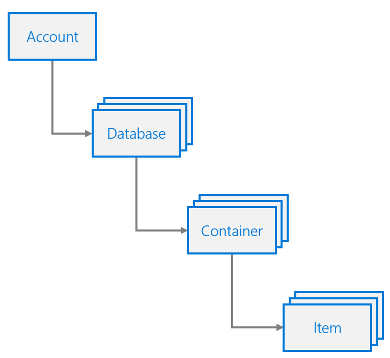
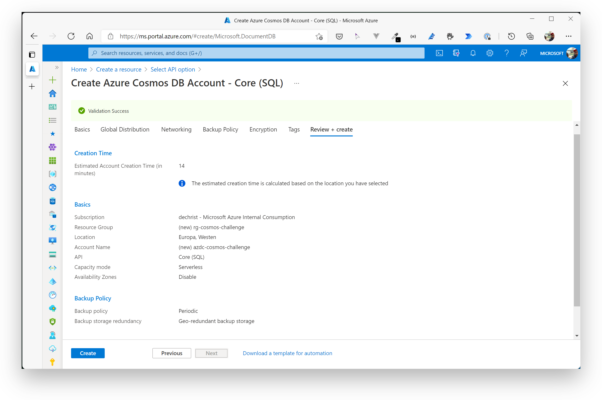
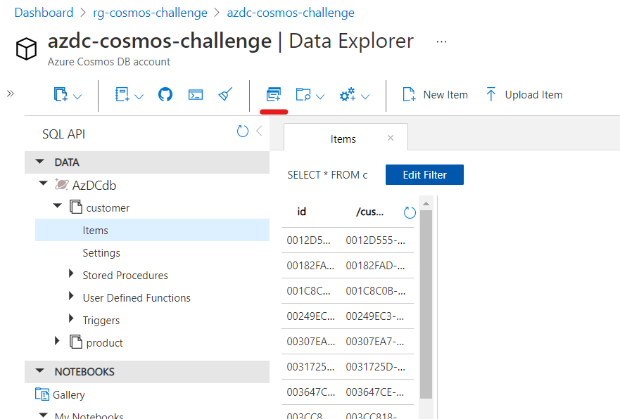
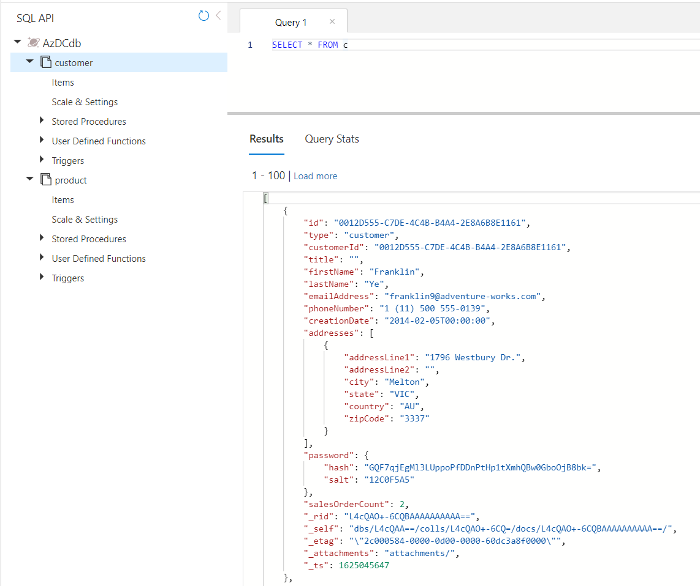
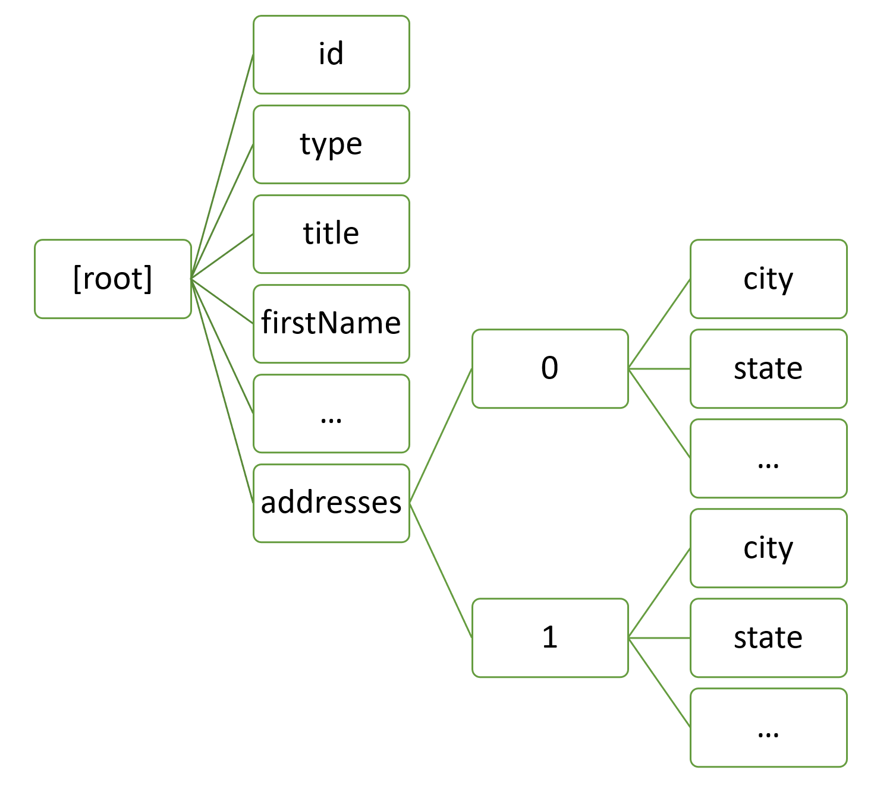

# Challenge 01: Cosmos DB

⏲️ *Est. time to complete: 60 min.* ⏲️

## Here is what you will learn 🎯

In this challenge you will learn how to:

- Create a Cosmos DB account
- Add data and query via the data explorer
- Learn about partitions and the effect of cross-partition queries
- Use the Cosmos DB change feed
- Monitor your database

## Table Of Contents

1. [Create a Comsos DB Account, Database and Containers](#create-a-comsos-db-account-database-and-containers)
2. [Add and query data](#add-and-query-data)
3. [Use the Cosmos DB Change Feed](#use-the-cosmos-db-change-feed)
4. [Monitor Cosmos DB](#monitor-cosmos-db)
5. [Azure Samples](#azure-samples)
6. [Cleanup](#cleanup)

## Create a Comsos DB Account, Database and Containers

Before we start creating a database account in Azure, let's have a brief look at the resource model of Cosmos DB. It is made of the following objects:

- _Account_: manages one or more databases
- _Database_: manages users, permissions and containers
- _Container_: a schema-agnostic container of user-generated JSON items and JavaScript based stored procedures, triggers and user-defined-functions (UDFs)
- _Item_: user-generated document stored in a container



To create a Cosmos DB account, database and the corresponding containers we will use in this challenge, you have two options:

- [Azure Portal](#option-1-azure-portal)
- [Azure Bicep](#option-2-azure-bicep)

Both are decribed in the next chapters, choose only one of them.

:::tip
📝 The "Bicep" option is much faster, because it will create all the objects automatically at once. If you want to go with that one, please also have a look at the "Create View" in the portal to make yourself familiar with all the settings you can adjust for a Cosmos DB account, db and container.
:::

### Option 1: Azure Portal

#### Create a Comsos DB Account

In the Azure Portal, click on _Create Resource_ and select _Azure Cosmos DB_. When prompted to select an API option, please choose _Core (SQL) - Recommended_.


:::tip
📝 As you might already know, Comsos DB supports a variety of APIs that you can use, depending on your use case. You can e.g. use the _MongoDB_ API - as the _Cosmos DB Core API_ - for storing documents, take the _Cassandra_ API, if you have to deal with timeseries oriented data or _Gremlin_, if you want to store the data in a graph with _vertices_ and _edges_. You can find out more about all the options (and when to choose which API) in the official documentation: <https://docs.microsoft.com/en-us/azure/cosmos-db/choose-api>.
:::

On the wizard, please choose/enter the following parameters:

| Option Name      | Value                                                                                                         |
| ---------------- | ------------------------------------------------------------------------------------------------------------- |
| _Resource Group_ | Create a new resource group called **rg-cosmos-challenge**                                                    |
| _Account Name_   | Enter a globally unique account name, like **azdc-cosmos-challenge**                                          |
| _Location_       | West Europe                                                                                                   |
| _Capacity mode_  | **Serverless** (we use the serverless option, because it's the cheapest option for development/test purposes) |



Leave all other options as suggested by the wizard and finally click _Create_. After approximately 4-8 minutes, the database account has been created. Please go to the resource as we now need to add the database and containers for our data.

#### Create a Database and Containers

The most convenient way to add a database and containers to a CosmosDB account is the _Data Explorer_. You can find the option in the context menu of the Comsos DB account overview in the Azure Portal. We now need to create two container, so please go to the _Data Explorer_ and click on _New Container_ in the toolbar.


#### Container: Customer

| Option Name     | Value                                                                                                               |
| --------------- | ------------------------------------------------------------------------------------------------------------------- |
| _Database id_   | Select the option _Create new_ and enter the name _AzDCdb_. With this first container, we also create the database. |
| _Container id_  | customer                                                                                                            |
| _Partition key_ | /customerId                                                                                                         |

Click _Ok_ and when the operation has finished, go to the _Settings_ view of the _customer_ container in the _Data Explorer_ and adjust the _Indexing Policy_. Copy the following JSON document in the editor and click _Save_ in the toolbar:

```json
{
    "indexingMode": "consistent",
    "automatic": true,
    "includedPaths": [
        {
            "path": "/*"
        }
    ],
    "excludedPaths": [
        {
            "path": "/title/?"
        },
        {
            "path": "/firstName/?"
        },
        {
            "path": "/lastName/?"
        },
        {
            "path": "/emailAddress/?"
        },
        {
            "path": "/phoneNumber/?"
        },
        {
            "path": "/creationDate/?"
        },
        {
            "path": "/addresses/*"
        },
        {
            "path": "/\"_etag\"/?"
        }
    ]
}
```

:::tip
📝 Why are we adjusting the indexing policy? We'll come back to that point later. Just be a little bit patient.
:::

#### Container: Product

| Option Name     | Value                                                 |
| --------------- | ----------------------------------------------------- |
| _Database id_   | Select the option _Use existing_ and select _AzDCdb_. |
| _Container id_  | customer                                              |
| _Partition key_ | /customerId                                           |

After you have created the database and the containers, the _Data Explorer_ should look like that:


Now we are ready to add data. You can move on to [Add and query data](#add-and-query-data)

### Option 2: Azure Bicep

You can run the following commands on your local machine or in the Azure Cloud Shell. If Azure Bicep isn't installed already, simply add it via the Azure CLI:

```shell
$ az bicep install #only needed, if bicep isn't present in the environment

$ cd day3/challenges/cosmosdb

$ az group create --name rg-cosmos-challenge --location westeurope
{
  "id": "/subscriptions/00000000-0000-0000-0000-000000000000/resourceGroups/rg-cosmos-challenge",
  "location": "westeurope",
  "managedBy": null,
  "name": "rg-cosmos-challenge",
  "properties": {
    "provisioningState": "Succeeded"
  },
  "tags": null,
  "type": "Microsoft.Resources/resourceGroups"
}

$ az deployment group create -f cosmos.bicep -g rg-cosmos-challenge
{
  "id": "/subscriptions/00000000-0000-0000-0000-000000000000/resourceGroups/rg-cosmos-challenge/providers/Microsoft.Resources/deployments/cosmos",
  "location": null,
  "name": "cosmos",
  ...
  ...
  ...
  ...
}
```

After approximately 8-10 minutes, the Cosmos DB account, database and the containers (_product_ and _customer_) have been created and are ready to be used. Open the account in the Azure Portal and navigate to the _Data Explorer_. It should look like similar to that:


Let's add data to the two containers.

## Add and query data

Now, it's time to add data to the _customer_ and _product_ containers. There a two datasets that have been prepared for you.

### Customer Dataset

The _customer_ dataset contains of two types of objects that we put in the same container: **customer** and **salesOrder**. Wait...two object types in the same container? You learned that when dealing with data in a (relational) database, the data should always be normalized and that it's best to have one object type in one table! "This is totally against that principle", you might think.

Yes, you are right - in a relational environment. But here, we are working with a NoSQL database and things are a little bit different. Mixing object types in one container is totally fine (and even a best practice in terms of performance). In this non-relational world, you also tend to follow the "de-normalization" principle. That means that data duplication, embedding etc. is not only possible, but encouraged. You optimize data models to make sure that all the required data is ready to be served by queries.

You can download the customer dataset here: <https://azuredevcollegesa.blob.core.windows.net/cosmosdata/customer.json>

#### Customer Data

A customer document has a property ```type``` set to _customer_ and contains several properties like ```firstName```, ```lastName```, ```emailAddress``` etc. You can see, that it also uses document embedding for ```addresses``` - the property is an array, so you can add multiple addresses to one customer.

:::tip When to use embedding? When to use referencing?
📝 To model relations in a document-oriented database, you have two choices: embedding and referencing. But which should you choose when?

| Embedding                                     | Referencing                                        |
| --------------------------------------------- | -------------------------------------------------- |
| 1:1 relationship                              | 1:many relationship (especially if unbounded)      |
| 1:few relationship                            | Many:many relationship                             |
| Related items are queried or updated together | Related items are queried or updated independently |
:::

The partition key of the container has been set to ```/customerId```, so each customer is placed in its own logical partition. With that approach, we achive the best distribution of data in terms of horizontal scaling and will never hit any storage limits - so we are prepared for massive growth of the data/application. On the other hand, this is not the best way when we want to search within our customer base, because we will definitely have cross-partition queries and they will consume more and more RUs as the data grows. How to deal with such a situation is discussed later in the challenge.

Here's a sample object from the container:

```json
{
    "id": "0012D555-C7DE-4C4B-B4A4-2E8A6B8E1161",
    "type": "customer",
    "customerId": "0012D555-C7DE-4C4B-B4A4-2E8A6B8E1161",
    "title": "",
    "firstName": "Franklin",
    "lastName": "Ye",
    "emailAddress": "franklin9@adventure-works.com",
    "phoneNumber": "1 (11) 500 555-0139",
    "creationDate": "2014-02-05T00:00:00",
    "addresses": [
      {
        "addressLine1": "1796 Westbury Dr.",
        "addressLine2": "",
        "city": "Melton",
        "state": "VIC",
        "country": "AU",
        "zipCode": "3337"
      }
    ],
    "password": {
      "hash": "GQF7qjEgMl3LUppoPfDDnPtHp1tXmhQBw0GboOjB8bk=",
      "salt": "12C0F5A5"
    },
    "salesOrderCount": 2
}
```

#### SalesOrder Data

The salesorder object is similar to the customer object (```type``` is set to _salesOrder_). It has properties that you would expect for a sales order like ```orderDate```, ```shipDate```, ```customerId``` etc. Also, embedding is used to save the line items of the order.

As these objects are stored in the same collection as the customers (```customer``` collection), the partition key is also set to ```customerId```. This has a huge advantage over storing the sales orders in a separate collection: you can query both customer and the corresponding sales orders in one query - and all items queried lie in the same logical thus physical partition. Queries are super fast and - from a relational standpoint - you avoid costly JOINs over several tables or multiple queries at all.

Here's a sample object from the container:

```json
{
    "id": "091F884C-DC00-4422-9B89-3438B22DEF07",
    "type": "salesOrder",
    "customerId": "0012D555-C7DE-4C4B-B4A4-2E8A6B8E1161",
    "orderDate": "2014-03-03T00:00:00",
    "shipDate": "2014-03-10T00:00:00",
    "details": [
      {
        "sku": "TT-M928",
        "name": "Mountain Tire Tube",
        "price": 4.99,
        "quantity": 1
      },
      {
        "sku": "PK-7098",
        "name": "Patch Kit/8 Patches",
        "price": 2.29,
        "quantity": 1
      },
      {
        "sku": "TI-M267",
        "name": "LL Mountain Tire",
        "price": 24.99,
        "quantity": 1
      }
    ]
}
```

### Product Dataset

The product dataset contains just one object type: ```product```. It simply stores the information for each product like ```name```, ```price```, ```categoryName```. The collection is partitioned by ```/categoryId```, so products are logically grouped by and can be queried via category.

You can download the product dataset here: <https://azuredevcollegesa.blob.core.windows.net/cosmosdata/product.json>

#### Product Data

Here's a sample object from the container:

```json
{
    "id": "9190229B-1372-4997-8F64-5B3E7A2459C5",
    "categoryId": "86F3CBAB-97A7-4D01-BABB-ADEFFFAED6B4",
    "categoryName": "Accessories, Tires and Tubes",
    "sku": "TT-M928",
    "name": "Mountain Tire Tube",
    "description": "The product called \"Mountain Tire Tube\"",
    "price": 4.99,
    "tags": [
      {
        "id": "66D8EA21-E1F0-471C-A17F-02F3B149D6E6",
        "name": "Tag-83"
      },
      {
        "id": "6FB11EB9-319C-431C-89D7-70113401D186",
        "name": "Tag-154"
      },
      {
        "id": "8AAFD985-8BCE-4FA8-85A2-2CA67D9DF8E6",
        "name": "Tag-172"
      },
      {
        "id": "A4D9E596-B630-4792-BDD1-7D6459827820",
        "name": "Tag-164"
      }
    ]
}
```

### Upload the datasets

To add the datasets to Cosmos DB, go to the _Data Explorer_ and first open the _Items_ menu item of the _customer_ container. When the tab appears, you'll see an _Upload Item_ button in the toolbar. Click on that button, then select the _customer.json_ file that you previously downloaded and click _Upload_.


Do the same with the _product.json_ file for the _product_ collection.

:::tip
📝 Depending on your network speed and latency, the uploads should take about 2-4 minutes.
:::

### Queries

Let's work with the data and execute some queries against the two containers.

#### Simple queries

First, let's issue queries in the _customer_ container where we have customer and sales order objects. Let's start with a few simple queries.

Therefor, go to the Data Explorer, open the _Items_ menu item of the _customer_ container and click on _New SQL Query_ in the toolbar.

:::tip
📝 You can open the _Data Explorer_ as a separate window via the toolbar.
:::



In the newly created tab, enter the following SQL command and click _Execute_.

```sql
SELECT * from c
```

As you can see in the _Results_ tab, Cosmos DB returns a set of documents, that live in the _customer_ container. It returns a paged resultset, showing documents in batches of 100 items.



:::tip
📝 Have a look at the _Query Stats_ tab! Here you can see what amount of RUs have been consumed by the query (and also other statistics).
:::

As you can see in the result document, there is a bunch of properties, that have a special meaning for documents stored via the SQL API, e.g. _id_, __rid_, __ts_ etc. All properties are described in the following table (excerpt from the official Comsos DB documentation):

| Property       | Description                                                                                                                                                                                                                                                                                                                                                                          |
| -------------- | ------------------------------------------------------------------------------------------------------------------------------------------------------------------------------------------------------------------------------------------------------------------------------------------------------------------------------------------------------------------------------------ |
| _id_           | Required. It is a user settable property. It is the unique attribute that identifies the document, that is, no two documents share the same ID **within a logical partition**. Partition and ID uniquely identifies an item in the database. The id field must not exceed 255 characters.                                                                                            |
| __rid_         | It is a system generated property. The resource ID (_rid) is a unique identifier that is also hierarchical per the resource stack on the resource model. It is used internally for placement and navigation of the document resource.                                                                                                                                                |
| __ts_          | It is a system generated property. It specifies the last updated timestamp of the resource. The value is a timestamp.                                                                                                                                                                                                                                                                |
| __self_        | It is a system generated property. It is the unique addressable URI for the resource.                                                                                                                                                                                                                                                                                                |
| __etag_        | It is a system generated property that specifies the resource etag required for [optimistic concurrency control](https://docs.microsoft.com/en-us/azure/cosmos-db/database-transactions-optimistic-concurrency#optimistic-concurrency-control).                                                                                                                                      |
| __attachments_ | It is a system generated property that specifies the addressable path for the attachments resource.                                                                                                                                                                                                                                                                                  |
| _ttl_          | Azure Cosmos DB provides the ability to delete items automatically from a container after a certain time period. By default, you can set _time to live_ or _TTL_ at the container level and override the value on a per-item basis. Use the _ttl_ property for setting the per-item time period. More on that [here](https://docs.microsoft.com/en-us/azure/cosmos-db/time-to-live). |

Let's execute another query to determine the amount of documents stored in the _customer_ collection.

```sql
SELECT COUNT(1) as numDocuments FROM c
```

The result should produce a JSON document like this:

```json
[
  {
    "numDocuments": 50584
    }
]
```

You can also query the value directly by adding the ```VALUE``` keyword:

```sql
SELECT VALUE(COUNT(1)) FROM c
```

Result:

```json
[
  50584
]
```

#### Indexing and Partition-Aware Queries

In Azure Cosmos DB, documents are automatically indexed without having to define a schema or create any secondary indexes. Every document that is stored in Cosmos DB is converted to a tree object, so that you can reference each property via its path.



E.g., you can access the _city_ property of the first address of a customer object via ```/addresses/0/city```.

Adding an index can significantly reduce the query time and consumed RUs, but can also be expensive when adding or updating a document, because after each action, the index has to be recalculated/recreated for the document data. So, if you have write-intensive workloads, it better to tweak the indexing policy.

Let's have a look at the _customer_ document. The indexing policy has been adjusted to NOT(!) index fields like _firstName_, _title_, _addresses_ etc. Adding or updating a customer consumes ~ 8.5 RUs. Using the standard indexing policy (which means all properties will be indexed), the same operation consumes ~13.2 RUs. That's about 150% "the price".

:::tip Index Types
📝 Cosmos DB supports several index types like _range_, _spatial_ (for geo-data) and _composite indexes_. To learn more about when to use what kind of index, refer to the official documentation: <https://docs.microsoft.com/en-us/azure/cosmos-db/index-overview>.
:::

You saw that limiting the amount of properties that get indexed is beneficial for storing data. RU cost is significantly reduced. But it has impact on querying data. If you want to use the collection to give users of your application to search and query for any properties, it has the opposite impact. A lot of RUs will be consumed.

Let's demonstrate that. Open a new query tab for the _customer_ container, issue the following queries and have a look at the _Query Stats_ tab to see the amount of RUs consumed.

```SQL
SELECT * FROM c where c.firstName = "Franklin"
```

The problem here is, that we are querying for a property that is not indexed **and** the query itself is a _cross-partition_ query. Azure Cosmos DB needs to fan-out the query to all physical partitions of the database. If you have a lot of data in the collection (e.g. 100GB), the cost for such a query will be a lot more expensive, because the amount of physical partitions will grow depending on how much data is stored in a container and thus the number of queries that need to be managed under the hood by the db engine.

Let's add the partition key to the query (means: Cosmos DB knows exactly to which physical partition to send the query to.).

```SQL
SELECT * FROM c where c.firstName = "Franklin" and c.customerId = "0012D555-C7DE-4C4B-B4A4-2E8A6B8E1161"
```

This is __much_ better! Now, let's adjust the indexing policy so that all properties will be indexed. Go to the _Scale & Settings_ menu item of the _customer_ container and set the indexing policy to:

```json
{
    "indexingMode": "consistent",
    "automatic": true,
    "includedPaths": [
        {
            "path": "/*"
        }
    ],
    "excludedPaths": [
        {
            "path": "/\"_etag\"/?"
        }
    ]
}
```

Comsos DB needs a few minutes to index the container - now for a query intensive application. Exceute the queries again and have another look at the _Query Stats_. You'll see a huge improvement in terms of RU cost.

Cross-partition:

```sql
SELECT * FROM c where c.firstName = "Franklin"
```

With partition key:

```sql
SELECT * FROM c where c.firstName = "Franklin" and c.customerId = "0012D555-C7DE-4C4B-B4A4-2E8A6B8E1161"
```

:::tip
📝 You can see, even cross-partition queries profit from proper indexing when executing queries. Nevertheless, you should definitely avoid these kind of queries as the cost grows with the amount of data stored in a container.
:::

#### Can I do (relational) JOINs?

One of the most discussed topics is how to model relations in Cosmos DB. You already saw one technique how to query related data: embedding. With embedding, you simply add the related data to the document as shown in the _customer_ object with _addresses_. When you read a customer document, addresses will automatically be fetched as well, because the information is part of the object itself.

```json
{
    "id": "0012D555-C7DE-4C4B-B4A4-2E8A6B8E1161",
    "type": "customer",
    "customerId": "0012D555-C7DE-4C4B-B4A4-2E8A6B8E1161",
    ...
    ...
    "creationDate": "2014-02-05T00:00:00",
    "addresses": [
        {
            "addressLine1": "1796 Westbury Dr.",
            "addressLine2": "",
            "city": "Melton",
            "state": "VIC",
            "country": "AU",
            "zipCode": "3337"
        }
    ]
}
```

This is a good practice, if you have 1:few relationships. If you have unbounded collections/relations, this is considered an anti-pattern, because storing and querying such a document is becoming expensive (also consider: you have an upper limit regarding the document size, which is currently set to _2MB_.).

Another technqiue is to place the related data in the same container, with the same partion key, so that you can query all data at once with a single command. Since all objects are placed in the same logical partition, commands consume the least amount of RUs possible and perform very well.

##### Example

Consider having customers and order objects in your application, that are placed in **separate containers**. To query a specific customer and all related orders, you would first issue a query that gets the customer and a second query that retrieves all order objects. In a relational database, you would just use one SQL query with a JOIN statement over these two tables.

In Comsos DB, just put the objects in the same container and with the same partition key and fetch both object types with one single query. No need to have costly JOINs or multiple select statements.

The current sample dataset `customer` is designed like that, so let's query for those objects.

##### Query for a customer object

```sql
SELECT * FROM c where c.customerId = "0012D555-C7DE-4C4B-B4A4-2E8A6B8E1161" 
  and c.type = "customer"
```

##### Query for the sales orders of that customer

```sql
SELECT * FROM c where c.customerId = "0012D555-C7DE-4C4B-B4A4-2E8A6B8E1161" 
  and c.type = "salesOrder"
```

##### Query for the customer, as well as for the sales orders in one statement

```sql
SELECT * FROM c where c.customerId = "0012D555-C7DE-4C4B-B4A4-2E8A6B8E1161"
```

#### Aggerations, Functions etc

Of course, Cosmos DB also supports aggregations, functions, geo-spatial data handling, triggers, subqueries, and much more. To give you an impression, what is possible, here are a few queries you can try on the _product_ and _customer_ container.

##### Get the average price of products by category

```sql
SELECT c.categoryName as Category, AVG(c.price) as avgPrice FROM c group by c.categoryName
```

##### Get the average price of products by category - within a category

```sql
SELECT c.categoryName as Category, AVG(c.price) as avgPrice FROM c where c.categoryId = "75BF1ACB-168D-469C-9AA3-1FD26BB4EA4C" group by c.categoryName
```

Bottom line, Cosmos DB supports the ...

##### Get the top 10 customers by orders - _customer_ container

```sql
SELECT TOP 10 c.firstName, c.lastName, c.salesOrderCount FROM c WHERE c.type = 'customer' ORDER BY c.salesOrderCount DESC
```

## Use the Cosmos DB Change Feed

Which APIs are supported...

### Why to use it?

The Azure Cosmos DB change feed enables efficient processing of large datasets with a high volume of writes. Change feed also offers an alternative to querying an entire dataset to identify what has changed. This document focuses on common change feed design patterns, design tradeoffs, and change feed limitations.

Azure Cosmos DB is well-suited for IoT, gaming, retail, and operational logging applications. A common design pattern in these applications is to use changes to the data to trigger additional actions. Examples of additional actions include:

Triggering a notification or a call to an API, when an item is inserted or updated.
Real-time stream processing for IoT or real-time analytics processing on operational data.
Data movement such as synchronizing with a cache, a search engine, a data warehouse, or cold storage.
The change feed in Azure Cosmos DB enables you to build efficient and scalable solutions for each of these patterns, as shown in the following image:


For event computing and notifications the Azure Cosmos DB change feed can simplify scenarios that need to trigger a notification or send a call to an API based on a certain event. Regarding Real-time stream processing the Azure Cosmos DB change feed can be used for real-time stream processing for IoT or real-time analytics processing on operational data. Data movement means that you can also read from the change feed for real-time purposes e.g. update a cache, perform zero down-time migrations or implement an application-level data tiering for example storing "hot data" in Azure Cosmos DB and aging out "cold data" to other storage systems as an Azure Blob Storage. You can read more details [here](https://docs.microsoft.com/en-us/azure/cosmos-db/change-feed-design-patterns).


### What does it support?

Which APIs are supported:
- SQL API
- MongoDB API
- Cassandra API
- Gremlin API

### How to consume the Change Feed?

In this challenge we will use the Azure Function which provides the simplest way to connect to the change feed. 
You can create small reactive Azure Functions that will be automatically triggered on each new event in your Azure Cosmos container's change feed.

As this is an introduction we will focus on the Azure Function sample. 
If you are interested to read about the other options as the ChangeFeed Processor, you get more details [here](https://docs.microsoft.com/en-us/azure/cosmos-db/change-feed-processor).


In the following sample we will create an Item in the *Customer Container* triggering a message to the change feed consumer e.g. in this case the Azure Function. In this sample the consumer replicates the message or the Item from the change feed to another container called *CustomerView*. 


### Sample: Create a CustomerView collection for query optimized access to Customer data

There are two options either to deploy the Cosmos DB via Portal or via _bicep_ file:

#### Option 1: Deployment via Portal

See the description of how to deploy a Cosmos DB via Portal from above or use the existing one.
Create a collection "customerView" using as partition key '/area'.

| Option Name     | Value                                                 |
| --------------- | ----------------------------------------------------- |
| _Database id_   | Select the option _Use existing_ and select _AzDCdb_. |
| _Container id_  | customerView                                          |
| _Partition key_ | /area                                                 |

#### Option 2: Deployment via Bicep File

We have prepared a bicep file for you which lets you automatically deploy the Cosmos DB.
We will go deeper into bicep files in the DevOps part on day 4.

```shell
az deployment group create -g rg-cosmos-challenge --template-file addcustomerviewcontainer.bicep
```

#### Explanation: what is done in index.js

Explain what is done in index.js
The function listens to every change on the customer collection and pushes customer documents that
have Germany or France as their addresses to the customerView collection.
Adjust the connection string of the azure function under _day3/challenges/cosmosdb/func/local.settings.json_.

```
cd trainingdays\day3\challenges\cosmosdb\func> code .
```

Run function (let it process all changes --> then show collection content)
There are two options to start listening to the change feed list.
We set the StartFromBeginning CosmosDBTrigger attribute in your function.json to true: _"startFromBeginning": true"_ which lets the function listen to within the change feed list from the beginning on and not just from the point in time where the function starts to read and process all changes to the change feed.Restart the Azure function. It will now read and process all changes from the beginning. Setting StartFromBeginning to true will tell the Azure function to start reading changes from the beginning of the history of the collection instead of the current time.

Update a customer in original collection and show result in "view" collection --> they are in sync


**Optional**:

```
az deployment group create -g rg-cosmos-challenge --template-file function.bicep
```

## Monitor Cosmos DB

CosmosDB insights

## Azure Samples / Further Information

- <https://docs.microsoft.com/en-us/azure/cosmos-db/modeling-data> - Modelling data
- <https://docs.microsoft.com/en-us/azure/cosmos-db/sql-query-getting-started> - SQL API Queries
- <https://aka.ms/PracticalCosmosDB>  - model a blog platform
- <https://youtube.com/azurecosmosdb> - videos on CosmosDB
- <https://devblogs.microsoft.com/cosmosdb/> - official CosmosDB blog
- <https://docs.microsoft.com/en-us/azure/cosmos-db/concepts-limits> - Service limits

## Cleanup

No clean-up needed this time. We will reuse the Cosmos DB account in the Azure Cognitive Search challenge. So please, don't delete any of the resources yet.

[◀ Previous challenge](./00-challenge-baseline.md) | [🔼 Day 3](../README.md) | [Next challenge ▶](./02-challenge-sql.md)
