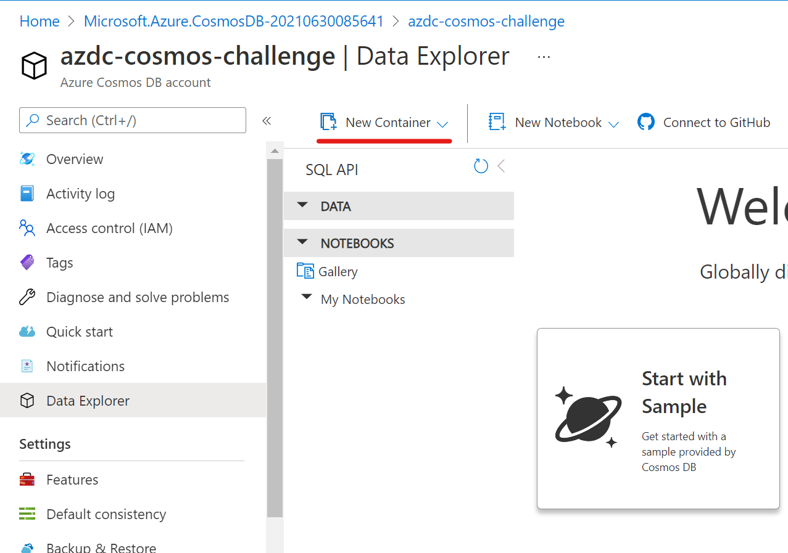
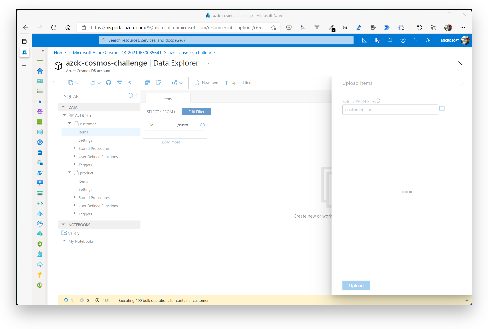

# Challenge 01: Cosmos DB

⏲️ *Est. time to complete: 60 min.* ⏲️

## Here is what you will learn 🎯

In this challenge you will learn how to:

- Create a Cosmos DB account
- Add data and query via the data explorer
- Learn about partitions and the effect of cross-partition queries
- Use the Cosmos DB change feed

## Table Of Contents

1. [Create a Comsos DB Account, Database and Containers](#create-a-comsos-db-account-database-and-containers)
2. [Add and query data](#add-and-query-data)
3. [Use the Cosmos DB Change Feed](#use-the-cosmos-db-change-feed)
4. [Azure Samples](#azure-samples)
5. [Cleanup](#cleanup)

## Create a Comsos DB Account, Database and Containers

Before we start creating a database account in Azure, let's have a brief look at the resource model of Cosmos DB. It is made of the following objects:

- _Account_: manages one or more databases
- _Database_: manages users, permissions and containers
- _Container_: a schema-agnostic container of user-generated JSON items and JavaScript based stored procedures, triggers and user-defined-functions (UDFs)
- _Item_: user-generated document stored in a container


To create a Cosmos DB account, database and the corresponding containers we will use in this challenge, you have two options:

- [Azure Portal](#option-1-azure-portal)
- [Azure Bicep](#option-2-azure-bicep)

Both are decribed in the next chapters, choose only one of them.

:::tip
📝 The "Bicep" option is much faster, because it will create all the objects automatically at once. If you want to go with that one, please also have a look at the "Create View" in the portal to make yourself familiar with all the settings you can adjust for a Cosmos DB account, db and container.
:::

### Option 1: Azure Portal

#### Create a Comsos DB Account

In the Azure Portal, click on _Create Resource_ and select _Azure Cosmos DB_. When prompted to select an API option, please choose _Core (SQL) - Recommended_.


:::tip
📝 As you might already know, Comsos DB supports a variety of APIs that you can use, depending on your use case. You can e.g. use the _MongoDB_ API - as the _Cosmos DB Core API_ - for storing documents, take the _Cassandra_ API, if you have to deal with timeseries oriented data or _Gremlin_, if you want to store the data in a graph with _vertices_ and _edges_. You can find out more about all the options (and when to choose which API) in the official documentation: <https://docs.microsoft.com/en-us/azure/cosmos-db/choose-api>.
:::

On the wizard, please choose/enter the following parameters:

| Option Name    | Value                                                                                                         |
| -------------- | ------------------------------------------------------------------------------------------------------------- |
| Resource Group | Create a new resource group called **rg-cosmos-challenge**                                                    |
| Account Name   | Enter a globally unique account name, like **azdc-cosmos-challenge**                                          |
| Location       | West Europe                                                                                                   |
| Capacity mode  | **Serverless** (we use the serverless option, because it's the cheapest option for development/test purposes) |


Leave all other options as suggested by the wizard and finally click _Create_. After approximately 4-8 minutes, the database account has been created. Please go to the resource as we now need to add the database and containers for our data.

#### Create a Database and Containers

The most convenient way to add a database and containers to a CosmosDB account is the _Data Explorer_. You can find the option in the context menu of the Comsos DB account overview in the Azure Portal. We now need to create two container, so please go to the _Data Explorer_ and click on _New Container_ in the toolbar.



#### Container: Customer

| Option Name   | Value                                                                                                               |
| ------------- | ------------------------------------------------------------------------------------------------------------------- |
| Database id   | Select the option _Create new_ and enter the name _AzDCdb_. With this first container, we also create the database. |
| Container id  | customer                                                                                                            |
| Partition key | /customerId                                                                                                         |

Click _Ok_ and when the operation has finished, go to the _Settings_ view of the _customer_ container in the _Data Explorer_ and adjust the _Indexing Policy_. Copy the following JSON document in the editor and click _Save_ in the toolbar:

```json
{
    "indexingMode": "consistent",
    "automatic": true,
    "includedPaths": [
        {
            "path": "/*"
        }
    ],
    "excludedPaths": [
        {
            "path": "/title/?"
        },
        {
            "path": "/firstName/?"
        },
        {
            "path": "/lastName/?"
        },
        {
            "path": "/emailAddress/?"
        },
        {
            "path": "/phoneNumber/?"
        },
        {
            "path": "/creationDate/?"
        },
        {
            "path": "/addresses/*"
        },
        {
            "path": "/\"_etag\"/?"
        }
    ]
}
```

:::tip
📝 Why are we adjusting the indexing policy? We'll come back to that point later. Just be a little bit patient.
:::

#### Container: Product

| Option Name   | Value                                                 |
| ------------- | ----------------------------------------------------- |
| Database id   | Select the option _Use existing_ and select _AzDCdb_. |
| Container id  | customer                                              |
| Partition key | /customerId                                           |

After you have created the database and the containers, the _Data Explorer_ should look like that:


Now we are ready to add data. You can move on to [Add and query data](#add-and-query-data)

### Option 2: Azure Bicep

You can run the following commands on your local machine or in the Azure Cloud Shell. If Azure Bicep isn't installed already, simply add it via the Azure CLI:

```shell
$ az bicep install #only needed, if bicep isn't present in the environment

$ cd day3/challenges/cosmosdb

$ az group create --name rg-cosmos-challenge --location westeurope
{
  "id": "/subscriptions/00000000-0000-0000-0000-000000000000/resourceGroups/rg-cosmos-challenge",
  "location": "westeurope",
  "managedBy": null,
  "name": "rg-cosmos-challenge",
  "properties": {
    "provisioningState": "Succeeded"
  },
  "tags": null,
  "type": "Microsoft.Resources/resourceGroups"
}

$ az deployment group create -f cosmos.bicep -g rg-cosmos-challenge
{
  "id": "/subscriptions/00000000-0000-0000-0000-000000000000/resourceGroups/rg-cosmos-challenge/providers/Microsoft.Resources/deployments/cosmos",
  "location": null,
  "name": "cosmos",
  ...
  ...
  ...
  ...
}
```

After approximately 8-10 minutes, the Cosmos DB account, database and the containers (_product_ and _customer_) have been created and are ready to be used. Open the account in the Azure Portal and navigate to the _Data Explorer_. It should look like similar to that:


Let's add data to the two containers.

## Add and query data

Now, it's time to add data to the _customer_ and _product_ containers. There a two datasets that have been prepared for you.

### Customer Dataset

The _customer_ dataset contains of two types of objects that we put in the same container: **customer** and **salesOrder**. Wait...two object types in the same container? You learned that when dealing with data in a (relational) database, the data should always be normalized and that it's best to have one object type in one table! "This is totally against that principle", you might think.

Yes, you are right in a relational environment. But here, we are working with a NoSQL database and things are a little bit different. Mixing object types in one container is totally fine (and even a best practice in terms of performance). In this non-relational world, you also tend to follow the "de-normalization" principle. That means that data duplication, embedding etc. is not only possible, but encouraged.

<https://azuredevcollegesa.blob.core.windows.net/cosmosdata/customer.json>

#### Customer Data

Explain --> type property, embedding

```json
{
    "id": "0012D555-C7DE-4C4B-B4A4-2E8A6B8E1161",
    "type": "customer",
    "customerId": "0012D555-C7DE-4C4B-B4A4-2E8A6B8E1161",
    "title": "",
    "firstName": "Franklin",
    "lastName": "Ye",
    "emailAddress": "franklin9@adventure-works.com",
    "phoneNumber": "1 (11) 500 555-0139",
    "creationDate": "2014-02-05T00:00:00",
    "addresses": [
      {
        "addressLine1": "1796 Westbury Dr.",
        "addressLine2": "",
        "city": "Melton",
        "state": "VIC",
        "country": "AU",
        "zipCode": "3337"
      }
    ],
    "password": {
      "hash": "GQF7qjEgMl3LUppoPfDDnPtHp1tXmhQBw0GboOjB8bk=",
      "salt": "12C0F5A5"
    },
    "salesOrderCount": 2
}
```

#### SalesOrder Data

Explain why in the same collection --> same partition key. Again: embedding.

```json
{
    "id": "091F884C-DC00-4422-9B89-3438B22DEF07",
    "type": "salesOrder",
    "customerId": "0012D555-C7DE-4C4B-B4A4-2E8A6B8E1161",
    "orderDate": "2014-03-03T00:00:00",
    "shipDate": "2014-03-10T00:00:00",
    "details": [
      {
        "sku": "TT-M928",
        "name": "Mountain Tire Tube",
        "price": 4.99,
        "quantity": 1
      },
      {
        "sku": "PK-7098",
        "name": "Patch Kit/8 Patches",
        "price": 2.29,
        "quantity": 1
      },
      {
        "sku": "TI-M267",
        "name": "LL Mountain Tire",
        "price": 24.99,
        "quantity": 1
      }
    ]
}
```

### Product Dataset

Explain dataset

Download: <https://azuredevcollegesa.blob.core.windows.net/cosmosdata/product.json>

#### Product Data

```json
{
    "id": "9190229B-1372-4997-8F64-5B3E7A2459C5",
    "categoryId": "86F3CBAB-97A7-4D01-BABB-ADEFFFAED6B4",
    "categoryName": "Accessories, Tires and Tubes",
    "sku": "TT-M928",
    "name": "Mountain Tire Tube",
    "description": "The product called \"Mountain Tire Tube\"",
    "price": 4.99,
    "tags": [
      {
        "id": "66D8EA21-E1F0-471C-A17F-02F3B149D6E6",
        "name": "Tag-83"
      },
      {
        "id": "6FB11EB9-319C-431C-89D7-70113401D186",
        "name": "Tag-154"
      },
      {
        "id": "8AAFD985-8BCE-4FA8-85A2-2CA67D9DF8E6",
        "name": "Tag-172"
      },
      {
        "id": "A4D9E596-B630-4792-BDD1-7D6459827820",
        "name": "Tag-164"
      }
    ]
}
```

### Uplopad the datasets

To add the datasets to Cosmos DB, go to the _Data Explorer_ and first open the _Items_ menu item of the _customer_ container. When the tab appears, you'll see a _Upload Item_ button in the toolbar. Click on that button and then select the _customer.json_ file that you previously downloaded. Upload it.



:::tip
📝 Depending on your network speed and latency, this should take about 2-3 minutes.
:::

Do the same with the _product.json_ file for the _product_ collection.

### Queries

How much data?
SELECT VALUE(COUNT(1)) FROM c

#### Simple Query

#### Partition-Aware Queries

#### Can I do JOINs?

Multiple types in same partition key / collection...

#### Aggerations

E.g. number of line items per sales order or number of tags per product

#### Indexing

What is it and why you should adjust the default settings?!

## Use the Cosmos DB Change Feed

Which APIs are supported...

### Why to use it?

### What does it support?

### How to consume the Change Feed?

Describe Azure Function and ChangeFeed Processor

### Sample: Create a CustomerView collection for query optimized access to Customer data

Create collection "customerView" (partition key '/area' - see bicep file) + Az Function under day3/challenges/cosmosdb/func (Adjust connection string to db)

Explain what is done in index.js

Run function (let it process all changes --> then show collection content)

Update a customer in original collection and show result in "view" collection --> they are in sync

## Azure Samples

_Add some links to Azure samples that might be of interest, e.g.:_

Azure AppService code samples:

- <https://docs.microsoft.com/en-us/samples/browse/?expanded=azure&products=azure-app-service%2Cazure-app-service-web>

## Cleanup

No clean-up needed this time. We will reuse the Cosmos DB account in the Azure Cognitive Search challenge. So please, don't delete any of the resources yet.

[◀ Previous challenge](./00-challenge-baseline.md) | [🔼 Day 3](../README.md) | [Next challenge ▶](./02-challenge-sql.md)
