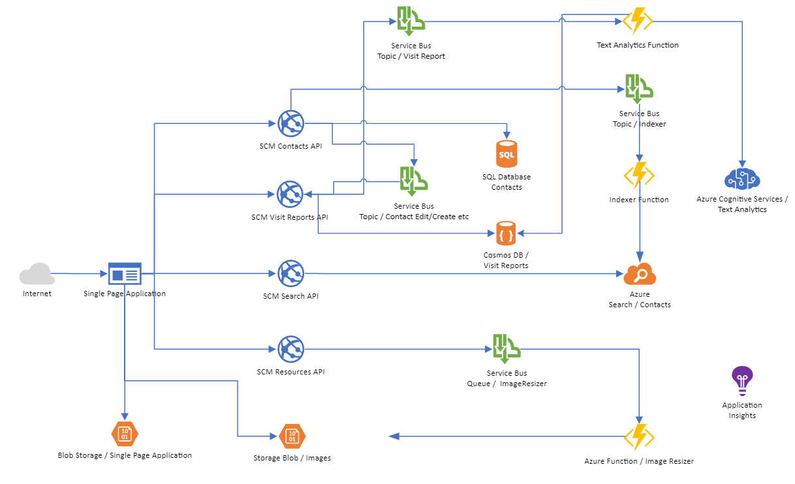

# Day 4 DevOps and Monitoring

## Welcome

Today we are going to focus on the topic _DevOps_. Therefore we take a closer look at GitHub, its components and how we can deploy infrastructure to Azure using code.

- GitHub organization
- GitHub project boards
- GitHub repositories
- GitHub Actions workflows
- Azure Bicep
- Azure Application Insights

## Challenges

- [Challenge 00: Create a GitHub organization](challenges/00-challenge-org.md) _(30 min.)_
- [Challenge 01: GitHub project boards](challenges/01-challenge-boards.md) _(20 min.)_
- [Challenge 02: GitHub Actions and Pages Intro](challenges/02-github-actions-intro.md) _(30 min.)_
- [Challenge 03: Deploy to Azure using GitHub Actions](challenges/03-challenge-bicep.md) _(30 min.)_
- [Challenge 04: Import the Azure Developer College's repository](challenges/04-challenge-azdc-repo.md) _(15 min.)_
- [Challenge 05: Create a CI/CD workflow to deploy the shared Azure resources of the SCM sample application](challenges/05-challenge-common-cicd.md) _(30 min.)_
- 💎 _[Breakout 1: Deploy the sample application with GitHub workflows](challenges/06-breakout.md)_ 💎

## Day 4 - Goal

You already have deployed the sample application to Azure manually. Today we want to dive into GitHub Actions workflows to show you how you can
automate your _build_ and _deployment process_ to constantly and continuously roll out an application and its components. Realizing a DevOps process means to plan, track and prioritize your work in an agile way. With GitHub projects boards, we can visualize a lean project management process to get everyone involved in the project on track and stay focused. We are going to use GitHub repositories to collaborate on code within the team. As we don't want to setup the needed Azure resources for the sample application by clicking in the portal, Azure bicep is introduced to describe the needed infrastructure as code.

Today you are going to create your own GitHub organization to manage all topics mentioned above.

### GitHub organization

A GitHub organization is a shared account where business and open-source projects can collaborate across many projects. Owners and Administrators can manage member access to the organization's data and projects with security and administrative features. At the beginning of the day you are going to create your own GitHub organization, invite team members and manage access to projects and repositories.

### GitHub project boards

Project boards on GitHub help you organize and prioritize your work. You can create project boards for specific feature work, comprehensive roadmaps or even release checklists. With project boards, you have the flexibility to create customized workflows that suits your needs. To organize and prioritize your work today, we are going to create a project board at the organization level, grant access to specific teams and visuialize the differnent challenges with Kanban columns. We will see how to visualize pull requests and issues on the board and how they flow from the _ToDo_ state to the _Closed_ state.

### GitHub repository

A GitHub repository contains all of your project's files and each file's revision history. During the day you are going to work with Git branches, commits and pull requests.

### GitHub Actions workflows

GitHub actions helps you to automate task within your software development lifcycle. GitHub Actions makes it easy to automate all your software workflows like CI/CD.
Today you will dive into GitHub Actions workflows and learn how to build and deploy each microservice of the sample application.

### Azure Bicep

You already have seen how to use ARM Templates, but with Azure Bicep it is easier to author your infrastructure as code.
Azure Bicep is a Domain Specific Language (DSL) for deploying Azure resource declaratively. It aims to drastically simplify the authoring experience with a cleaner syntax, improved type safety, and better support for modularity and code re-use. Today you will deploy a simple Azure Bicep file using a GitHub Actions workflow.
The sample application itself uses Azure Bicep to deploy all needed Azure resources.

### Azure Application Insights

Application Insights, a feature of Azure Monitor, is an extensible Application Performance Management (APM) service for developers and DevOps professionals. Use it to monitor your live applications. It will automatically detect performance anomalies, and includes powerful analytics tools to help you diagnose issues and to understand what users actually do with your app. Today you will learn how to use Application Insights to monitor the sample application.

### Architecture

At the end of the day we will have deployed the same architecture for the sample application.

### Remarks

The challenges marked with the "💎" are the ones that focus on the sample application and represent the adoption of what you have learned in the challenges before. They results of the "💎" challenges will be reused in the next days.

Happy hacking! 😎
