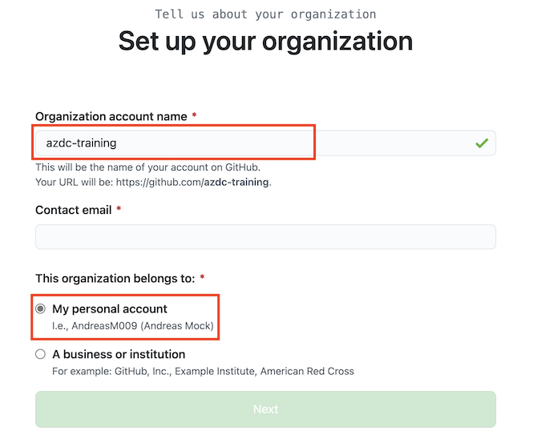
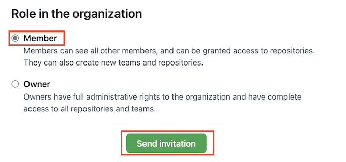
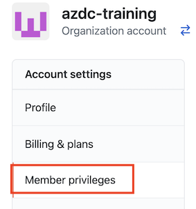
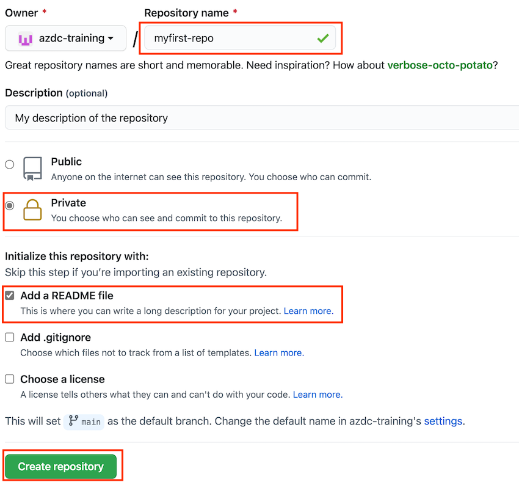
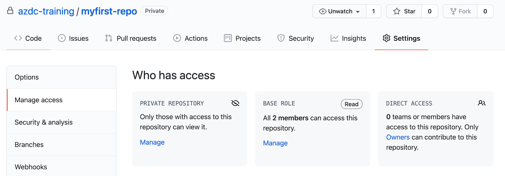
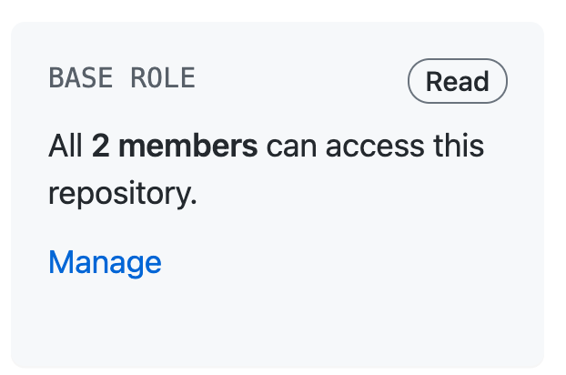
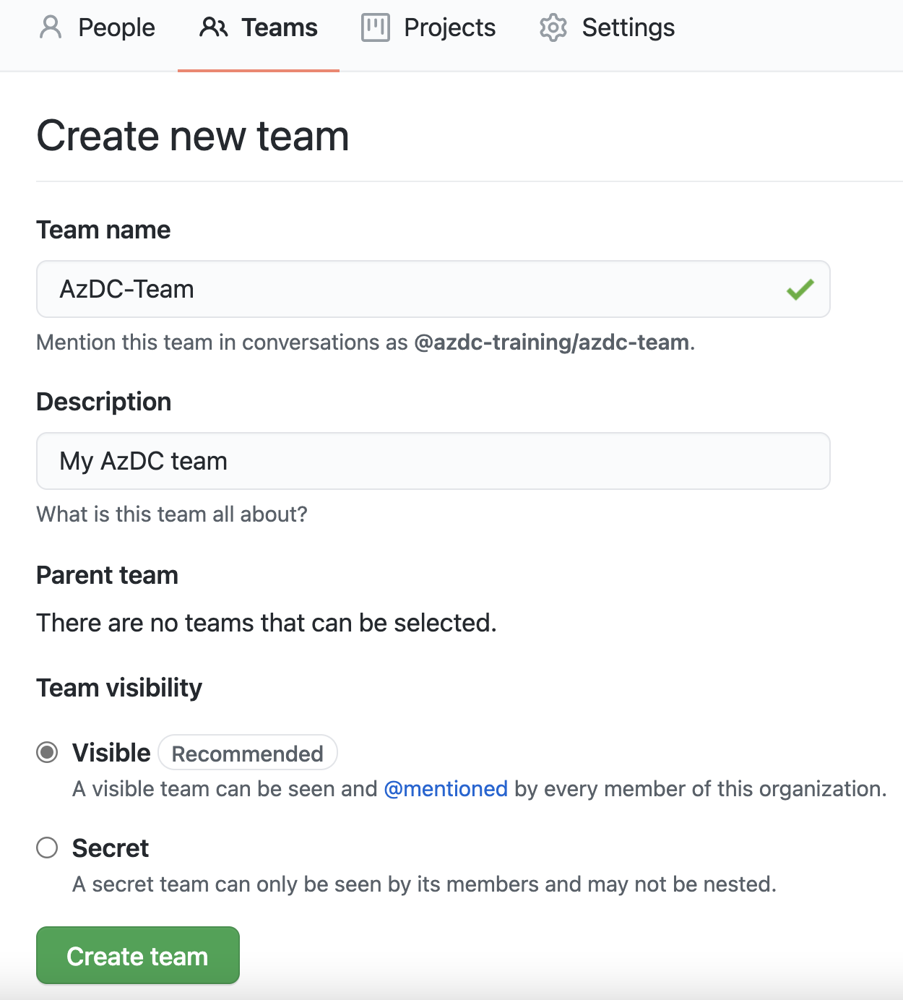
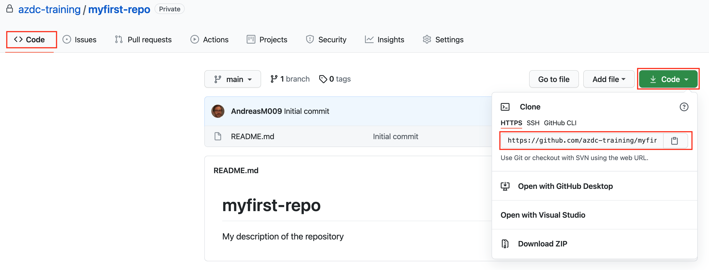
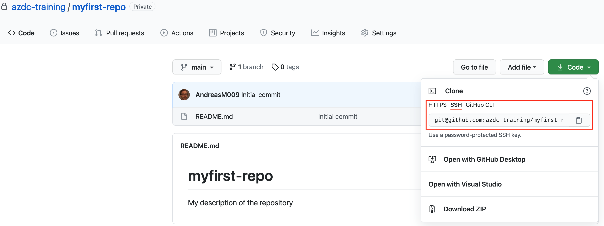

# Challenge 0: Create a GitHub organization

⏲️ *Est. time to complete: 15 min.* ⏲️

## Here is what you will learn 🎯

In this challenge you will learn how to:

- Create a GitHub organization
- Invite organization members and assign roles
- Create your first repository
- Create a team and assign permissions to a repository

## Table Of Contents

1. [Create a GitHub organization](#create-a-github-organization)
2. [Invite organization members an assign roles](#invite-organization-members-an-assign-roles)
3. [Create your first repository](#create-your-first-repository)
4. [Create a team and assign permission](#create-a-team-and-assign-permission)
5. [Clone the repository to your local machine](#clone-the-repository-to-your-local-machine)
6. [Useful Links](#useful-links)

## Create a GitHub organization

A GitHub organization is a shared account where business and open-source projects can collaborate across many projects. Owners and Administrators can manage member access to the organization's data and projects with security and administrative features. In the first part of this challenge we are going to create our own GitHub organization which we use for all challenges today. 

:::tip
📝 _If you don't have a GitHub account, you need to create one. You can create your account [here](https://github.com/join)._
:::

First we need to [login to GitHub](https://github.com/login).

Next, navigate to _Your organizations_ and create a new oragnization.


First you have to choose a plan for your organization. For today a free plan is enough.
Next, you need to specify a global unique name for your organization an tell GitHub that the organization belongs to your personal account. After you have set all needed values, click _Next_ and complete the setup. We don't need to add organization members now, because we want to do that in the next part of this challenge.




## Invite organization members an assign roles

At the moment you are the _Owner_ and the only one who can access the newly created organization. You can check this by navigating to the _People_ section in the GitHub's navigation bar. The members list shows each member and their access level. 
Owners have full access to teams, repositories and settings of the organization.
Of course we want to work with colleagues. We are now looking at how we can add our colleagues to the organization and what access rights we can give them. To add a new member, navigate to the _People_ section, enter the invitee's email or GitHub handle and click _Invite Member_. 


Next, you need to specify the invitee's organization role. 

**Member:**
Members can see all other members and can be granted access to repositories. They can create teams and repositories.

**Owner**
Owners have full administrative rights to the organization and have complete access to all repositories and teams.

Actually, at least two people should be assigned to the Owner role. In this training, however, it is enough that there is only one owner. Therefore we assign the role _Member_ to the invited person.




After clicking _Send invitation_ the invitee gets an email where the invitation can be accepted. 
When we navigate back to the _People_ section, we see that there is one pending invitation. The pending invitation state of the invitee is going to be changed as soon the invitee has accepted the invitation. The status of the invitee's pending invitation will be changed once the invitee has accepted the invitation.

Wait until the invitee has accepted the invitation and verified that they have access to the organization.

:::tip
📝 _If you want, the invitee can check if they can create a repository. It is be possible, because the Member role was assigned. But it is not possible to change settings of the organisation. Therefore the Settings section in the GitHub's navigation bar is not displayed. _
:::

### Outside collaborators

When you look at the _People_ section there is an entry named _Outside collaborators_ under the _Organization permissions_. So, what is an _Outside collaborator_? An _Outside collaborator_ is a person who isn't explicitly a member of your organization, but who has _Read_, or _Admin_ permissions to one or more repositories of your organization. 
This is useful when, for example, we are working with partner companies on a project but don't want partners to have organization-level access. Partners cannot view members of the organization and cannot create repositories. We only give partners access to selected repositories.
We will look at how to give _Outside collaborators_ access to repositories later.

### Member privileges

As an organization _Owner_, we can manage _Members'_ privileges. Navigate to the organization's _Settings_ section in the GitHub's navigation bar and click _Manage privileges_.




Here you can manage what members of the organization are allowed to do. For example, if you want to control access to repositories for members, we need to look at _base permissions_. Per default, members can clone and pull all repositories within the organization, regardless if the repositories are public or private. If we want to restrict access to repositories as owner, we can set the value _None_. With this setting it is only possible to clone and pull public repositories. If members need access to a repository, we need to add them to teams or make them collaborators on individual repositories.
But it also works the other way around, members can be assigned more rights.  With _Write_ and _Admin_ members will get more access rights to each repository within the organization.

For this challenge we leave it at the default setting.


Take your time and have a look at the other settings and feel free to discuss them within your team mates.


## Create your first repository

Now it is time to create your first repository and clone it to your local machine. Navigate to the _Repositories_ section in the GitHub's navigation bar and click the green _New_ button. 
Give the repository a name e.g. _myfirst-repo_ (If you want, you can add a description).
At this time, we want to make the repository private and choose later who can commit. 

:::tip
📝 _Since we have already invited a colleague as a member of the organization and used the default _Read_ setting as Base permission in the member privileges, the invited colleague can clone and pull the newly created repository._
:::

Please initialize the repository with a _README_ file. 

::: tip
📝 _If you want, you can initialize the repository with a _.gitignore_ file, by selecting a template._
:::



Click the _Create repository_ button to create the repository.

A GitHub repository contains all of your project's files and each file's revision history. Currently, 2 people have access to the repository. You, as owner, have full access and your invited colleague has read access. Of course we want to work together on the repository. That's why we have to give the colleague write permissions. Therefore navigate to the repository's settings section and go to _Manage access_.



In the _Who has access_ area you can see that the repository is a private one. 
Two members have _Read_ access to the repository. You are the _Owner_ of the repository and your invited colleague has _Read_ access to it, because we have given members _Read_ access to all repositories in the _Manage privileges_ settings of the organization.



There are two ways to give someone more access than the Base permission allows.

**People:**
Assigning individual people who are either members of the organization, or _Outside Collaborators_. An _Outside collaborator_ is a person who isn't explicitly a member of your organisation. 

**Teams:**
We can organize people into team, and assign rights to the team.

In the next section we will create a _Team_ and give it write access to the repository.

## Create a team and assign permission

Navigate to the _Teams_ section  of your organization and click the green _New Team_ button. 
Name the Team _AzDC-Team_ and give a description. At this time we make the team visible. 



After you have created the Team, you can add members in the _Members_ section. Again, we have the option to add both members of the organization or _Outside collaborators_. 
Now add the invited colleague to the team. After your colleague was added you can change their role within the Team. You can choose between _Member_ and _Maintainer_.

**Maintainer:** Maintainers can add and remove team members and create child teams.

**Member:** A member has no administrative permissions to the team.

For the moment we leave it at the role _Member_, which is the default.

Next, we add the existing repository to the Team and grant write access. Navigate to the _Repositories_ section within your Team and add the repository we created earlier.


After the repository was added, you can change the access level in the dropdown menu.


In the dropdown menu all possible access levels are listed. For our scenario we choose _Write_, because we want to allow the team to push to the repository and to manage issues and pull requests.

:::tip
📝 _If you want to validate the access level, add an Outside collaborator and assign Read permission and validate if the added Outside collaborator can edit the created README.md file and push the changes to the repository. The Outside collaborator can use the GitHub UI and does not need to clone the repository. Then validate if your invited colleague (Member of the organization and the AzDC-Team) can edit the file and push the changes to the repository._
:::

:::tip
📝 _Navigate to the Discussion section within your Team and checkout the Team's page. Each team has its own page within an organization. On a team's page, you can view team members, child teams, and the team's repositories. Organization owners and team maintainers can access team settings and update the team's description and profile picture from the team's page_
:::

## Clone the repository to your local machine

Cloning a public repository from GitHub using git commandline tool is very easy, but when it comes to clone a private repository it is a bit tricky. You can either clone the repository with a password, a token or you can clone it using SSH credentials.

### Clone the repository with a password

Navigate to your repository, select the _<> Code_ section, click the green _Code_ botton and copy the _HTTPS_ url.



Now, open a terminal and clone the repository to a location of your choice using the git clone command and your GitHub username:

```Shell
git clone https://your_username@repository_url
```

After a short time, you will be prompted for a password. Once the git client authenticated, the repository is cloned to your local machine.

::: tip
📝 _If you have enabled MFA for your account, you need to use SSH credentials to clone the repository._
:::

Using your username and password you have to input your password every time for each operation to the repository. You can permanently store your password in the git configuration, but first you have to enable the credentials helper by running the git config command:

```Shell
git config --global credential.helper store
```

Now you only have to enter your password once, when you clone a repository.

### Clone the repository with SSH keys

First, you need to generate an SSH keypair on your local machine and add the public key to your GitHub account.
GitHub has a very good documentation: [Connectiong to GitHub with SSA](https://docs.github.com/en/github/authenticating-to-github/connecting-to-github-with-ssh)
After you added your public SSH key to your GitHub account, you can clone the repository using SSH.



Open a terminal and use the git clone command to clone the repository:

```
git clone git@github.com:<your-org-name>/<your-repo-name>.git
```

## Useful Links

[About GitHub organisations](https://docs.github.com/en/organizations/collaborating-with-groups-in-organizations/about-organizations)

[About GitHub repositories](https://docs.github.com/en/github/creating-cloning-and-archiving-repositories/creating-a-repository-on-github/about-repositories)

[About GitHub Teams](https://docs.github.com/en/organizations/organizing-members-into-teams/about-teams)


[🔼 Day 4(GitHub)](../README.md) | [Next challenge ▶](./NN-challenge.md)
