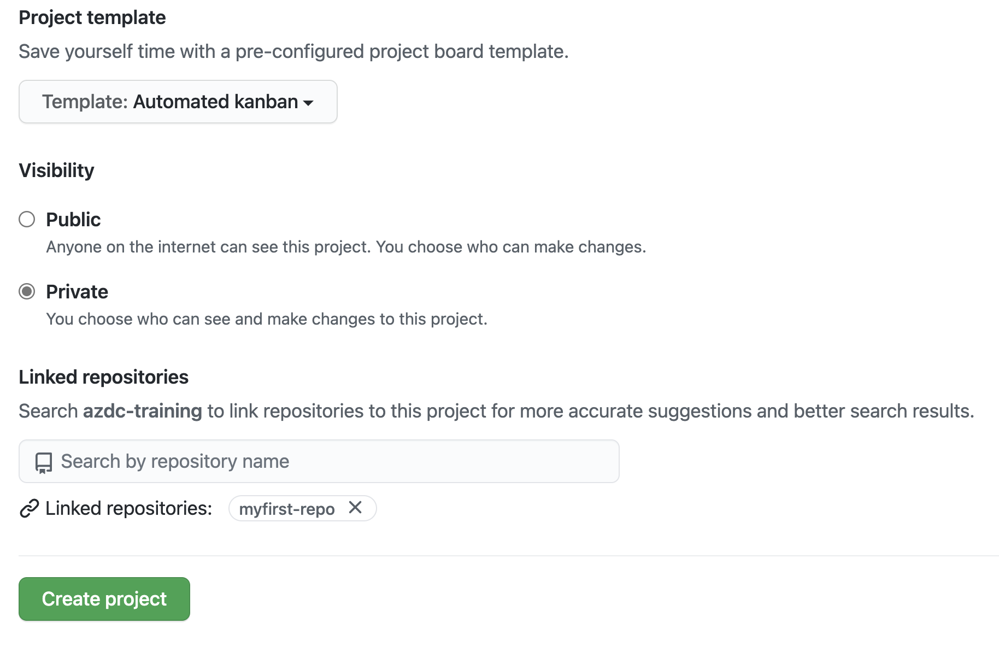
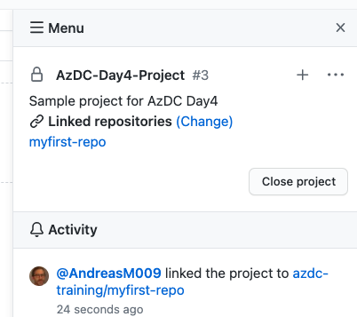
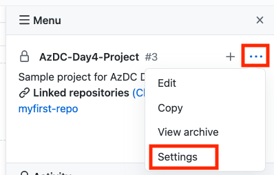
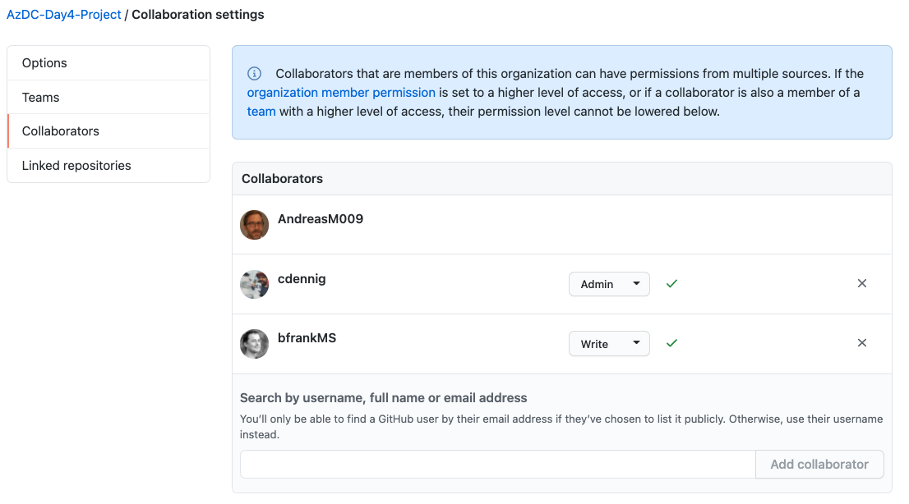

# Challenge 01: GitHub project boards

⏲️ *Est. time to complete: 20 min.* ⏲️

## Here is what you will learn 🎯

In this challenge you will learn how to:
- Create a GitHub project board
- Assign permissions to a team 
- Add project Administrators
- Working with cards
- Plan milestones (sprints)
- Use GitHub labels to categorize issues and pull requests
- See how issues and pull requests flow automatically through the different board's columns

## Table of content

1. [Create a GitHub project board](#create-a-github-project-board)
2. [Assign permissions to a team](#assign-permissions-to-a-team)
3. [Add project Administrators](#add-project-administrators)
4. [Working with cards](#working-with-cards)
5. [See how issues and pull requests flow automatically through the different board's columns](#use-github-labels-to-categorize-issues-and-pull-requests)
6. [Plan your work for day4](#plan-your-work-for-day4)

## Create a GitHub project board

Project boards on GitHub help you organize and prioritize your work. You can create project boards for specific feature work, comprehensive roadmaps or even release checklists. With project boards, you have the flexibility to create customized workflows that suits your needs. To organize and prioritize your work today, we are going to create a project board at the organization level. Of course it is possible to create a board on repository level, but as we will create more repositories during the day and we want to visualize our work across all repositories, we create a board on organization level. GitHub provides different template for a project board. Today, we use the template _Automated kanban_. With this template, we get a simple board with three columns:
- To do, for cards that must be done
- In progress, to display cards we are currently working on
- Done, cards we have completed

Let us create the project board. Navigate to the _Project_ section of your organization and create a new project.
Name the project _AcDC-Day4-Project_ give it a description.

Select the _Automated kanban_ template and choose _Private_ for the visibility of the project. Link the project to your repository as well to be able to show issues on the board later.

After the project is created, we can add notes to plan and track our work. There are already some example notes created in the _To Do_ column of the board. You can delete these notes, as we don't need them. A project board is made up of issues, pull requests and notes which are displayed as cards. Cards are categorized in columns of your choice. We can move cards from one column to another. As we have selected the _Automated kanban_ template, the board is made up of three columns, but you can add more columns to the board to categorize cards the way you want it. 

The project is already linked to the repository _myfirst_repo_. There is a _Menu_ button at the upper right corner of the board. When you click the button, you get an overview of activities and a list of linked repositories. 

:::tip
📝 _Maybe the button is not visible, because there is the flyout dislayed that allows you to add cards. Close it and you will see the Menu button._
:::

## Assign permissions to a team

At the moment organisation owners and members are the only one who can add and manage cards. We need to assign permissions to a team so they can create and manage cards.
Open the board's menu again. Click the ellipsis _..._ button and open the _Settings_. 

In the _Options_ section you can manage the visibility of the project and organization member's permissions. _Write_ is the default baseline permission level for all members of the organization. 

:::tip
📝 _To restrict access to all organisation members, set Read as basline permission level._
:::

Since we are working with a single team in our organization today and we may have already added _Outside collaborators_ to this team, we still need to give _Write_ permissions to this team. Navigate to the _Teams_ section and assign _Write_ permissions to the _AzDC-Team_ team.

## Add project Administrators

As the organization owner, only you have full administrative rights in this project. We can make both members of the organization, but also _Outside collaborators_ project administrators. In the _Collaborators_ section you can add collaborators and give them _Admin_ permissions.

## Working with cards

## Plan milestones (sprints)

## Use GitHub labels to categorize issues and pull requests

## See how issues and pull requests flow automatically through the different board's columns

## Plan your work for day4