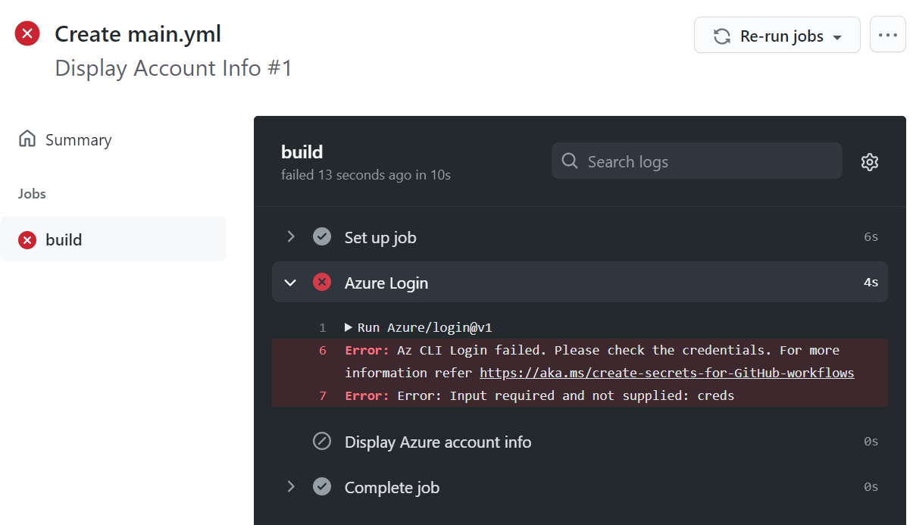

# Deploy to Azure WebApp using GitHub Actions

⏲️ _est. time to complete: 30 min._ ⏲️

## Here is what you will learn 🎯

In this challenge you will learn how to:

- access your Azure Subscription from GitHub Actions
- use GitHub Secrets to securely store access credentials
- create a Service Principal for your Azure Subscription
- create a Resource Group in GitHub Actions
- deploy a bicep template using GitHub Actions
- build and deploy your WebApp to Azure AppService

## Table of contents

- [Deploy to Azure WebApp using GitHub Actions](#deploy-to-azure-webapp-using-github-actions)
- [here is what you will learn 🎯](#here-is-what-you-will-learn-)
- [Azure Login Action](#azure-login-action)
- [Create Service Principal](#create-service-principal)
- [Create Azure Bicep template](#create-azure-bicep-template)
- [Create resource group and deploy Bicep template](#create-resource-group-and-deploy-bicep-template)
- [Create a simple express app](#create-a-simple-express-app)
- [Deploy AppService](#deploy-appservice)## Azure Login Action

## Getting started

In this challenge we will learn how to securely access your Azure Subscriptions
from GitHub, how to create infrastructure from code and how to deploy into the
freshly created infrastructure.

As in the previous challenges we will start with a new repository.

Create one now.

### Accessing Azure

In your fresh repository create a new GitHub Actions workflow.

We will use the `Azure/login` Action to give our deploy job permissions within
our Azure Subscription. Take a look at the
[documentation](https://github.com/Azure/login) for the `Azure/login` Action and
read through the ["Configure deployment
credentials"](https://github.com/Azure/login#configure-deployment-credentials)
section.

You can use the sample workflow provided below. Just commit it into your
repository and watch the first execution fail.

```yaml
# az-login.yaml
name: Display Account Info

on:
  push:

jobs:
  login:
    runs-on: ubuntu-latest

    steps:
      - name: Azure Login
        uses: Azure/login@v1
        with:
          creds: ${{ secrets.AZURE_CREDENTIALS }}

      - name: Display Azure account info
        run: az account show -o yaml
```

Out of the box your GitHub Pipeline will not have any credentials in place to
log into your Azure Subscriptions. The first run of your pipeline should fail
with an error message like this:

```
Error: Az CLI Login failed. Please check the credentials.
```



## Programmatic access to Azure

To allow GitHub to interact with our Azure Subscriptions we need to create a
Service Account in our Azure Active Directory. This account represents not a
user but a service, machine or digital agent. These accounts are called
**Service Principal**.

Having read the documentation on the `Azure/login` you might already have seen
the following line to create a Service Principal for role based access control.

Make sure to **change the name** for your service principal so you can identify it
later on your Azure AD.

```shell
# Change the name and set use your subscription-id to create a Service Principal.
az ad sp create-for-rbac --name "{name}-github-actions-sp" --sdk-auth --role contributor --scopes /subscriptions/{subscription-id}
```

## Create Azure Bicep template

```bicep
@description('The SKU of App Service Plan')
param planSku string = 'B1'

@maxLength(8)
@description('Name of environment')
param env string = 'webapp'

@description('Resource tags object to use')
param resourceTag object = {
  Environment: env
  Application: 'Webapp'
}
var location = resourceGroup().location

var webAppName = 'app-webapp-${env}-${uniqueString(resourceGroup().id)}'
var planName = 'plan-webapp-${env}-${uniqueString(resourceGroup().id)}'

resource appplan 'Microsoft.Web/serverfarms@2020-12-01' = {
  name: planName
  location: location
  kind: 'linux'
  sku: {
    name: planSku
  }
  properties: {
    reserved: true
  }
}

resource webapp 'Microsoft.Web/sites@2020-12-01' = {
  name: webAppName
  location: location
  tags: resourceTag
  kind: 'app,linux'
  properties: {
    serverFarmId: appplan.id
    httpsOnly: true
    clientAffinityEnabled: false
    siteConfig: {
      linuxFxVersion: 'NODE|14-lts'
      alwaysOn: true
    }
  }
}

output webAppName string = webAppName
output webAppEndpoint string = webapp.properties.defaultHostName
```

## Create resource group and deploy Bicep template

```yaml
name: Deploy Bicep template

on:
  push:

env:
  RESOURCE_GROUP_NAME: github-action-bicep-rg
  RESOURCE_GROUP_LOCATION: westeurope
  ENV_NAME: devd4

jobs:
  deploy-infra:
    runs-on: ubuntu-latest

    steps:
      - uses: actions/checkout@v2

      - name: Azure Login
        uses: Azure/login@v1
        with:
          creds: ${{ secrets.AZURE_CREDENTIALS }}

      - name: Create Resource Group
        run: >
          az group create
          -l ${{ env.RESOURCE_GROUP_LOCATION }}
          -n ${{ env.RESOURCE_GROUP_NAME }}

      - name: Deploy Bicep template
        uses: azure/arm-deploy@v1
        id: infra
        with:
          resourceGroupName: ${{ env.RESOURCE_GROUP_NAME }}
          template: ./infra.bicep
          parameters: >
            env=${{ env.ENV_NAME }}

      - name: Print WebApp endpoint
        run: echo https://${{ steps.infra.outputs.webAppEndpoint }}
```

## Create a simple express app

```shell
npx express-generator ./ --view pug --git
npm install
git add .
git commit -m "Add simple express app"
git push
```

## Deploy AppService

```yaml
name: CI

on:
  push:

env:
  RESOURCE_GROUP_NAME: github-action-bicep-rg
  RESOURCE_GROUP_LOCATION: westeurope
  ENV_NAME: devd4

jobs:
  deploy-infra:
    runs-on: ubuntu-latest
    outputs:
      webAppName: ${{ steps.infra.outputs.webAppName }}
    steps:
      - uses: actions/checkout@v2

      - name: Azure Login
        uses: Azure/login@v1
        with:
          creds: ${{ secrets.AZURE_CREDENTIALS }}

      - name: Create ResourceGroup
        run: >
          az group create
          -l ${{ env.RESOURCE_GROUP_LOCATION }}
          -n ${{ env.RESOURCE_GROUP_NAME }}

      - uses: azure/arm-deploy@v1
        id: infra
        with:
          resourceGroupName: ${{ env.RESOURCE_GROUP_NAME }}
          template: ./infra.bicep
          parameters: env=${{ env.ENV_NAME }}

      - name: Print WebApp endpoint
        run: echo https://${{ steps.infra.outputs.webAppEndpoint }}

  deploy-webapp:
    needs: [deploy-infra]
    runs-on: ubuntu-latest

    steps:
      - uses: actions/checkout@v2

      - name: Setup Node.js environment
        uses: actions/setup-node@v2.2.0
        with:
          node-version: 12.x

      - name: Npm install
        run: npm ci

      - name: Azure Login
        uses: Azure/login@v1
        with:
          creds: ${{ secrets.AZURE_CREDENTIALS }}

      - name: Deploy Azure WebApp
        uses: Azure/webapps-deploy@v2
        with:
          app-name: ${{ needs.deploy-infra.outputs.webAppName }}
          startup-command: npm start
```
