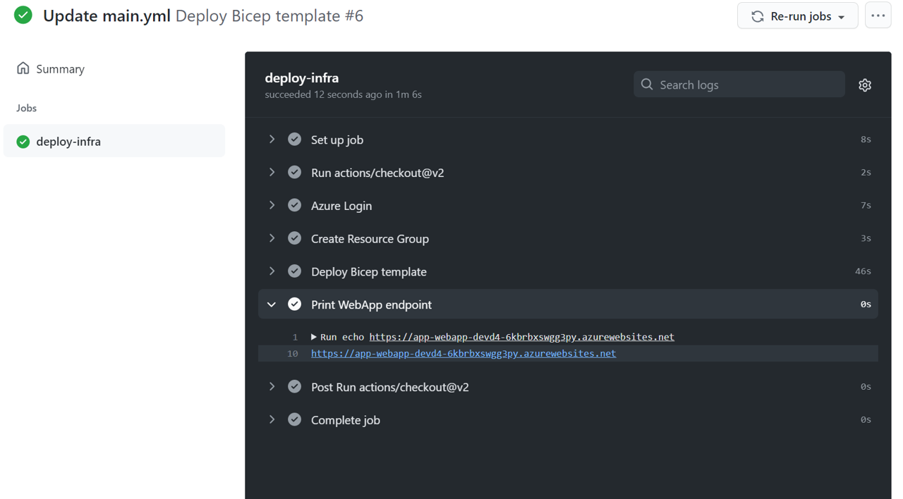
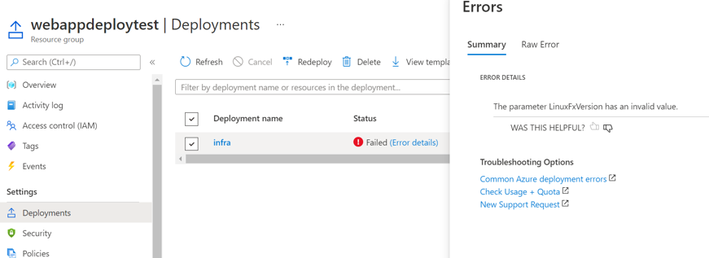
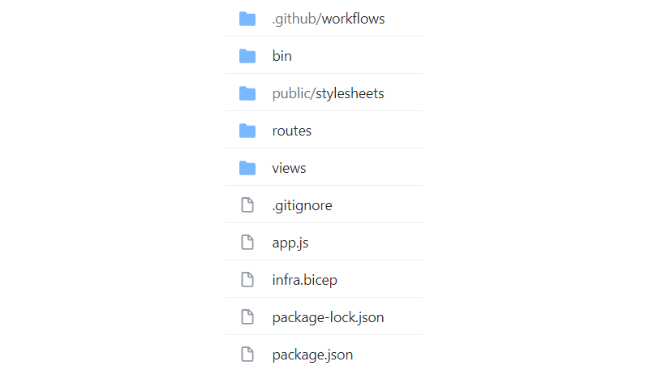
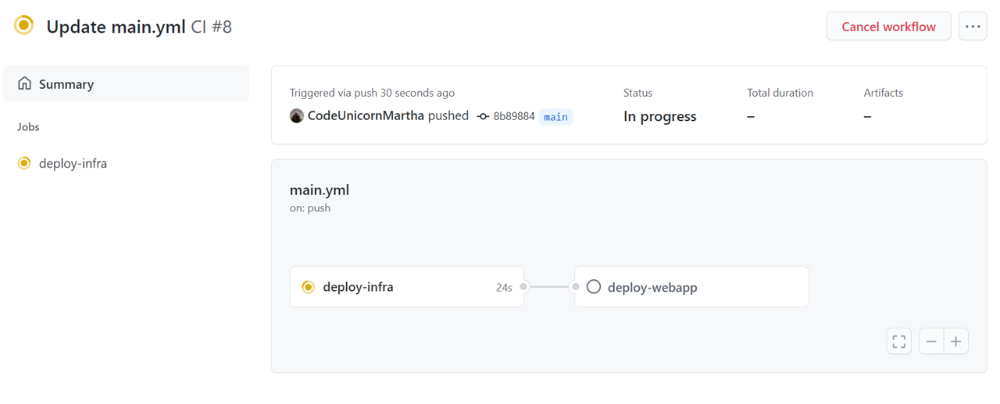

# Challenge 03: Deploy to Azure WebApp using GitHub Actions

⏲️ _est. time to complete: 30 min._ ⏲️

## Here is what you will learn 🎯

In this challenge you will learn how to:

- access your Azure Subscription from GitHub Actions
- use GitHub Secrets to securely store access credentials
- create a Service Principal for your Azure Subscription
- create a Resource Group in GitHub Actions
- deploy a bicep template using GitHub Actions
- build and deploy your WebApp to Azure AppService

## Table of contents

1. [Getting started](#getting-started)
2. [Create Azure Bicep template](#create-azure-bicep-template)
3. [Create resource group and deploy Bicep template](#create-resource-group-and-deploy-bicep-template)
4. [Create a simple express app](#create-a-simple-express-app)
5. [Deploy AppService](#deploy-appservice)
6. [Finish](#finish)

## Getting started

In this challenge we will learn how to securely access your Azure Subscriptions
from GitHub, how to create infrastructure from code and how to deploy into the
freshly created infrastructure.

As in the previous challenges we will start with a new repository.

Create one now.

### Accessing Azure

In your fresh repository create a new GitHub Actions workflow.

We will use the `Azure/login` Action to give our deploy job permissions within
our Azure Subscription. Take a look at the
[documentation](https://github.com/Azure/login) for the `Azure/login` Action and
read through the ["Configure deployment
credentials"](https://github.com/Azure/login#configure-deployment-credentials)
section.

You can use the sample workflow provided below. Just commit it into your
repository and watch the first execution fail.

```yaml
# az-login.yaml
name: Display Account Info

on:
  push:

jobs:
  login:
    runs-on: ubuntu-latest

    steps:
      - name: Azure Login
        uses: Azure/login@v1
        with:
          creds: ${{ secrets.AZURE_CREDENTIALS }}

      - name: Display Azure account info
        run: az account show -o yaml
```

Out of the box your GitHub Pipeline will not have any credentials in place to
log into your Azure Subscriptions. The first run of your pipeline should fail
with an error message like this:

```
Error: Az CLI Login failed. Please check the credentials.
```


### Programmatic access to Azure

To allow GitHub to interact with our Azure Subscriptions we need to create a
Service Account in our Azure Active Directory. This account represents not a
user but a service, machine or digital agent. These accounts are called
[**Service
Principal**](https://docs.microsoft.com/azure/active-directory/develop/app-objects-and-service-principals#service-principal-object).

Having read the documentation on the `Azure/login` you might already have seen
the following line to create a Service Principal for role based access control.

Make sure to **change the name** for your service principal so you can identify
it later on your Azure AD and scope the contributor access to your subscription
by setting your subscription id for the scope.

```shell
# Change the name and set use your subscription-id to create a Service Principal.
az ad sp create-for-rbac --name "{name}-github-actions-sp" --sdk-auth --role contributor --scopes /subscriptions/{subscription-id}
```

:::warning

Take a **secure** note of the `json` response returned by this command. You can
reuse these credentials throughout the day.

:::

:::tip

📝 It is best practice to set the scope of the Service Principal based on the
**principal of least privilege**. Here we scope to the entire subscription so you
can use it to create resource groups programmatically and reuse it for the rest
of todays challenges. On production accounts you will probably scope the access
to a specific resource group.

```shell
--scopes /subscriptions/{subscription-id}/resourceGroups/{resource-group}
```

Or even a specific resource:

```shell
--scopes /subscriptions/{subscription-id}/resourceGroups/{resource-group}/providers/Microsoft.Web/sites/{app-name}
```

:::

### Storing the secret

Now that we have created the Service Principal and have acquired the necessary
access credentials we can store them in our repository in GitHub.

Navigate to your repositories `Settings > Secrets` page and add a new secret
named `AZURE_CREDENTIALS`.

::: v-pre

Now we should be able to re-run our workflow file from the beginning. We
referenced the GitHub secret using the `${{ secrets.AZURE_CREDENTIALS }}`
expression in the `azure/login` action.

:::

Before continuing, make sure the workflow executes successfully and you can see
your account information in the workflow output.

## Create Azure Bicep template

Let's see how we can prepare our infrastructure for our WebApp deployment.

We will start pretty simple with just the minimal requirements to run an Azure
App Service. That mean deploying an App Service Plan and the App Service itself.


To be able to expand and evolve our infrastructure together with our
applications source code, we will use _infrastructure as code_ **IaC** to
describe the desired state of our resources.

Take a look a the following Azure Bicep template.

```bicep
// infra.bicep
@description('The SKU of App Service Plan')
param planSku string = 'B1'

@maxLength(8)
@description('Name of environment')
param env string = 'webapp'

@description('Resource tags object to use')
param resourceTag object = {
  Environment: env
  Application: 'Webapp'
}
var location = resourceGroup().location

var webAppName = 'app-webapp-${env}-${uniqueString(resourceGroup().id)}'
var planName = 'plan-webapp-${env}-${uniqueString(resourceGroup().id)}'

resource appplan 'Microsoft.Web/serverfarms@2020-12-01' = {
  name: planName
  location: location
  kind: 'linux'
  sku: {
    name: planSku
  }
  properties: {
    reserved: true
  }
}

resource webapp 'Microsoft.Web/sites@2020-12-01' = {
  name: webAppName
  location: location
  tags: resourceTag
  kind: 'app,linux'
  properties: {
    serverFarmId: appplan.id
    httpsOnly: true
    clientAffinityEnabled: false
    siteConfig: {
      linuxFxVersion: 'NODE|14-lts'
      alwaysOn: true
    }
  }
}

output webAppName string = webAppName
output webAppEndpoint string = webapp.properties.defaultHostName
```

This template describes just the two resources we will need for now.

Note that we can configure this template using it's parameters `env`, `planSku`
and `resourceTag` and that a deployment of this template will output two values
`webAppName` and `webAppEndpoint`. We will use these in the following step, when
we deploy the template to a resource group using our workflow in GitHub.

Create a new `infra.bicep` file in your repository containing the bicep template
above.

If you want to try out the bicep template from your local machine before
automating everything in GitHub you can do so by creating a new resource group.

```shell
az group create --name bicep-template-test --location westeurope
```

Then deploy the template to that resource group like this:

```shell
az deployment group create -g bicep-template-test --template-file infra.bicep
```

If you do this don't forget to delete the resource group when you are done.

## Create resource group and deploy Bicep template

Let's go back to our GitHub Actions workflow from the beginning.

We will start by renaming and extending the workflow file to do the following:

- declare variables for all steps in the entire workflow
- checkout the repository
- log in to Azure
- create a new resource group
- deploy the bicep template to that group
- print one of the template outputs in the workflow log

```yaml
# deploy-infra.yaml
name: Deploy Bicep template

on:
  push:

env:
  # Change this if more then one user is deploying to
  # the same subscription
  RESOURCE_GROUP_NAME: github-action-bicep-rg
  RESOURCE_GROUP_LOCATION: westeurope
  ENV_NAME: devd4

jobs:
  deploy-infra:
    runs-on: ubuntu-latest

    steps:
      - uses: actions/checkout@v2

      - name: Azure Login
        uses: Azure/login@v1
        with:
          creds: ${{ secrets.AZURE_CREDENTIALS }}

      - name: Create Resource Group
        run: >
          az group create
          -l ${{ env.RESOURCE_GROUP_LOCATION }}
          -n ${{ env.RESOURCE_GROUP_NAME }}

      - name: Deploy Bicep template
        uses: azure/arm-deploy@v1
        id: infra
        with:
          resourceGroupName: ${{ env.RESOURCE_GROUP_NAME }}
          template: ./infra.bicep
          # Here we pass the template parameters to the deployment
          parameters: >
            env=${{ env.ENV_NAME }}

      - name: Print WebApp endpoint
        # Here we read the outputs of our previously deployed template
        run: echo https://${{ steps.infra.outputs.webAppEndpoint }}
```

With the updated workflow file, the stored secret and the `infra.bicep` template
in place, we should be able to run our first deployment directly into our Azure
subscription.

Check the workflow log. You should be able to find the `Print WebApp endpoint`
step and within the link to your freshly deployed app service. You can also take
a look at the Azure Portal to make sure the desired resources have been
deployed.



:::tip

📝 Should you run into any errors during the template deployment steps, you can
check the resource groups deployment tab on the Azure Portal to get more
information on what went wrong.



:::

## Create a simple express app

You should have just seen the welcome page for the Azure App Service. Now we
want to see how we could deploy our own application to the App Service.

In this section we will use
[express-generator](https://expressjs.com/en/starter/generator.html) to generate
a small nodejs express app and make sure we can run it locally.

```shell
npx express-generator ./ --view pug --git
npm install
npm start
```

This should start a small web application on
[`localhost:3000`](http://localhost:3000). If everything checks out for you
feel free to look around the app and don't forget to commit and push the app to
your repository.

```
git add .
git commit -m "Add simple express app"
git push
```

With a proper web application in place, we can now take a look at how to deploy
this to the Azure App Service.

## Deploy AppService

By now your repositories content should look something like this:



You should have a workflow file under `.github/workflows/`, an `infra.bicep` and
various files and folders specific to the generated express app.

Let's go to our workflow file and extend it by creating a second job named
`deploy-webapp` and an output that we can reference for our `deploy-infra` job.

The new `deploy-webapp` job runs the following steps:

- check out the source code
- setup nodejs 12
- install the npm dependencies from the lockfile
- login to Azure
- deploy to the Azure App Service

```yaml
#deploy.yaml
name: CI

on:
  push:

env:
  RESOURCE_GROUP_NAME: github-action-bicep-rg
  RESOURCE_GROUP_LOCATION: westeurope
  ENV_NAME: devd4

jobs:
  deploy-infra:
    runs-on: ubuntu-latest
    # The output can be read from other jobs that depend on this one
    outputs:
      webAppName: ${{ steps.infra.outputs.webAppName }}
    steps:
      - uses: actions/checkout@v2

      - name: Azure Login
        uses: Azure/login@v1
        with:
          creds: ${{ secrets.AZURE_CREDENTIALS }}

      - name: Create ResourceGroup
        run: >
          az group create
          -l ${{ env.RESOURCE_GROUP_LOCATION }}
          -n ${{ env.RESOURCE_GROUP_NAME }}

      - uses: azure/arm-deploy@v1
        id: infra
        with:
          resourceGroupName: ${{ env.RESOURCE_GROUP_NAME }}
          template: ./infra.bicep
          parameters: env=${{ env.ENV_NAME }}

      - name: Print WebApp endpoint
        run: echo https://${{ steps.infra.outputs.webAppEndpoint }}

  deploy-webapp:
    needs: [deploy-infra]
    runs-on: ubuntu-latest

    steps:
      - uses: actions/checkout@v2

      - name: Setup Node.js environment
        uses: actions/setup-node@v2.2.0
        with:
          node-version: 12.x

      - name: Npm install
        run: npm ci

      - name: Azure Login
        uses: Azure/login@v1
        with:
          creds: ${{ secrets.AZURE_CREDENTIALS }}

      - name: Deploy Azure WebApp
        uses: Azure/webapps-deploy@v2
        with:
          # We reference the webAppName output of the deploy-infra job
          app-name: ${{ needs.deploy-infra.outputs.webAppName }}
          startup-command: npm start
```

Once you've updated an started your workflow you should see both dependant jobs
in graphical overview on your workflows summary page.



Wait for the deployment to complete and access your webapps endpoint again from your browser.
You should see the deployed express app running on your App Service.

## Enable Dependabot security updates - Optional

Now that we have our app up and running, let's take a look at dependency
management.

The application we've generated is a simple nodejs express app. As such it comes
with quite a few _npm_ dependencies. Every single software dependency can introduce
possible security vulnerabilities into our application. For large projects,
managing and updating all these dependencies can be quite a challenge.

GitHub has a build-in feature to help you manage your software dependencies
called _Dependabot_. Dependabot should already be enabled by default on your
repository and have created a first security report of your software
dependencies by now. Take a look at the `Security > Dependabot alerts` tab of
your repository now.

You should see something like this:


In this sample we can see two dependencies with _high severity_ vulnerabilities
detected. They are related to remote code execution for applications running the
`pug` template engine. Since we only deploy our application as a static website
we are not directly affected by this vulnerability but still might want to fix it.

We can also see `clean-css` dependency marked as _low severity_ where untrusted
input might lead to a compute heavy operation that opens your application to
denial of service attacks. This also does not affect our static compiled
website.

Now let's see how we can use GitHub to help us fix these issues.

We have to options. We can manually try to generate a fix for a security
vulnerability by using the `Create Dependabot security update` button on the
vulnerabilities detail page.


The second option is to enable automatic creation of _Dependabot security
updates_ on your repositories `Settings > Security & analysis` page.


Enabling this option will automatically open pull requests for security
vulnerabilities on your dependencies. I highly recommend you to enable this
option, especially if you have a strong CI and testing setup in place, as it
allows you to fix some of these dependencies in an easy and fast manner.

Having opted for one of the mentioned steps you should see a pull request appear
on your repositories `Pull requests` tab. Go ahead and merge it then take a look
at the Dependabot alerts again. They should have disappeared.


## Finish

Congratulations! You've just deployed your first infrastructure and webapp using GitHub Actions.

Feel free to make a few minor changes to the webapp and see how the updates to
your repository trigger a new deployment updating the WebApp in place.

[◀ Previous challenge](./02-github-actions-intro.md) | [🔼 Day 4](../README.md) | [Next challenge ▶](./04-challenge-azdc-repo.md)
