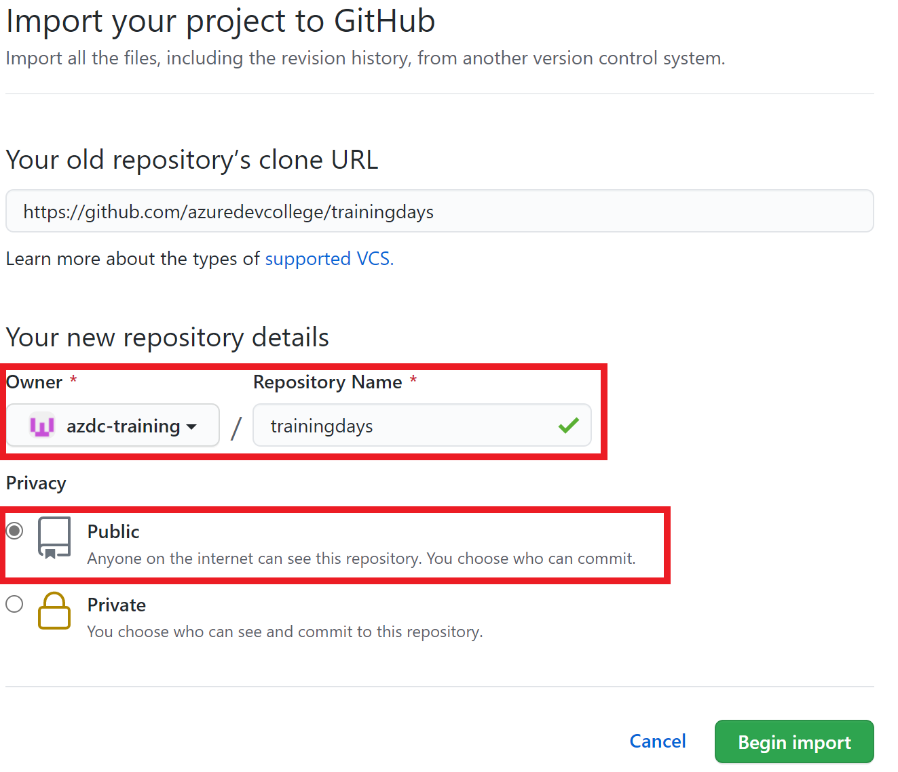
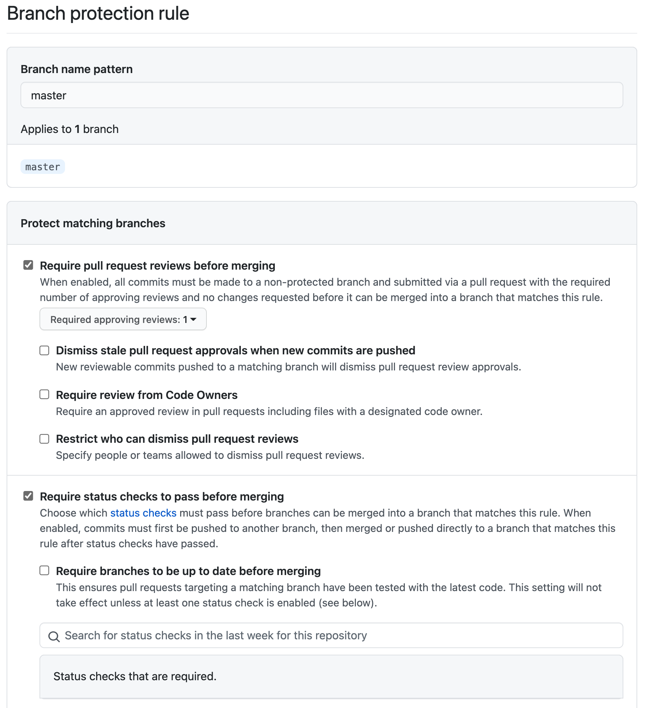

# Challenge 04: Import the Azure Developer College's repository and set branch rules

⏲️ *Est. time to complete: 15 min.* ⏲️

## Here is what you will learn 🎯

In this challenge you will learn how to:

- Import the Azure Developer College's repository into your organization
- Set branch rules to require reviewers and status checks

## Table Of Contents

1. [Import the Azure Developer College's repository into your organization](#import-the-azure-developer-colleges-repository-into-your-organization)
2. [Set branch rules](#set-branch-rules)
3. [Manage access](#manage-access)
4. [Summary](#summary)

## Import the Azure Developer College's repository into your organization

In the last challenges we have learned a lot about GitHub features and Azure bicep. Now it's time to come back to the Azure Developer College's sample application and connect the dots. In the next challenges and breakout sessions we want to show you how to use a CI/CD workflow to deploy the sample application to Azure using GitHub Actions workflows. All Azure bicep and GitHub Actions workflows are already available in the Azure Developer College's repository. Don't worry you don't have to implement all parts to create a professional CI/CD workflow. We just need to import the repository into your GitHub organisation. So, let us start!

Navigate to your GitHub organisation and go to the section _Repositories_ and create a new repository. In the _New repository_ form click the _Import a repository_ link.

In the _Import your project to GitHub_ view, we need to specify the URL of the repository we want to import. 
This is the URL of the Azure Developer College traningdays' https://github.com/azuredevcollege/trainingdays. 
Use the name _trainingdays_ as repository name.

::: danger
🛑 Be careful and use the right owner for the repository you want to import !
:::

We need to make the repository public as we want to set _Branch rules_ later in this challenge. Branch rules are only available for public repositories in the free tier.
After all values are set, we can start the import.

It may take some time until the repository is imported. 

After the import was successful, we can get started and take a look at the repository. 
Don't worry if there are still some branches that want to be merged into the master. 
When importing a repository, all branches are also imported. The college is continuously being developed in branches, 
but we can ignore these branches. 

## Set branch rules

With GitHub branch rules you can protect your branches and enforce certain workflows, such as requiring an approving review 
or passing status checks for all pull requests.

We want to establish the following workflow for all our pull requests before changes can be merged into the master branch:
  - A pull request needs at minimum one approving review
  - All status checks must pass

To set a branch rule for the master branch, navigate to the imported _trainingdays_ repository and go to the _Settings_ section. On the left navigation bar choose _Branches_. Under _Branch protection rules_ we can add a new protection rule.

In the view _Branch protection rule_ we use *master* as _Branch name pattern_ as we want to apply the rule to the master branch only.
Now we specify in _Protect matching branches_ which rules we want to apply. 
- Set _Require pull request review before merging_ and require one approving reviewer
- Set _Require status checks to pass before merging_

:::tip
📝 If you want to enforce all configured restrictions even for administrators. Set _Include administrators_.
:::

Take your time and have a look at the other protection rules. You can find more about them in the GitHub Documentation [here](https://docs.github.com/en/github/administering-a-repository/defining-the-mergeability-of-pull-requests/about-protected-branches).

## Manage access 

At the moment you, as the repository's owner, are the only one who can contribute to the repository and manage issues and pull requests. 
As we have applied branch rules, we need to give access to other people to allow them to manage issues and pull requests. 
We have already seen how to manage access and grant write permissions to a repository in [00-challenge-org](./00-challenge-org.md#create-a-team-and-assign-permission). 

Now, grant write permissions to the _AzDC-Team_ we created in [00-challenge-org](./00-challenge-org.md).

## Summary

With barnch protection rules we can protect branches and enforce certain workflows. In our case we have applied rules which enforce the following workflow:
- whenever we want to make changes in the master branch, we have to create a new branch from the master first, as a direct push to the master branch is prevented.
- once the work in the new branch is completed, we have to integrate it into the master branch via a pull request.
- the pull request must be verified by at least one reviewer
- status checks must pass (we will create them in the next challenge)

In the next challenge we will see how we can request reviewers to approve a pull request and how we can add GitHub Actions workflows as status checks.

[◀ Previous challenge](./03-challenge-bicep.md) | [🔼 Day 4](../README.md) | [Next challenge ▶](./05-challenge-common-cicd.md)