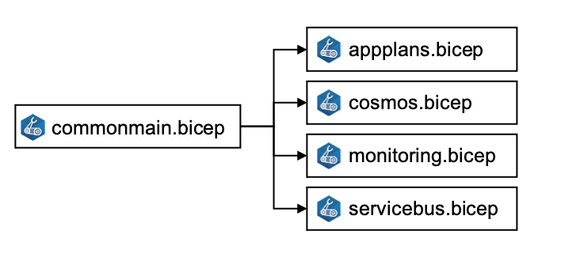
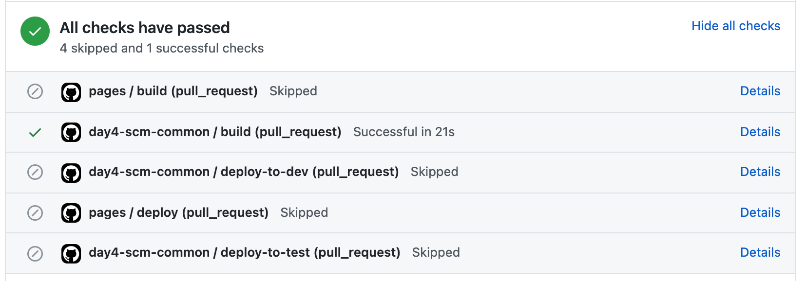
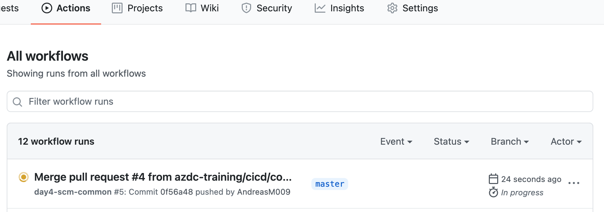
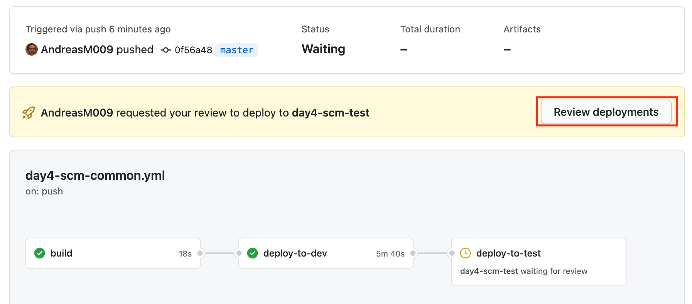
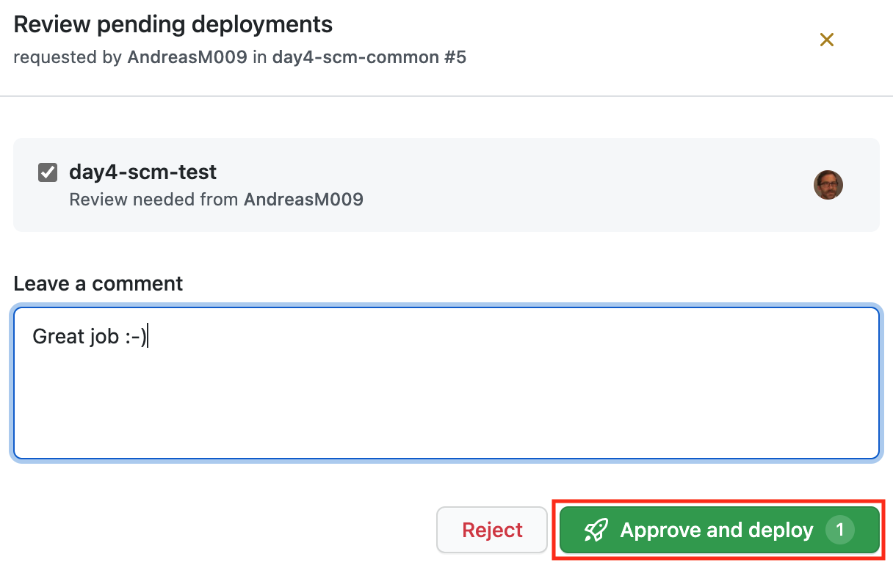
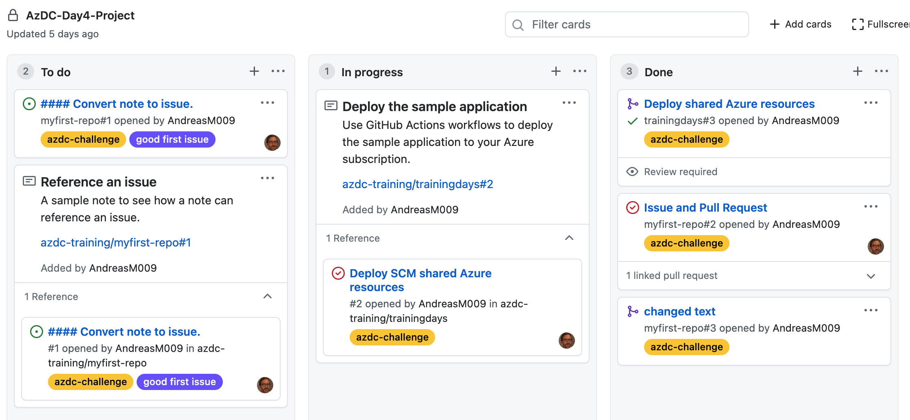

# 💎 Challenge 05: Create a CI/CD workflow to deploy the shared Azure resources of the SCM sample application 💎

⏲️ _Est. time to complete: 30 min._ ⏲️

## Here is what you will learn 🎯

In this challenge you will learn how to:

- Create a GitHub CI/CD workflow to deploy shared Azure resources of the
  SCM sample application
- Add approval reviewer to a pull request
- See a pull requests status checks in action
- Deploy changes to the master branch to a development environment
- Approve deployment requests to a Testing environment

## Table of content

1. [Get started](#get-started)
2. [Goal](#goal)
3. [Plan your work](#plan-your-work)
4. [Create Dev and Test environments](#create-dev-and-test-environments)
5. [Create a service principal and store the secret](#create-a-service-principal-and-store-the-secret)
6. [Activate the CI/CD workflow](#activate-the-cicd-workflow)
7. [Summary](#summary)

## Get started

Now it's time to come back to the Azure Developer College's sample application.
We want to introduce a professional CI/CD workflow to continuously and constantly
deploy changes and features to multiple environments. A best practice is to
first deploy changes in a separate environment before those changes eventually
go live. We can look for potential errors and ensure the quality of our
application. Such an environment is usually referred to as the _testing_ stage.
But that is not enough, because it also makes sense to continuously provide the
current development status in an environment during the development period. This
gives us the opportunity to request feedback from the product owners within a
sprint. Such an environment is called the _development_ stage.

In this challenge we want to start preparing for deployment in two environments.
After changes were pushed to the master branch we deploy these changes to the
development environment. A deployment to the testing environment is only
triggered, after a manual approval. In addition, we want to check within a pull
request whether all application components can also be built. These are the
status checks of a pull request that we addressed in the last challenge.

The following graphic illustrates the workflow:


The sample application is composed of various micro-services. Each service
belongs to a bounded context of the SCM domain. A bounded context defines its
own domain model and it comprises the business logic for a specific technical
area of the application. The SCM sample application consist of the following
bounded contexts:


Each context provides an API which the frontend accesses and presents the domain
to the user:


A bounded context should be the responsibility of a single team. However, a team
can also be responsible for several bounded contexts, but it is not recommended
that several teams work on one bounded context.

What does this mean for our CI/CD workflow?

Regardless of the teams, we should be able to roll out each bounded context
independently. This way we reduce the time for deployment, as the complete
application does not have to be deployed. We can implement independent release
cycles and roll out targeted features and fixes. However, this approach also
supports the development of an application by several teams.

Later in the day we will create the following CI/CD workflows to deploy to a
development and testing environment:

- scm-contactsapi
- scm-resourcesapi
- scm-searchapi
- scm-visitreportapi
- scm-frontend

In the SCM sample application's architecture no service within a bounded context
communicates directly with services from another bounded context. Instead
changes to a domain object within a bounded context are published through
events, which describe the changes. Technically, a message bus is used to
notify other bounded contexts about the changes. With this approach we can
decouple the bounded contexts. Decoupling increases the availability of our
application, because when a request is made to the API, not all services have to
be addressed. A bounded context is informed of changes via the message bus.
These changes can then be processed asynchronously and the own domain model can
be updated. This approach is also used within a bounded context. The Resource
Context for example, stores uploaded images in an Azure blob first and uses a
message queue to notify the image resizer that a new image is available. The
image resizer loads the image asynchronously in the background and creates a
thumbnail of the image.

## Goal

The goal of this challenge is to create a CI/CD workflow for shared Azure
resources. Before we can deploy all other services we need to create a set of
Azure resources, which are used by all services. We will create the necessary
GitHub Actions workflow. Don't worry, the workflow is already created, but we
need to take a few steps to activate it. This will also give us the opportunity
to introduce GitHub environments and understand how a pull request workflow
works, including status checks and reviewers. At the end of this challenge we
will have created one Azure resource group for each environment (Dev, Test).
Each resource group contains the shared components:

- **Azure ApplicationInsights**, to get a continuous monitoring of the
  application
- **Azure ServiceBus**, used to transport events from one bounded context to
  another and for events within a bounded context
- **AppServicePlan Windows**, for Windows based workloads
- **AppServicePlan Linux**, for Linux based workloads
- **Consumption based AppServicePlan Windows**, for Windows based Azure
  Functions
- **Storage Account**, needed for Azure Functions
- **Cosmos DB Account**, account for Cosmos DB

## Plan your work

First we want to reflect our work for this challenge on the project board. We
have already created a _note_ on our project board, which says:

> Deploy the sample application

To describe the outstanding work for this challenge, we create the following
issue in the imported trainingdays repository, set the label `azdc-challenge`
and link it to the _note_:

```Text
Deploy SCM shared Azure resources

Prepare GitHub Actions workflow to deploy shared Azure resources to your Azure
subscription.
```

:::tip

📝 We have already seen how to link an issue to a note in
[challenge-boards](./01-challenge-boards.md#working-with-cards)

:::

Now drag and drop the note to the _In progess_ column.

Your board should now look like this:


## Create Dev and Test environments

Now it's time to prepare GitHub environments to deploy the sample application to
a _Dev_ and _Test_ stage. A GitHub environment can be configured with
protection rules and secrets. A workflow job can reference environments to use
environment's protection rules and secrets.

### Dev environment

Let us first create the environment for the Development stage.

Navigate to the imported _trainigdays_ repository in your organization and go to
the repository's settings. Open the _Environments_ view and create the
environment `day4-scm-dev`. As we only want to deploy the master branch to that
environment, we limit what branches can deploy to that environment.

Select the `Deployment branches` dropdown and choose the `Selected branches`
option. Add the `master` branch as allowed branch.

We need to add a secret, because we will create an Azure SQL Database and need
to provide an initial password, which we can securely store as an environment
secret and access it later in the GitHub Actions workflow.

Use the `Add Secret` button to add a new secret named `SQL_PASSSWORD`.

You can generate a strong password by using the following command:

```shell
pwgen -n 20 -y
```


### Test environment

Create another environment for the Test stage and name it `day4-scm-test`. As we
want a manual approval, before a deployment is executed to that environment, we
set _Environment protection rules_. Activate `Required reviewers` and add a
reviewer.

:::tip

📝 Add yourself as a Reviewer, otherwise you will have to wait until the
selected reviewer approves the deployment request.

:::

Make sure to again configure the selected branches and the `SQL_PASSWORD`
environment secret. The password should differ for each environment.


## Create a service principal and store the secret

To allow GitHub to interact with our Azure Subscription we need to create a
Service principal in our Azure Active Directory. We have already learned in
[challenge 3](./03-challenge-bicep.md#programmatic-access-to-azure) how we can
programmatically access an Azure subscription.

If you don't remember your Service Principal's credentials, just create a new
one and copy the credentials from the output of the following command:

```shell
# Change the name and use your subscription-id to create a Service Principal.
az ad sp create-for-rbac --name "{name}-github-actions-sp" --sdk-auth --role contributor --scopes /subscriptions/{subscription-id}
```

Now we need to store the Service Principal's credentials. Navigate to the
_trainingdays_ repository `Settings > Secrets`page and add a new repository
secret named `AZURE_CREDENTIALS`.

## Activate the CI/CD workflow

Now we have everything prepared to active the CI/CD workflow. First, clone the
repository, create a new branch named `cicd/common`and check it out:

```shell
git clone <your repository>

git branch cicd/common
git checkout cicd/common

# or
git checkout -b cicd/common
```

There is already a Visual Studio Code workspace prepared which we can simple
open with:

```shell
cd day4
code ./day4.code-workspace
```

All known application components are already available in this workspace. In
addition, we see two more directories:

- **workflows**, here we find all prepared GitHub Actions workflow for the Azure
  Developer College
- **infrastructure**, here we find all bicep modules to deploy the needed Azure
  infrastructure for all components

### Infrastructure as code

Take your time and have a look at the structure of the bicep files. Under the
directory `infrastructure` we can find all bounded contexts of the sample
application:

- **common** > the shared Azure resource
- **contacts** > Contact Context
- **resources** > Resource Context
- **search** > Search Context
- **visitreports** > VisitREport Context
- **frontend** > Frontend

Each bounded context describes its own infrastructure using code. Azure Bicep
modules are used to make the Bicep code more maintainable.

In this challenge we will deploy the shared Azure resources used by all bounded
contexts. You can find the needed Bicep code in the workspace folder
`infrastructure/common`. There is one main Bicep module `commonmain.bicep` which
references other Bicep modules to describe the infrastructure.



After the shared Azure resources are deployed, each bounded context references
these resources using the Azure naming convention and the Bicep `existing`
keyword. You can find the naming conventions
[here](https://docs.microsoft.com/azure/cloud-adoption-framework/ready/azure-best-practices/resource-naming).

Here is an example:

The `ContactsAPI` is deployed to an Azure WebApp, which needs an AppService
Plan. The AppService Plan is deployed as a shared Azure resource, which means
that the plan is used by multiple bounded contexts (remember, three plans are
provided, as described above). To reference the plan in the `Contact Context`
bicep files we use the `existing` keyword and the Azure naming conventions:

```bicep
// naming conventions helps us to reference a resource by name
// the resource group's id is joined as a unique string to make the resource name unique
var planWindowsName = 'plan-scm-win-${env}-${uniqueString(resourceGroup().id)}'

// we can reference existing Azure resources by their type and name with the `existing` keyword ...
resource appplan 'Microsoft.Web/serverfarms@2020-12-01' existing = {
  name: planWindowsName
}

// .. and use the symbolic name to access properties
resource webapp 'Microsoft.Web/sites@2020-12-01' = {
  name: webAppName
  location: location
  tags: resourceTag
  properties: {
    // use the plan's symbolic name
    serverFarmId: appplan.id
    ...
```

You can find the code for the `Contact Context`in the workspace folder
`infrastructure/contacts`. Again, there is a main module that references other
modules to produce maintainable code.

### GitHub Actions workflows

Now it's time to have a look at the already prepared GitHub Actions workflows
for Day4. You can find all workflows in the workspace folder `workflows`. Today
we focus on all workflows with the prefix `day4-`. First, we will prepare the
workflow for the shared Azure resources. Open the workflow
`workflows/day4-scm-common.yml`. This workflow, like all others, is triggered
when a pull request is opened or changes were pushed to the master branch. In
addition, filters are applied to individual files:

```yaml
name: day4-scm-common

on:
  push:
    branches:
      - master
    paths:
      - day4/apps/infrastructure/bicep/common/**
      - .github/workflows/day4-scm-common.yml
  pull_request:
    branches:
      - master
    paths:
      - day4/apps/infrastructure/bicep/common/**
      - .github/workflows/day4-scm-common.yml

  workflow_dispatch:
```

With the trigger `workflow_dispatch`it is possible to trigger the workflow
manually.

The workflows consists of three jobs:

```yaml
jobs:
  build: # to build all needed artefacts
  ...
  deploy-to-dev:
    environment: day4-scm-dev # deploy to dev environment
  ...
  delpoy-to-test:
    environment: day4-scm-test # deploy to test environment
```

As you see, first all artifacts, needed for the deployment, are created and
validated. With the `build`job we can make sure that everything can be created,
even if we only try to transpile Bicep code to Azure ARM templates.

If everything can be created the next job `deploy-to-dev`is executed, but only
if the trigger event is of type `push`or `workflow_dispatch`. This means, that
the deployment will only be executed, if changes were pushed to the master
branch or the workflows is triggered manually. Within a pull request, only the
step `build` is executed to get immediately feedback if everything can be built
or not. If the build fails, the status check of a pull request would also fail
and the pull request cannot be merged.

That is exactly what we want to achieve. Remember the goal of this challenge:


### Prepare the workflow and create a pull request

Now it's time to prepare the workflow which rolls out the shared Azure resources
for the Azure Developer College's sample application. We have already cloned
the repository and created a new branch `cicd/common`.

Open the workflow `day4-scm-common.yml` and replace the organization name in
each job condition with your organization's name:

```yaml
jobs:
  build:
    if: github.repository == '<your organisation name>/trainingdays'
  ...
  deploy-to-dev:
    if: (github.repository == '<your organisation name>/trainingdays') && ((github.event_name == 'push') || (github.event_name == 'workflow_dispatch'))
  ...
  delpoy-to-test:
    if: (github.repository == '<your organisation name>/trainingdays') && ((github.event_name == 'push') || (github.event_name == 'workflow_dispatch'))
```

Save the file, commit your changes and push the branch to the remote repository:

```Shell
git add .
git commit -m "changed org name in common workflow"
git push --set-upstream origin cicd/common
```

Now, create a pull request to merge the branch `cicd/common` into the `master`
branch. Set `Deploy shared Azure resources` as title and close the issue
`Deploy SCM shared Azure resources` using the keyword `closes #<issue id>` in
the pull requests body.

:::tip

📝 If you want, you can add a reviewer. However, since you as the Administrator
are excluded from the branch rules, you can merge the pull request without a
review approval.

:::

Wait a few seconds, until the status checks are triggered:


If everything is configured correctly, the build job of the workflow should be
successful:



Now merge the pull request and navigate to your repository' action page. You
should see that the `day4-scm-common` workflow is triggered after a few seconds.



In the details page of the running workflow you see all jobs.


After the `dev` environment is deployed, go to the Azure portal an checkout the
newly created resource group and resources. The workflow is now in the
`waiting`state, because a reviewer must approve the deployment to the `test`
environment:



Review the pending deployment, leave a comment and `Approve and deploy`:



Now the test environment will be deployed. After the deployment is finished, we
have another resource group with all shared Azure resources in the test
environment.

Take your time and investigate the created resources.

Check your Project Board, it should look something like this:



## Summary

We have seen how to create a CI/CD workflow where a reviewer has to approve a
deployment to the test environment. This workflow can also be used to validate
all artifacts within a pull request. This helps us to avoid build breaks. Of
course, there would be many other scenarios that can be implemented with the
GitHub Actions workflow. Maybe it is a good idea to deploy directly to a
development environment within a pull request to even validate the deployment
before pushing changes to the master branch.

We have so far only provided the shared Azure resources for the Azure Developer
College's sample application. There is still some work to be done. We'll move
straight into the breakout session where we'll deploy all the rest of the
bounded contexts. We proceed step by step in the same way as in this Challenge:

- create an issue to plan and track your work
- pull changes from the master branch
- create a feature branch `cicd/all`
- prepare all workflows
- commit and push changes
- create a pull request
- merge the pull request
- wait until everything is deployed

[◀ Previous challenge](./04-challenge-azdc-repo.md) | [🔼 Day 4](../README.md) | [Next challenge ▶](./06-breakout.md)
