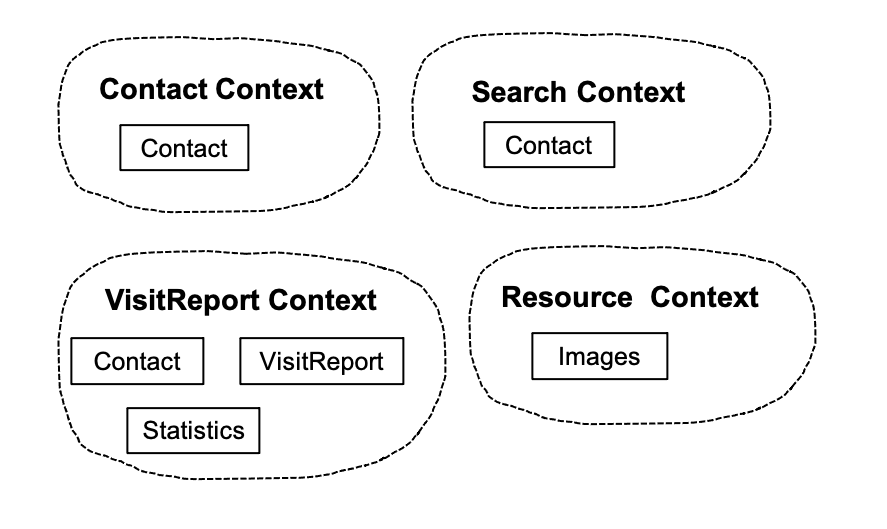
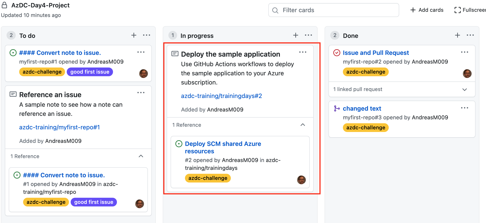
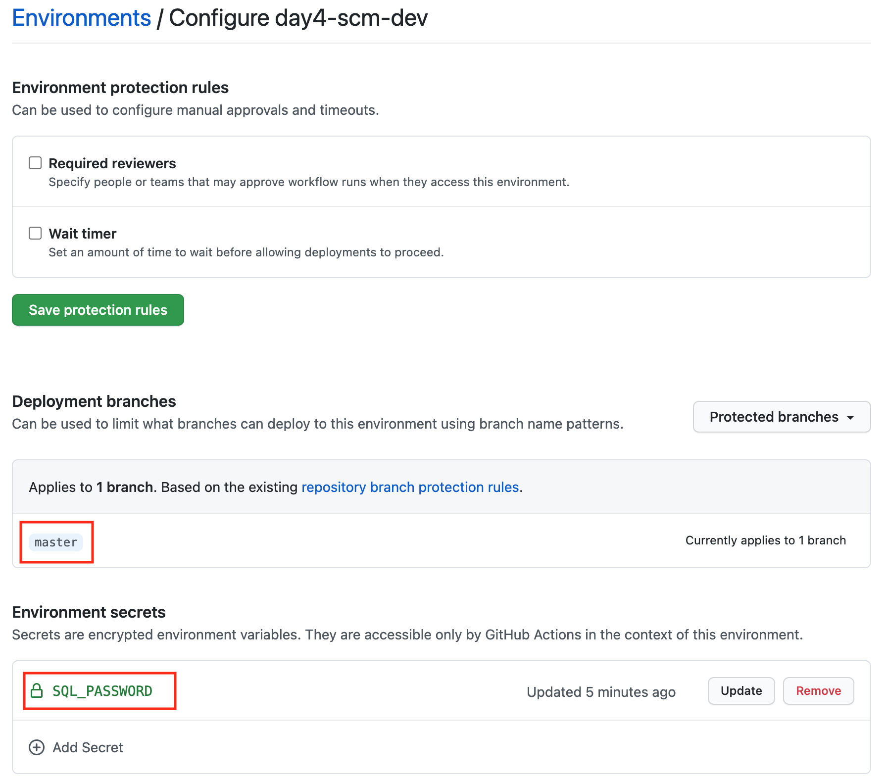
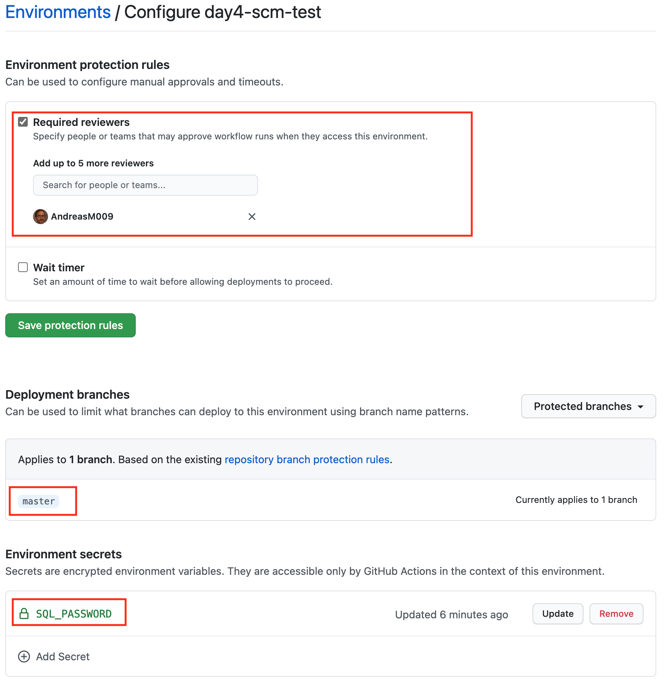

# Challenge 05: Create a CI/CD workflow to deploy the shared Azure resources of the SCM sample application

⏲️ _Est. time to complete: 30 min._ ⏲️

## Here is what you will learn 🎯

In this challenge you will learn how to:

- Create a GitHub CI/CD workflow to deploy common used Azure resources of the SCM sample application
- Add approval reviewer to a pull request
- See a pull requests status checks in action
- Deploy changes to the master branch to a development environment
- Approve deployment requests to a Testing environment

## Table of content

1. [Get started](#get-started)
2. [Goal](#goal)
3. [Plan your work](#plan-your-work)
4. [Create Dev and Test environments](#create-dev-and-test-environments)
5. [Create a service principal and store the secret](#create-a-service-principal-and-store-the-secret)
6. [Activate the CI/CD workflow](#activate-the-cicd-workflow)

## Get started

Now it's time to come back to the Azure Developer College's sample application. We want to introduce a professional CI/CD workflow to coninuously and constantly deploy changes and features to multiple environments. A best practice is to first deploy changes in a separate environment before those changes eventually go live. We can look for potential errors and ensure the quality of our application. Such an environment is usually referred to as the Testing stage. But that is not enough, because it also makes sense to continuously provide the current development status in an environment during the development period. This gives us the opportunity to request feedback from the product owners within a sprint. Such an environment is called the development stage. 

In this challenge we want to start preparing for deployment in two environments. After changes were pushed to the master branch we deploy these changes to the development environment. A deployment to the testing environment is only triggered, after a manual approval. In addition, we want to check within a pull request whether all application components can also be built. These are the status checks of a pull request that we addressed in the last challenge.

The following graphic illustrates the workflow:


The sample application is composed of various microservices. Each service belongs to a bounded context of the SCM domain. A bounded context defines its own domain model and it comprises the business logic for a specific technical area of the application. The SCM sample application consist of the following bounded contexts:



Each context provides an API which the frontend accesses and presents the domain to the user:


A bounded context should be the responsibility of a single team. However, a team can also be responsible for several bounded contexts, but it is not recommended that several teams work on one bounded context. 

What does this mean for our CI/CD workflow?

Regardless of the teams, we should be able to roll out each bounded context independently. This way we reduce the time for deployment, as the complete application does not have to be deployed. We can implement independent release cycles and roll out targeted features and fixes. However, this approach also supports the development of an application by several teams.

Later in the day we will create the following CI/CD workflows to deploy to a development and testing environment:
- scm-contactsapi
- scm-resourcesapi
- scm-searchapi
- scm-visitreportapi
- scm-frontend

In the SCM sample application's architecture no service within a bounded context communicates directly with services from another bounded context. Instead changes to a domain object within a bounded context are published through events, which describe that changes. Technically, a message bus is used to notify other bounded contexts about the changes. With this approach we can decouple the bounded contexts. Decoupling increases the availability of our application, because when a request is made to the API, not all services have to be addressed. A bounded context is informed of changes via the message bus. These changes can then be processed asynchronously and the own domain model can be updated. This approach is also used within a bounded context. The Resource Context for example, stores uploaded images in an Azure blob first and uses a message queue to notify the image resizer that a new image is available. The image resizer loads the image asynchronously in the background and creates a thumbnail of the image. 

## Goal

The goal of this challenge is to create a CI/CD workflow for shared Azure resources. Before we can deploy all other services we need to create a set of Azure resources, which are used by all services. We will create the necessary GitHub Actions workflow. Don't worry, the workflow is already created, but we need to take a few steps to activate it. This will also give us the opportunity to introduce GitHub environments and understand how a pull request workflow works, including status checks and reviewers. At the end of this challenge we will have created one Azure resource group for each environment (Dev, Test). Each resource group contains the shared components:

- **Azure ApplicationInsights**, to get a continuous monitoring of the application
- **Azure ServiceBus**, used to transport events from one bounded context to another and for events within a bounded context
- **AppServicePlan Windows**, for Windows based workloads
- **AppServicePlan Linux**, for Linux based workloads
- **Consumption based AppServicePlan Windows**, for Windows based Azure Functions
- **Storage Account**, needed for Azure Functions
- **Cosmos DB Account**, account for Cosmos DB

## Plan your work

First we want to reflect our work for this challenge on the project board. We have already created a _Note_ on our project board, which says:
_Deploy the sample application_

To describe the outstanding work for this challenge, we create the following issue in the imported trainingdays repository, set the label `azdc-challenge` and link it to the _Note_:

```Text
Deploy SCM shared Azure resources

Prepare GitHub Actions workflow to deploy shared Azure resources to your Azure subscription.
```

:::tip
📝 We have already seen how to link an issue to a note in [challenge-boards](./01-challenge-boards.md#working-with-cards)
:::

Now drag and drop the note to the _In progess_ column. 

Your board should now look like that:



## Create Dev and Test environments

Now it's time to prepare GitHub environments to deploy the sample application to a _Dev_ and _Test_ stage.
A GitHub environment can be configured with protection rules and secrets. A workflow job can reference environments to use environment's protection rules and secrets. 

### Dev environment

Let us first create the environment for the Development stage.

Navigate to the imported _trainigdays_ repository in your organisation and go to the repositoy's settings. Open the _Environments_ view and create the environment `day4-scm-dev`.
As we only want to deploy the master branch to that environment, we limit what branches can deploy to that environment.

We need to add a secret, because we will create an Azure SQL Database, later. Therefore we need a password, which we can securely store as an environment secret and access it later in the GitHub Actions workflow.



### Test environment

Create another environment for the Test stage and name it `scm-day4-test`. As we want a manual approval, before a deployment is executed to that environment, we set _Environment protection rules_. Activate `Required reviewers` and add a reviewer.

:::tip
📝 Add yourself as a Reviewer, otherwise you will have to wait until the selected reviewer approves the deployment request.
:::



## Create a service principal and store the secret

To allow GitHub to interact with our Azure Subscriptions we need to create a
Service principal in our Azure Active Directory. We have already learned in [challenge 03](./03-challenge-bicep.md#programmatic-access-to-azure) how we can programmatically access an Azure subscription.

If you don't remember your Service Principal's credentials, just create a new one and copy the credentials from the output of the following command:

```shell
# Change the name and set use your subscription-id to create a Service Principal.
az ad sp create-for-rbac --name "{name}-github-actions-sp" --sdk-auth --role contributor --scopes /subscriptions/{subscription-id}
```

Now we need to store the Service Principal's credentials.
Navigate to the _trainingdays_ repository `Settings > Secrets`page and add a new repository
secret named `AZURE_CREDENTIALS`.

## Activate the CI/CD workflow

Now we have everything prepared to active the CI/CD workflow.
First, clone the repository, create a new branch named `cicd/common`and check it out:

``` shell
git clone <your repository>

git branch cicd/common
git checkout cicd/common

# or
git checkout -b cicd/common
```

There is already a Visual Studio Code workspace prepared which we can simple open with:

```shell
cd day4
code ./day4.code-workspace
```

All known application components are already available in this workspace. In addition, we see two more directories:

- **workflows**, here we find all prepared GitHub Actions workflow for the Azure Developer College
- **infrastructure**, here we find all bicep modules to deploy the needed Azure infrastructure for all components

Take your time and have a look at the structure of the bicep files. Under the directory `infrastructure` we can find all the bounded contexts of the sample application:

- **common** > the shared Azure resource
- **contacts** > Contact Context
- **resources** > Resource Context
- **search** > Search Context
- **visitreports** > VisitREport Context
- **frontend** > Frontend

Each bounded context describes its own infrastructure using code. Azure Bicep modules are used to make the Bicep code more maintainable. The shared Azure resources are referenced using the Azure naming conventions, which you can find [here](https://docs.microsoft.com/en-us/azure/cloud-adoption-framework/ready/azure-best-practices/resource-naming). 

Here is an example:

The `ContactsAPI` is deployed to an Azure WebApp, which needs an AppService Plan. The AppService Plan is deployed as a shared Azure resource, which means that the plan is used by multiple bounded contexts (remember, three plans are provided, as described above). To reference the plan in the `Contact Context` bicep files we use the `existing` keyword and the Azure naming conventions:

```bicep
// naming conventions helps us to reference resource by name
var planWindowsName = 'plan-scm-win-${env}-${uniqueString(resourceGroup().id)}'

// we can reference existing Azure resources by their type and name with the `existing` keyword ...
resource appplan 'Microsoft.Web/serverfarms@2020-12-01' existing = {
  name: planWindowsName
}

// .. and use the symbolic name to access properties
resource webapp 'Microsoft.Web/sites@2020-12-01' = {
  name: webAppName
  location: location
  tags: resourceTag
  properties: {
    serverFarmId: appplan.id
    ...
```


