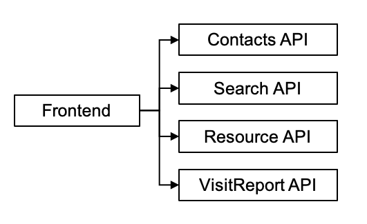

# Challenge 01: Create a CI/CD workflow to deploy the common used Azure resources of the SCM sample application

⏲️ _Est. time to complete: 30 min._ ⏲️

## Here is what you will learn 🎯

In this challenge you will learn how to:

- Create a GitHub CI/CD workflow to deploy common used Azure resources of the SCM sample application
- Add approval reviewer to a pull request
- See a pull requests status checks in action
- Deploy changes to the master branch to a development environment
- Approve deployment requests to a Testing environment

## Table of content

1. [Get started](#get-started)

## Get started

Now it's time to come back to the Azure Developer College's sample application. We want to introduce a professional CI/CD workflow to coninuously and constantly deploy changes and features to multiple environments. A best practice is to first deploy changes in a separate environment before those changes eventually go live. We can look for potential errors and ensure the quality of our application. Such an environment is usually referred to as the Testing stage. But that is not enough, because it also makes sense to continuously provide the current development status in an environment during the development period. This gives us the opportunity to request feedback from the product owners within a sprint. Such an environment is called the development stage. 

In this challenge we want to start preparing for deployment in two environments. After changes were pushed to the master branch we deploy these changes to the development environment. A deployment to the testing environment is only triggered, after a manual approval. In addition, we want to check within a pull request whether all application components can also be built. These are the status checks of a pull request that we addressed in the last challenge.

The following graphic illustrates the wortkflow:

The sample application is composed of various microservices. Each service belongs to a bounded context of the SCM domain. A bounded context defines its own domain model and it comprises the business logic for a specific technical area of the application. The SCM sample application consist of the following bounded contexts:

Each context provides an API which the frontend accesses and presents the domain to the user:

A bounded context should be the responsibility of a single team. However, a team can also be responsible for several bounded contexts, but it is not recommended that several teams work on one bounded context. 

What does this mean for our CI/CD workflow?

Regardless of the teams, we should be able to roll out each bounded context independently. This way we reduce the time for deployment, as the complete application does not have to be deployed. We can implement independent release cycles and roll out targeted features and fixes. However, this approach also supports the development of an application by several teams.

Later in the day we will create the following CI/CD workflows to deploy to a development and testing environment:
- scm-contactsapi
- scm-resourcesapi
- scm-searchapi
- scm-visitreportapi
- scm-frontend

