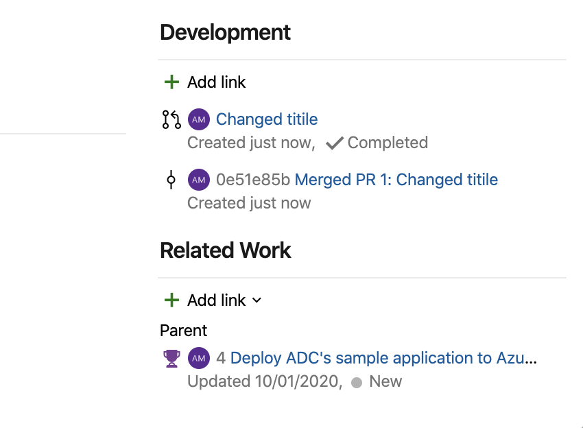

# Challenge-2: Work with Azure Repos


## Here is what you will learn

- Create a Git repository for your code
- Use an SSH key for authentication
- Clone the Git repository to your local developer machine
- Work with branches and PullRequests

## Import the Azure Developer College GitHub repository to your Azure Repo

Open your browser and navigate to the [Azure Developer College Training Days on GitHub](https://github.com/azuredevcollege/trainingdays). Click the green "Code" button and copy the
https url.


Go to your Azure DevOps project import the repository and name it _azuredevcollege_:


## Clone the repository to your local machine, use SSH key authentication

SSH public key authentication works with an asymmetric pair of generated encryption keys. The public key is shared with Azure DevOps and used to verify the initial ssh connection. The private key is kept safe and secure on your system.

If you haven't already created an SSH key on your system, please follow these steps [here](https://docs.microsoft.com/en-us/azure/devops/repos/git/use-ssh-keys-to-authenticate?view=azure-devops&tabs=current-page#step-1-create-your-ssh-keys).

After you have created the SSH key for your system, add the public key to Azure DevOps services.
Follow these steps described [here](https://docs.microsoft.com/en-us/azure/devops/repos/git/use-ssh-keys-to-authenticate?view=azure-devops&tabs=current-page#step-2--add-the-public-key-to-azure-devops-servicestfs).

Now that you have added your SSH public key to Azure DevOps, you are ready to clone the Azure Developer College's repository to your local machine.

Open a shell and go to your project's folder ansd clone the repository as described [here](https://docs.microsoft.com/en-us/azure/devops/repos/git/use-ssh-keys-to-authenticate?view=azure-devops&tabs=current-page#step-3-clone-the-git-repository-with-ssh) to your local machine.

**Congratulations**, you have completed your first UserStory. Go to Azure Boards and set the story "S1" to completed.

## Working with Branches and PullRequests

Now it's time to start working on UserStory "S2". Go to Azure Boards and move the state of the UserStory to "Active". We want to setup the master branch's policies to require a _PullRequest_ to merge changes from a feature branch into the master branch. Additionally we would like to have each _PullRequest_ associated with a _Work Item_ (UserStory in our case).

### Setup master branch's policies to require a PullRequest and WorkItems

To protect your branch you need to configure branch policies. [Here](https://docs.microsoft.com/en-us/azure/devops/repos/git/branch-policies?view=azure-devops) you can find a description of how to setup policies for your master branch to require a _PullRequest_ and a link to a _Work Item_.

### Create a feature branch to complete UserStory S2

There are several ways to create a feature branch. You can either use the command line and the git command or you can use VS Code. [Here](https://docs.microsoft.com/en-us/azure/devops/repos/git/branches?view=azure-devops&tabs=command-line) you can find a description to get more details about it.

#### Command line

Open a shell and navigate to the root directory of your ADC's repository and use the command as follows to create a feature branch:

```shell
git branch features/changetitle
```

Now checkout the new branch:

```shell
git checkout features/changetitle
```

Open VS Code and have a look at the left bottom corner:

```shell
code .
```

In the status bar of VS Codes you can see the information on which branch you are working on.

#### Change the title of the sample application.

Open the file day4/apps/frontend/scmfe/src/components/home/Home.vue, change the title and save the file.

#### Commit the changes to your local branch.

Now you can commit the changes you made to your local branch. You can either commit the changes by using the command line or VS Code.
In VS Code click the Source Control icon (there is already a blue bubble which informs you that you have made changes to the repository). Enter a comment and commit your changes.
If you want to use the command line do the following:

```shell
git add .
git commit -m "Comment"
```

#### Push your local branch to the remote repository

Now your changes are only available in your local branch. To make the changes available for all your team members you have to push your changes to the remote repository. You can either use VS Code or the command line to push your changes.
In VS Code go to Source Control and click the button with the three "..." dots. A context menu is displayed and you have to click _Push_ to upload your changes to the remote repository.

If you want to use the command line, do the following:

```
git push
```

Now navigate to your Azure Repo and have a look at the branches. Your branch is now available and can be cloned by your team members.

### Create a PullRequest to apply your changes to the master branch

To create a _PullRequest_ follow the instructions [here](https://docs.microsoft.com/en-us/azure/devops/repos/git/pullrequest?view=azure-devops#create-a-pull-request-1). Select the branch "features/changetitle" to be merged into the master and link the UseStory _S2_ to the PullRequest.

After you have completed the _PullRequest_ you have completed the UserStory "S2". Go to Azure Boards and set the story to state _completed_. Maybe it is already set to completed depending on the choice you made during the completion of the PullRequest. Have a look at the story. You will see that the UserStory was linked to the code changes and to the PullRequest:


**Congratulations** you have completed UserStory S2!
