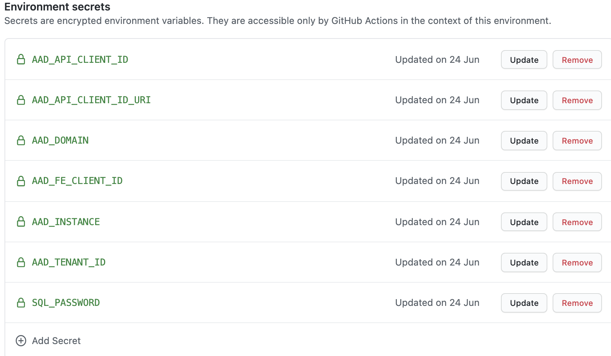
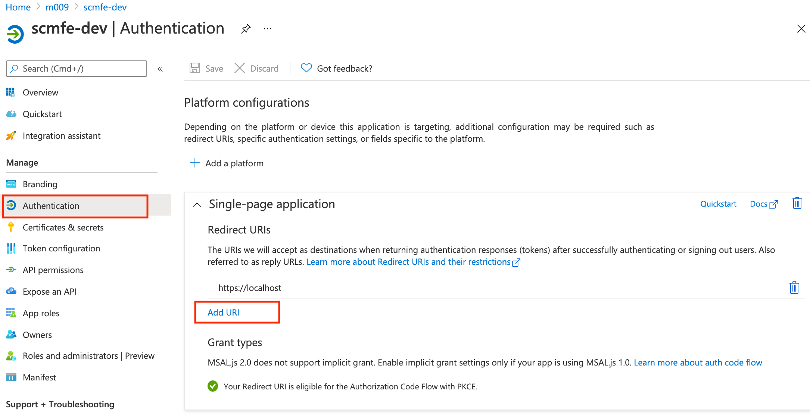
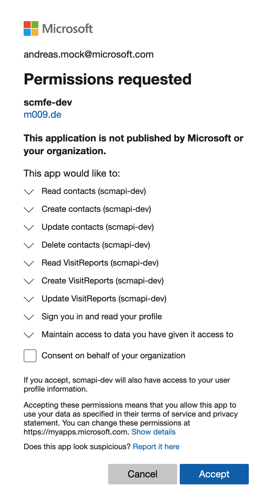
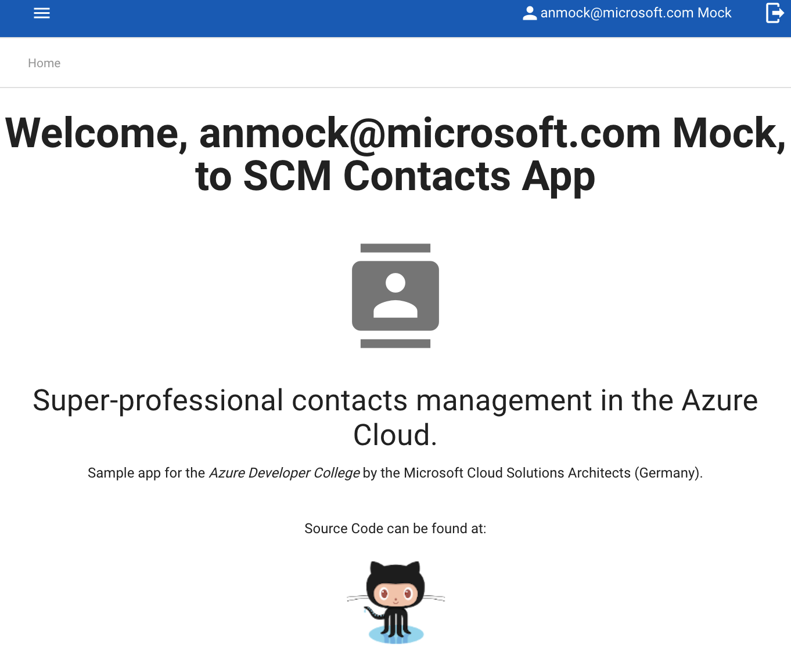

# 💎 Challenge 3: Create Azure AD applications and prepare GitHub environments 💎

## Here is what you will learn 🎯

⏲️ _Est. time to complete: 30 min._ ⏲️

- Create Azure AD's client and server applications to integrate Azure AD into the sample application
- Configure GitHub envrionement's to deploy to a development and testing stage
- Deploy the shared Azure resources of the sample application
- Deploy the front end and adjust Reply Urls

## Table of content

1. [Goal](#goal)
2. [Create Azure AD applications](#create-azure-ad-applications)
3. [Create development and test environments](#create-azure-ad-applications)
4. [Activate the CI/CD workflow](#activate-the-cicd-workflow)
5. [Summary](#summary)

## Goal

In the previous challenges you have learned some basics about the OpenID Connect and OAuth2 flows. You have seen how you can sign in users and how to acquire an access token for an Azure AD's protected resource. In this challenge we will integrate Azure AD into the sample application step by step. We will use GitHub Actions workflows to deploy the sample application to Azure. Don't worry, the needed GitHub Actions workflows are already implemented, but we need to take few steps to activeate them.

## Create Azure AD applications

In [Challenge 2](./challenge-2.md) you have already seen how to create an Azure AD client application to sign in users and how to create an API application that exposes OAuth2 permissions. We have to do the same for the sample application.

There is already a script available in the repository to create both applications for you. It is located here: [day5/apps/infrastructure/scripts/aad-integration.sh](../apps/infrastructure/scripts/aad-integration.sh). You need to run it in a bash/Shell environment)

The script creates the server application first and then the client application for the sample application. It also uses a [oauth2-permissions.json](../apps/infrastructure/scripts/oauth2-permissions.json) file where all needed OAuth2 permission are defined.

After running the script twice, we registered the following applications in Azure AD:


For each environmnent two applications are registerd. One for the client and one for all APIs of the sample application.

### Run the script

Open a shell and use Azure CLI to connect to the Azure AD Tenant where you want to create the applications (you can also use the Azure Cloud Shell). If you have created a new Azure AD that is not linked to an Azure subscription, add the additional option _--allow-no-subscription_:

```shell
az login --allow-no-subscription
```

You must run the script twice:

- once for creating the applications for the `Development` stage
- once for creating the applications for the `Testing` stage

Use the following parameters to run the script for the `Development` stage:

| Parameter | Value|
| ------------------ | --------------|
| _API-APP-NAME_     | scmapi-dev |
| _API-APP-URI_      | http://scmapi-dev |
| _UI-APP-NAME_      | scmfe-dev |

Use the following parameter for the `Testing` stage:

| Parameter          | Value |
| ------------------ | --------------------- |
| _API-APP-NAME_     | scmapi-test|
| _API-APP-URI_      | http://scmapi-test |
| _UI-APP-NAME_      | scmfe-test|

Navigate to the directory [day5/apps/infrastructure/scripts](../apps/infrastructure/scripts) which contains the script and the `oauth2-permissions.json` configuration file.

Run the script twice:

- once for the `Development`
- once for the `Testing`stage.

:::tip
📝 Note down the `UI AppId` and `API AppId` from the output after each run!
:::

```shell
./aad-integration.sh <API-APP-NAME> <API-APP-URI> <UI-APP-NAME>
```

The output:

```shell
...
...
UI AppId for app <UI_APP_NAME>: <please note down>
API AppId for app <API_APP_NAME>: <please note down>
```

### Validate the Applications in Azure AD

After the script has been executed twice, navigate to your Azure AD and inspect the previously created applications. You should see four new applications.

## Create development and test environments

Now it's time to prepare GitHub environments to deploy the sample application to
a _Dev_ and _Test_ stage for Day5 with Azure AD integration. A GitHub environment can be configured with
protection rules and secrets. A workflow job can reference environments to use
environment's protection rules and secrets.

### Dev environment

Let us first create the environment for the Development stage.

Navigate to the imported _trainigdays_ repository in your organization and go to
the repository's settings. Open the _Environments_ view and create the
environment `day5-scm-dev`. As we only want to deploy the master branch to that
environment, we limit what branches can deploy to that environment.

Select the `Deployment branches` dropdown and choose the `Selected branches`
option. Add the `master` branch as allowed branch.

We need to add some secrets, which are accessed later in the GitHub Actions workflow.

Use the `Add Secret` button to add a new secret named `SQL_PASSSWORD`.

You can generate a strong password by using the following command:

```shell
pwgen -n 20 -y
```

Now, add the following secrets for the Azure AD integration:

| Secret name | Value |
|-------------|-------|
|AAD_API_CLIENT_ID | _the AppId of the Azure AD's application registration for the APIs_  |
|AAD_API_CLIENT_ID_URI | http://scmapi-dev |
|AAD_FE_CLIENT_ID | _the AppId of the Azure AD's application registration for the UI client_ |
|AAD_DOMAIN |_your Azure AD's domain name e.g. azuredevcollege.onmicrosoftonline.com_ |
|AAD_INSTANCE | https://login.microsoftonline.com |
|AAD_TENANT_ID| _your Azure AD's tenant or directory id_ |

::: warning
⚠️ Make sure you use the values you used for the application registration script for the development environment !
:::

At the end your secrets for the development environment looks like this:



### Test environment

Create another environment for the Test stage and name it `day5-scm-test`. As we
want a manual approval, before a deployment is executed to that environment, we
set _Environment protection rules_. Activate `Required reviewers` and add a
reviewer.

:::tip

📝 Add yourself as a Reviewer, otherwise you will have to wait until the
selected reviewer approves the deployment request.

:::

Make sure to again configure the selected branches and the `secrets` as following:

| Secret name | Value |
|-------------|-------|
|AAD_API_CLIENT_ID | _the AppId of the Azure AD's application registration for the APIs_  |
|AAD_API_CLIENT_ID_URI | http://scmapi-test |
|AAD_FE_CLIENT_ID | _the AppId of the Azure AD's application registration for the UI client_ |
|AAD_DOMAIN |_your Azure AD's domain name e.g. azuredevcollege.onmicrosoftonline.com_ |
|AAD_INSTANCE | https://login.microsoftonline.com |
|AAD_TENANT_ID| _your Azure AD's tenant or directory id_ |
|SQL_PASSWORD| _your password_ |

::: warning
⚠️ Make sure you use the values you used for the application registration script for the test environment !
:::

## Create a service principal and store the secret

To allow GitHub to interact with our Azure Subscription we need to create a
Service principal in our Azure Active Directory. If you have already created a service principal and added it to your repository's secrets, you can skip this step and continue with [Activate the CI/CD workflow](#activate-the-cicd-workflow).

Create a new Service Principal and copy the credentials from the output of the following command:

```shell
# Change the name and use your subscription-id to create a Service Principal.
az ad sp create-for-rbac --name "{name}-github-actions-sp" --sdk-auth --role contributor --scopes /subscriptions/{subscription-id}
```

Now we need to store the Service Principal's credentials. Navigate to the imported
_trainingdays_ repository `Settings > Secrets`page and add a new repository
secret named `AZURE_CREDENTIALS`.

## Activate the CI/CD workflow

Now we have everything prepared to active the CI/CD workflow. First, checkout the master branch, pull changes and 
create a new branch `cicd/aad-common`

```shell
git checkout master
git pull

git branch cicd/aad-common
git checkout cicd/aad-common

# or
git checkout -b cicd/aad-common
```

There is already a Visual Studio Code workspace prepared which we can simple
open with:

```shell
cd day5
code ./day5.code-workspace
```

All known application components are already available in this workspace. In
addition, we see two more directories:

- **workflows**, here we find all prepared GitHub Actions workflow for the Azure
  Developer College
- **infrastructure**, here we find all bicep modules to deploy the needed Azure
  infrastructure for all components

### GitHub Actions workflows

Now it's time to have a look at the already prepared GitHub Actions workflows
for Day5. You can find all workflows in the workspace folder `workflows`. Today
we focus on all workflows with the prefix `day5-`. First, we will prepare the
workflow for the shared Azure resources. Open the workflow
`workflows/day5-scm-common.yml`. This workflow, like all others, is triggered
when a pull request is opened or changes were pushed to the master branch. In
addition, filters are applied to individual files:

```yaml
name: day5-scm-common

on:
  push:
    branches:
      - master
    paths:
      - day5/apps/infrastructure/bicep/common/**
      - .github/workflows/day5-scm-common.yml
  pull_request:
    branches:
      - master
    paths:
      - day5/apps/infrastructure/bicep/common/**
      - .github/workflows/day5-scm-common.yml

  workflow_dispatch:
```

With the trigger `workflow_dispatch`it is possible to trigger the workflow
manually.

The workflows consists of three jobs:

### Prepare the workflow and create a pull request

Now it's time to prepare the workflow which rolls out the shared Azure resources
for the Azure Developer College's sample application. We have already cloned
the repository and created a new branch `cicd/aad-common`.

Open the workflow `day5-scm-common.yml` and replace the organization name in
each job condition with your organization's name:

```yaml
jobs:
  build:
    if: github.repository == '<your organisation name>/trainingdays'
  ...
  deploy-to-dev:
    if: (github.repository == '<your organisation name>/trainingdays') && ((github.event_name == 'push') || (github.event_name == 'workflow_dispatch'))
  ...
  delpoy-to-test:
    if: (github.repository == '<your organisation name>/trainingdays') && ((github.event_name == 'push') || (github.event_name == 'workflow_dispatch'))
```

Save the file, commit your changes and push the branch to the remote repository:

```Shell
git add .
git commit -m "changed org name in common workflow"
git push --set-upstream origin cicd/aad-common
```

Now, create a pull request to merge the branch `cicd/aad-common` into the `master`
branch. Set `Deploy shared Azure resources for AAD integration` as title.

:::tip

📝 If you want, you can add a reviewer. However, since you as the Administrator
are excluded from the branch rules, you can merge the pull request without a
review approval.

:::

Wait a few seconds, until the status checks are triggered and successful.

Now merge the pull request and navigate to your repository' action page. You
should see that the `day5-scm-common` workflow is triggered after a few seconds.

After the `dev` environment is deployed, go to the Azure portal an checkout the
newly created resource group and resources. The workflow is now in the
`waiting`state, because a reviewer must approve the deployment to the `test`
environment:

Review the pending deployment, leave a comment and `Approve and deploy`:

Now the test environment will be deployed. After the deployment is finished, we
have another resource group with all shared Azure resources in the test
environment.

## Deploy the front end and adjust Reply Urls

Now it's time to deploy the front end and adjust the needed Reply Urls for the registered Azure AD applications. Azure AD issues tokens to known endpoints, only. The front end is hosted as a `Static website` in an Azure storage account. As the storage account is created with the front end deployment, we don't know the front end's url at the moment. First we need to deploy the front end to each environment and then adjust the reply urls in the Azure AD's application registration for each environment. 

### Activate the workflow

Let's pull the latest changes first:

```Shell
git checkout master
git pull
```

Next, create a new feature branch `cicd/aad-frontend`:

```Shell
git checkout -b cicd/aad-frontend
```

In VS Code, open the workflow `day5-scm-frontend.yml` and replace the organization name in
each job condition with your organization's name:

```yaml
jobs:
  build-bicep:
    if: github.repository == '<your organisation name>/trainingdays'
...
```
Save the file, commit your changes and push the branch to the remote repository:

```Shell
git add .
git commit -m "changed org name in frontend workflow"
git push --set-upstream origin cicd/aad-frontend
```

Now, create a pull request to merge the branch `cicd/aad-frontend` into the `master`
branch. Set `Deploy front end for AAD integration` as title.

Wait a few seconds, until the status checks are triggered and successful.

Now merge the pull request and navigate to your repository' action page. You
should see that the `day5-scm-frontend` workflow is triggered after a few seconds.

The workflow is now in the `waiting`state, because a reviewer must approve the deployment to the `test`
environment:

Review the pending deployment, leave a comment and `Approve and deploy`:

### Adjust the reply url in the Azure AD's application registrations

Now the test environment will be deployed. After the deployment is finished, we need to adjust reply urls in the Azure AD applications for each environment.

Navigate to the Azure portal and go to the resource group for the development environment. The name of the resource group starts with `rg-scm-devday5-` and end with your GitHub organization name `rg-scm-devday5-<your organization name>`. We need to find the storage account where the frontend is hosted in a static website. The deployment created some Azure `Tags` to group the used Azure resources regarding their bounded context. Within the resource group you can set filters in the `Resources` details view. 

Apply the following filter:


As a result we see one storage account. Open the storage account and go to the section `Static website`. Here you can find the primary endpoint of the frontend in the development environment. Copy the URL and open the frontend in your browser.

Next, navigate to `Azure Active Directory > App registrations`, select `All applications` and search for `scmfe-dev`. Open the application and go to `Authentication`. Add the `Reply Url` you copied to your clipboard and save the changes:



Please repeat these steps for the application in the `test` environment to adjust the Reply url, too.

### Browse the application

Open a private browser window and navigate to the front end of the development environment. If everything is configured correctly, you are redirected to Azure AD. Log in and give the app the necessary OAuth2 permissions to access your data on your behalf:



Back in the application, you see your principal name in the right upper corner:



## Summary

In this challenge we have registered four applications in Azure AD. Two applications for the front end and two applications for the back end. Each front end and backend application is assigned to one environment. We have prepared two GitHub environments and set the necessary secrets to integrate into Azure AD.
The shared Azure resources and the front end are already deployed to the `dev`and `test`environment. Next, we go into the breakout session and roll out the complete application.

[◀ Previous challenge](./02-challenge.md) | [🔼 Day 5](../README.md) | [Next challenge ▶](./04-challenge.md)

