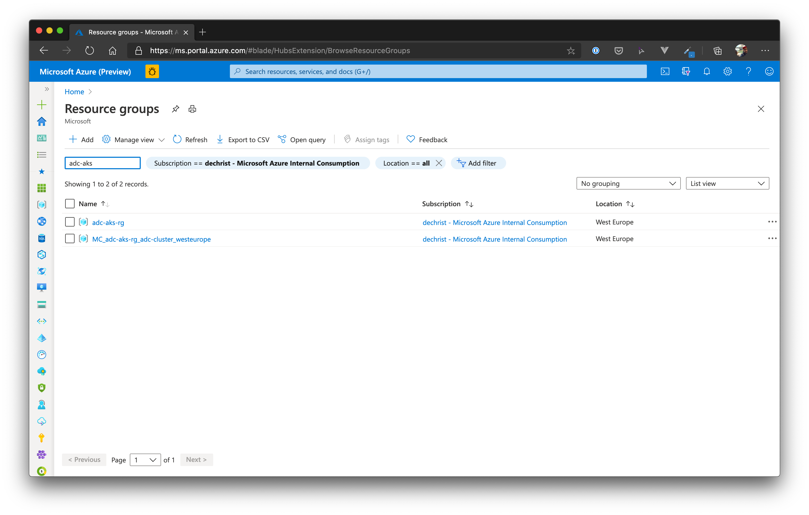
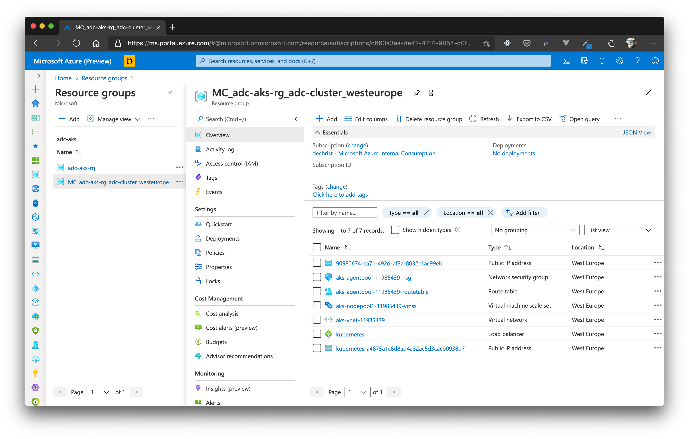
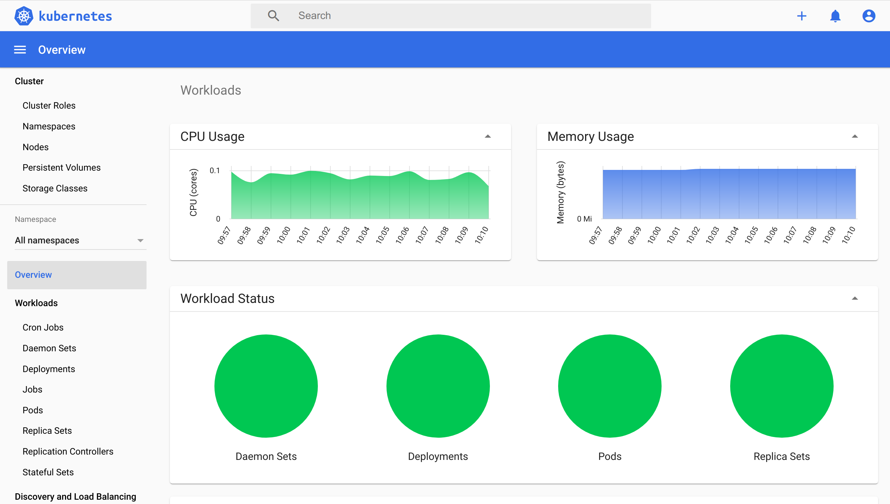

# Create your first Kubernetes Cluster

In this section we will create a Kubernetes cluster using the Azure CLI, configure your local access credentials to control your cluster using kubectl, take some first steps and run our first pod.

## Create the cluster

To have a clean overview of what is being provisioned under the hood, we create a new resource
group and and create our Kubernetes cluster within.

```shell
az group create --name adc-aks-rg --location westeurope
az aks create --resource-group adc-aks-rg --name adc-cluster --generate-ssh-keys --kubernetes-version 1.19.7
```

Let's inspect the created resources:



The `az aks create` command created a second resource group named
`MC_adc-aks-rg_adc-cluster_westeurope` containing all resources provisioned for our AKS
cluster.


The resource group we explicitly created only holds the AKS resource.



All other resource for the cluster are created in it's own resource group. This resource group and
all it's containing resources will be deleted when the cluster is destroyed.

## Establish access to the cluster

Now it's time to access our cluster. To authenticate us against the cluster Kubernetes uses client
certificates and access tokens. To obtain these access credentials for our newly created cluster we
use the `az aks get-credentials` command:

```shell
$ az aks get-credentials --resource-group adc-aks-rg --name adc-cluster
Merged "adc-cluster" as current context in /home/waltken/.kube/config

$ kubectl version # check client and server version of kubernetes
Client Version: version.Info{Major:"1", Minor:"20", GitVersion:"v1.20.2", GitCommit:"faecb196815e248d3ecfb03c680a4507229c2a56", GitTreeState:"clean", BuildDate:"2021-01-14T18:56:46Z", GoVersion:"go1.15.6", Compiler:"gc", Platform:"linux/amd64"}
Server Version: version.Info{Major:"1", Minor:"19", GitVersion:"v1.19.7", GitCommit:"14f897abdc7b57f0850da68bd5959c9ee14ce2fe", GitTreeState:"clean", BuildDate:"2021-01-22T17:29:38Z", GoVersion:"go1.15.5", Compiler:"gc", Platform:"linux/amd64"}
```

`kubectl version` prints both the version of the locally running commandline tool as well as the
Kubernetes version running on our cluster. To inspect the access credentials and cluster
configuration stored for us in our `~/.kube/config` file run `kubectl config view`.

We've setup access to our Kubernetes cluster. Now we can start exploring and working with our
cluster.

## Access the dashboard

AKS no longer comes with the kubernetes-dashboard installed by default. Lucky
for us there is a one-liner to quickly install the dashboard into our
cluster:

```shell
kubectl apply -f https://raw.githubusercontent.com/kubernetes/dashboard/v2.2.0/aio/deploy/recommended.yaml
```

Now, accessing the dashboard requires us to create a `ServiceAccount` with the
_cluster-admin_ `ClusterRole`.

To create these `Resources` within our Kubernetes cluster we will first declare the desired
configuration for our `ServiceAccount` in a yaml file and apply the desired configuration to our
cluster using the `kubectl apply` command.

```yaml
# dashboard-admin.yaml

# Create a ServiceAccount that we can use to access the Dashboard
apiVersion: v1
kind: ServiceAccount
metadata:
  name: admin-user # Create a ServiceAccount named admin-user
  namespace: kubernetes-dashboard

# This separates multiple resource definitions in a single file
---
# Bind the cluster-admin ClusterRole to the admin-user ServiceAccount
apiVersion: rbac.authorization.k8s.io/v1
kind: ClusterRoleBinding
metadata:
  name: admin-user
roleRef:
  apiGroup: rbac.authorization.k8s.io
  kind: ClusterRole
  name: cluster-admin
subjects:
  - kind: ServiceAccount
    name: admin-user
    namespace: kubernetes-dashboard
```

Create a new `dashboard-admin.yaml` file and paste the above content.

> **INFO:** you will be creating lots of YAML files today - hooray! :) Create a folder called `yaml` in the root directory of your repo and save all files you create within that location. You can apply the manifests via kubectl from that folder.

We can apply the configuration using the following line:

```shell
$ kubectl apply -f dashboard-admin.yaml
serviceaccount/admin-user created
clusterrolebinding.rbac.authorization.k8s.io/admin-user created
```

We need to discover the created users secret access token, to gain access to the dashboard.

```shell
$ kubectl -n kubernetes-dashboard get secret
NAME                               TYPE                                  DATA   AGE
admin-user-token-22554             kubernetes.io/service-account-token   3      32s
default-token-8fjcr                kubernetes.io/service-account-token   3      76s
kubernetes-dashboard-certs         Opaque                                0      76s
kubernetes-dashboard-csrf          Opaque                                1      76s
kubernetes-dashboard-key-holder    Opaque                                2      75s
kubernetes-dashboard-token-zmvj4   kubernetes.io/service-account-token   3      76s
```

Find the secret that belongs to the `admin-user-token` and let `kubectl describe` it to see the content of the secret:

```shell
$ kubectl -n kubernetes-dashboard describe secret admin-user-token-smw2j
Name:         admin-user-token-22554
Namespace:    kubernetes-dashboard
Labels:       <none>
Annotations:  kubernetes.io/service-account.name: admin-user
              kubernetes.io/service-account.uid: 02a8e2e7-c25d-48a2-b8b8-f6ce99e77a5d

Type:  kubernetes.io/service-account-token

Data
====
ca.crt:     1765 bytes
namespace:  20 bytes
token:      XXXXXXXXXXXXXXXXXXXXXXXXXXXXXXXXXXXXXXXXXXXXXXXXXXXXXXXXXXXXXXXXXXXXXXXXXXXXXXXXXXXXXXXXXX
```

> Watch out! You token will have a different random 5 character suffix.

Copy the token to your clipboard for the next step.

Now we start the kubernetes proxy to access the remote api safely on our local machine:

```shell
$ kubectl proxy
Starting to serve on 127.0.0.1:8001
```

The process keeps running until you interrupt it using `Ctrl-C`. Let's keep it running for now.

[Access the dashboard](http://localhost:8001/api/v1/namespaces/kubernetes-dashboard/services/https:kubernetes-dashboard:/proxy/)
and login using the token you've acquired for the _admin-user_ `ServiceAccount`.


Take your time to explore the dashboard. Make use of the `Namespace` selector to navigate the
different namespaces.



> **Security Note:** The dashboard component is considered a "security risk", because it is an additional way to access your cluster - and you have to take care of securing it. Normally, you would not install the dashboard component in production clusters. There is an option for disabling the dashboard, even after installation: `az aks disable-addons -a kube-dashboard -n my_cluster_name -g my_cluster_resource_group`.

## Run your first pod

Now we will run our first pod on our kubernetes cluster. Let's keep the `kubectl proxy` command
running and execute this in new tab in your console.

```shell
$ kubectl run -i -t pod1 --image=busybox --restart=Never --rm=true
If you don't see a command prompt, try pressing enter.
/ #
```

We've just started a `Pod` named _pod1_ based on the _busybox_ image.

To understand the different flags we've added to the command take a look at the built in
documentation to `kubectl run`.

```shell
$ kubectl run --help
Create and run a particular image in a pod.

Examples:
  # Start a nginx pod.
  kubectl run nginx --image=nginx

...
```

## Questions

What do the different flags (`-i`, `-t`, `--restart=Never`, `--rm=True`) used in the `kubectl run`
command do?
