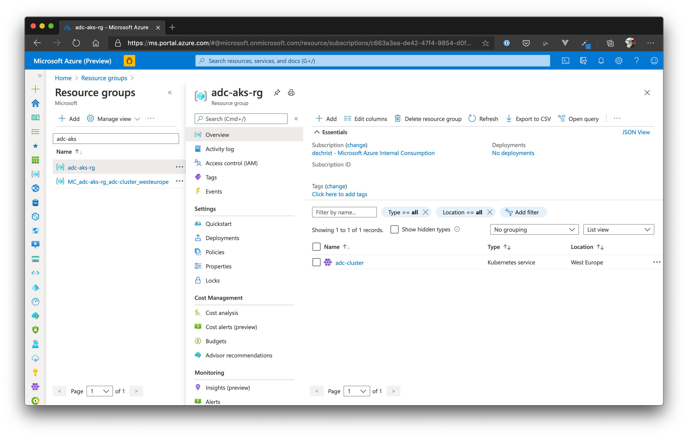
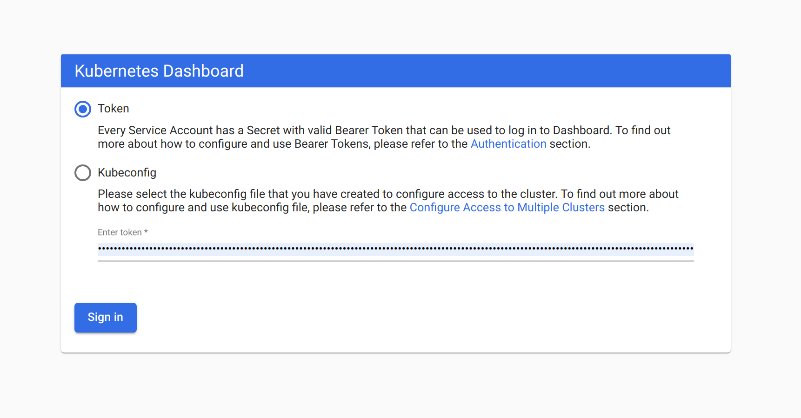

# Create your first Kubernetes Cluster

In this section we will create a Kubernetes cluster using the Azure CLI, configure your local access credentials to control your cluster using kubectl, take some first steps and run our first pod.

## Create the cluster

To have a clean overview of what is beeing provisioned under the hood, we create a new resource
group and and create our Kubernetes cluster within.

```zsh
$ az group create --name adc-aks-rg --location westeurope
$ az aks create --resource-group adc-aks-rg --name adc-cluster --generate-ssh-keys --kubernetes-version 1.17.11
```

> Note that we deploy Kubernetes with the latest available version on azure at the time of writing.
> If you use a different version, you might run into trouble during the _Access the Dashboard_
> section.

Let's inspect the created resources:


The `az aks create` command created a second resource group named
`MC_adc-aks-rg_adc-cluster_westeurope` containing all resources provisioned for our AKS
cluster.



The resource group we explicitly created only holds the AKS resource.


All other resource for the cluster are created in it's own resource group. This resource group and
all it's containing resources will be deleted when the cluster is destroyed.

## Establish access to the cluster

Now it's time to access our cluster. To authenticate us against the cluster Kubernetes uses client
certificates and access tokens. To obtain these access credentials for our newly created cluster we
use the `az aks get-credentials` command:

```zsh
$ az aks get-credentials --resource-group adc-aks-rg --name adc-cluster
$ kubectl version # check client and server version of kubernetes
Client Version: version.Info{Major:"1", Minor:"18", GitVersion:"v1.18.6", GitCommit:"dff82dc0de47299ab66c83c626e08b245ab19037", GitTreeState:"clean", BuildDate:"2020-07-16T06:30:04Z", GoVersion:"go1.14.5", Compiler:"gc", Platform:"linux/amd64"}
Server Version: version.Info{Major:"1", Minor:"17", GitVersion:"v1.17.7", GitCommit:"5737fe2e0b8e92698351a853b0d07f9c39b96736", GitTreeState:"clean", BuildDate:"2020-06-24T19:54:11Z", GoVersion:"go1.13.6", Compiler:"gc", Platform:"linux/amd64"}
```

`kubectl version` prints both the version of the locally runnig commandline tool as well as the
Kubernetes version running on our cluster. To inspect the access credentials and cluster
configuration stored for us in our `~/.kube/config` file run `kubectl config view`.

We've setup access to our Kubernetes cluster. Now we can start exploring and working with our
cluster.

## Access the dashboard

AKS comes with the kubernetes-dashboard installed by default. Accessing the dashboard requires us to
create a `ServiceAccount` with the _cluster-admin_ `ClusterRole`.

To create these `Resources` within our Kubernetes cluster we will first declare the desired
configuration for our `ServiceAccount` in a yaml file and apply the desired configuration to our
cluster using the `kubectl apply` command.

```yaml
# dashboard-admin.yaml

# First we create a new namespace for our role to live in. This way we can
# later delete the entire namespace and remove all configurations made here.
apiVersion: v1
kind: Namespace
metadata:
  name: kubernetes-dashboard

# This separates multiple resource definitions in a single file
---
apiVersion: v1
kind: ServiceAccount
metadata:
  name: admin-user # Create a ServiceAccount named admin-user
  namespace: kubernetes-dashboard

---
# Bind the cluster-admin ClusterRole to the admin-user ServiceAccount
apiVersion: rbac.authorization.k8s.io/v1
kind: ClusterRoleBinding
metadata:
  name: admin-user
roleRef:
  apiGroup: rbac.authorization.k8s.io
  kind: ClusterRole
  name: cluster-admin
subjects:
  - kind: ServiceAccount
    name: admin-user
    namespace: kubernetes-dashboard
```

Create a new `dashboard-admin.yaml` file and paste the above content.

We can apply the configuration using the following line:

```zsh
$ kubectl apply -f dashboard-admin.yaml
```

We need to discover the created users secret access token, to gain access to the dashboard.

```zsh
$ kubectl -n kubernetes-dashboard get secret
```

Find the secret that belongs to the `admin-user` and let kubectl `describe` it to see the content of the secret:

```zsh
$ kubectl -n kubernetes-dashboard describe secret admin-user-token-smw2j
```

> Watch out! You token will have a differnet random 5 character suffix.

Copy the token to your clipboard for the next step.

Now we start the kubernetes proxy to access the remote api safely on our local machine:

```zsh
$ kubectl proxy
```

The process keeps running unitl you interrupt it using `Ctrl-C`. Let's keep it running for now.

[Access the dashboard](http://localhost:8001/api/v1/namespaces/kube-system/services/https:kubernetes-dashboard:/proxy/)
and login using the token you've aquired for the _admin-user_ `ServiceAccount`.



Take your time to explore the dashboard. Make use of the `Namespace` selector to navigate the
different namespaces.


# Run your first pod

Now we will run our first pod on our kubernetes cluster. Let's keep the `kubectl proxy` command
running and execute this in new tab in your console.

```zsh
$ kubectl run -i -t pod1 --image=busybox --restart=Never --rm=true
If you don't see a command prompt, try pressing enter.
/ #
```

We've just started a `Pod` named _pod1_ based on the _busybox_ image.

To understand the different flags we've added to the command take a look at the built in
documentation to `kubectl run`.

```zsh
$ kubectl run --help
```

## Questions

What do the different flags (`-i`, `-t`, `--restart=Never`, `--rm=True`) used in the `kubectl run`
command do?
